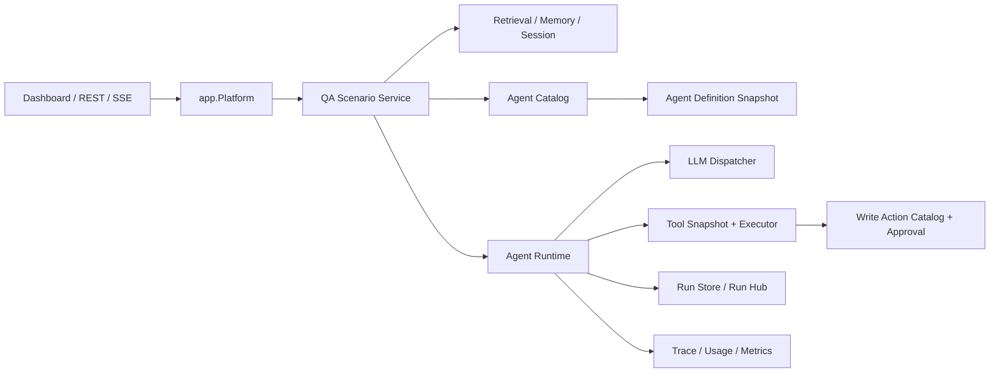

# 单 Agent 解耦与独立 Runtime 方案

[返回设计索引](README.zh-CN.md)

> 状态：第一阶段已实现，后续演进中
> 更新日期：2026-08-05
> 适用范围：Nasuta QA Agent 及后续可复用 Agent
> 依赖基线：模块 01、02、04、06、08、09

## 1. 结论

### 实施状态

第一阶段已在 Nasuta 中落地：

- `agent.Definition`、`agent.Runtime` 和 `agentcatalog` 已形成独立执行合同；
- QA Runtime 已由 `app.Platform` 统一持有和组装；
- Agent Run 已保存 Definition、Tool Snapshot、Schema、Workflow 等版本快照；
- 现有 QA SSE、Run、Step、Usage 和取消链路保持兼容。

尚未落地的是跨进程 Remote Worker、Agent 控制面 UI 和完整运行指标体系。这些属于后续部署与运营阶段，不影响本阶段在进程内为多 Agent 提供稳定执行单元。

推荐把当前 `internal/agent.QA` 拆成“场景编排”和“通用执行”两层，在同一进程内先形成独立 Agent Runtime：

```text
QA Scenario
  -> Agent Catalog 解析版本化 Agent Definition
  -> 编译一次不可变 Run Request
  -> Agent Runtime 执行模型/工具循环
  -> 返回 Run Result 与权威 Trace
```

第一阶段不把 Agent 拆成独立微服务。独立首先指代码所有权、配置、合同、生命周期、权限和观测独立，而不是部署单元独立。只有出现独立扩缩容、故障域隔离、异构执行环境或跨进程队列恢复等真实需求后，才在相同 Runtime 合同下增加 Remote Worker Adapter。

该方案是后续多 Agent 的前置重构：先让“一个 Agent 是什么、如何执行、能看见哪些工具、使用多少预算”成为稳定合同，再引入多个 Agent 和 Orchestrator。

## 2. 当前问题

### 2.1 `QA` 同时承担过多职责

当前 `internal/agent.QA` 同时负责：

- 创建主模型和快速模型；
- 创建检索器、Reranker 和 Memory Store；
- 读取会话、压缩历史和召回记忆；
- 规划 Evidence 和预取工具；
- 创建 Registry、Tool Executor、Agent Loop、RunHub 和 RunStore；
- 组装 QA Prompt、执行 Agent、生成最终回答；
- 处理运行事件、Token、引用和会话落库；
- 根据平台配置重建运行对象。

这使“QA 场景”和“Agent 执行机制”共享一个生命周期。新增 Incident Agent、Review Agent 或其他专用 Agent 时，只能复制 `QADeps`、复用 QA 专属类型，或继续把分支塞进 `QA`。

### 2.2 执行内核仍依赖 QA 语义

`internal/agent.Agent` 已经具备工具循环、预算、Observer、Controller 和最终回答保障，但其入口直接依赖：

- `domain.EvidencePlan`；
- `retrieval.RetrievedContext`；
- `ConversationContext`；
- QA 专属 System Prompt 与证据编排；
- `allowWrite` 布尔值和 QA Tool Policy。

这些类型把执行内核锁定在问答场景。后续 Agent 即使不需要会话、检索或 QA Evidence Plan，也必须伪造对应输入。

### 2.3 构造和重载边界不稳定

Dashboard 当前可以直接通过 `agent.NewQA(QADeps)` 组合大量底层依赖。平台配置重载时，传输层需要理解 LLM、Registry、RunStore、Session、Memory 和写能力之间的关系。结果是：

- 传输层知道过多业务和运行时细节；
- 一个配置变化可能重建整套 QA 对象；
- 无法按 Agent Definition 固定一次 Run 的模型、工具和预算快照；
- 未来多个 Agent 容易各自形成一套构造逻辑。

### 2.4 Agent 身份没有版本化

当前一次 Run 记录模型、步骤和使用量，但缺少稳定的：

- `agent_id`；
- `definition_version`；
- Prompt/Policy 内容哈希；
- Tool Snapshot 标识；
- 输入/输出 Schema 版本；
- 能力与权限边界。

因此同名 Agent 配置变化后，历史 Run 很难被准确解释、回放和比较。

## 3. 目标与非目标

### 3.1 目标

1. 将可复用 Agent 执行机制从 QA 场景中抽离。
2. 每次 Run 固定版本化 Definition、模型、工具、策略和预算快照。
3. QA 只负责 QA 领域的检索、会话、记忆和 Evidence 编排。
4. Dashboard/Transport 只调用应用服务，不再组装 Agent 底层依赖。
5. 保持现有 SSE、Run、Step、Usage、引用和取消语义兼容。
6. 为多 Agent 提供可组合的最小执行单元。
7. 保持 Provider 失败可见，禁止静默替换。

### 3.2 非目标

- 第一阶段不新增独立 Agent 微服务；
- 不引入自由对话式 Agent 群；
- 不把所有场景统一成一个万能 Request；
- 不让 Runtime 直接拥有检索、Memory、Feature Delivery 或 Incident 业务；
- 不扩大 MCP 或写工具权限；
- 不为了配置热更新增加冗余持久状态机。

## 4. 备选方案

| 方案 | 描述 | 优点 | 主要问题 | 结论 |
|---|---|---|---|---|
| A. 继续扩展 `QA` | 在现有对象中增加 Agent 类型和分支 | 改动最小 | 场景、执行和构造继续耦合，多 Agent 会放大复杂度 | 不采用 |
| B. 进程内独立 Runtime | 抽取窄合同、Definition、Catalog 和 Runtime | 迁移可控；保留低延迟；可先稳定边界 | 仍共享进程故障域 | 推荐 |
| C. 立即微服务化 | Agent 通过 RPC/队列独立部署 | 可独立扩缩容和隔离 | 提前引入网络、鉴权、序列化、队列恢复和分布式追踪 | 暂不采用 |
| D. 引入外部 Agent Framework | 用第三方框架承载 Loop/Graph | 可获得现成编排能力 | 与现有 Tool、Run、Approval、Trace 合同重复，迁移风险高 | 当前不采用 |

## 5. 目标架构



依赖方向为：

```text
transport -> app -> scenario -> public agent contracts
                         \-> internal agentruntime
agentruntime -> llm/tool/run abstractions
agentruntime -X-> qa/retrieval/memory/featuredelivery
```

Runtime 不回调 QA，也不持有通用依赖容器。每个运行对象只保存执行所需的精确依赖。

## 6. 核心领域模型

### 6.1 Agent Definition

`AgentDefinition` 描述一个可执行 Agent 的不可变版本：

```go
type Definition struct {
    ID            string
    Version       int64
    DisplayName   string
    Purpose       string
    Prompt        PromptSpec
    InputSchema   SchemaRef
    OutputSchema  SchemaRef
    Model         ModelPolicy
    Tools         ToolPolicy
    Budget        BudgetPolicy
    Permissions   PermissionPolicy
    FailurePolicy FailurePolicy
    ContentHash   string
}
```

约束：

1. `ID + Version` 唯一，已被 Run 使用的版本不可原地修改。
2. `ContentHash` 覆盖 Prompt、Schema、Tool Policy、预算和权限。
3. Provider、Model、Tool Snapshot 在 Run 创建时解析并固定。
4. Definition 只描述执行策略，不嵌入数据库、Retriever 或业务 Service。
5. Secret 只保存引用，不能进入 Definition、Run 输入或 Trace。

第一阶段 Definition 可以来自代码和平台设置的确定性快照，不要求立即建设可视化 Agent 编辑器。

### 6.2 Run Request

场景层把业务输入编译为 Runtime 可执行请求：

```go
type RunRequest struct {
    RunID       string
    Agent       DefinitionRef
    Input       json.RawMessage
    Messages    []Message
    Context     []ContextBlock
    ToolScope   ToolScope
    Actor       Actor
    Correlation Correlation
}
```

`ContextBlock` 是通用可信上下文容器，只表达来源、标题、正文、引用、完整性和内容哈希。QA 的 `EvidencePlan`、`RetrievedContext` 和会话召回结果在 QA 层转换为该类型，不能进入 Runtime 公共合同。

### 6.3 Run Snapshot

Runtime 在开始执行前创建不可变 `RunSnapshot`：

```text
run_id
agent_id / definition_version / definition_hash
provider / model / model_parameters
tool_snapshot_id / visible_tool_ids
input_schema_version / output_schema_version
prompt_hash / context_hash
budgets
actor / tenant / correlation
created_at
```

运行中配置变化不影响已开始的 Run。配置重载只生成新的 Definition/Catalog Snapshot。

### 6.4 Run Result

```go
type RunResult struct {
    RunID       string
    Status      RunStatus
    Output      json.RawMessage
    Text        string
    Evidence    EvidenceSummary
    References  []Reference
    Usage       Usage
    Error       *RunError
}
```

结果区分模型输出、结构化输出、证据状态和运行错误。Runtime 不把 Provider 错误包装成成功文本，也不自行生成业务兜底答案。

## 7. Runtime 职责

### 7.1 Runtime 拥有

- Definition 和 Request 校验；
- Run Snapshot 固定；
- Prompt/Message/Context 的通用编译；
- LLM Tool Calling Loop；
- Tool Snapshot、参数校验和执行；
- 步骤数、时间、Token、上下文和工具输出预算；
- 最终回答预留与截断续写；
- 输出 Schema 校验；
- Observer、Controller、Run/Step/Usage 记录；
- 取消、超时和错误分类；
- 权威引用和 Evidence Summary 汇总。

### 7.2 Runtime 不拥有

- QA 问题清洗、意图识别和 Evidence Plan；
- 检索 Query Plan、Rerank 和知识选择；
- Session 历史压缩和长期记忆召回；
- Incident 诊断策略；
- Feature Delivery Artifact 谱系和阶段 Gate；
- Review 结论；
- 写操作审批业务；
- 业务 API 和 UI 文案。

### 7.3 QA 场景保留

`QAService` 负责：

1. 接收并规范化 QA 请求；
2. 加载有界会话和记忆；
3. 生成 QA Evidence Plan；
4. 执行预检索与场景专属预取；
5. 选择 QA Agent Definition；
6. 编译 `RunRequest`；
7. 调用 Runtime；
8. 保存会话消息和 QA 领域结果。

## 8. 包与所有权边界

推荐目标包：

```text
agent/
  definition.go       对应用公开的窄合同
  runtime.go          Runtime 接口和请求/结果类型
  event.go            稳定事件合同

internal/agentruntime/
  runtime.go          执行入口
  loop.go             通用工具循环
  context.go          通用上下文编译
  budget.go           预算与最终回答预留
  output.go           输出校验

internal/agentcatalog/
  catalog.go          Definition Snapshot 解析与发布

internal/qa/
  service.go          QA 场景编排
  evidence.go         Evidence Plan 与检索
  conversation.go     Session / Memory
  prompt.go           QA 专属 Prompt

internal/knowledgetools/
  registry.go         可复用知识读工具注册
```

迁移过程中可以保留 `internal/agent` 作为兼容层，但最终应按概念拆分，避免变成新的杂物包。

公共 `agent` 包只暴露应用组合所需合同。`internal/agentruntime` 和 `internal/agentcatalog` 保持 Nasuta 内部实现，CodeLoom 等应用通过 `app.Platform` 使用，不直接导入内部包。

## 9. Tool 与权限模型

1. Catalog 根据 Definition 解析逻辑 Tool Policy。
2. Runtime 根据 Actor、场景授权和能力可用性生成一次不可变 Tool Snapshot。
3. 模型只看到 Snapshot 中允许的定义。
4. 执行器只接受 Snapshot 中存在的 Tool ID，不能按名称回退到全局 Registry。
5. 读工具和写动作继续使用不同 Catalog。
6. 写动作必须同时满足 Definition 允许、调用方授权、Run 显式开启和人工审批。
7. 多 Agent 准备阶段不改变现有 MCP 只读边界。

不得把 `allowWrite bool` 作为长期权限模型。迁移后使用结构化 `ToolScope` 和 `PermissionDecision`，明确决策来源及拒绝原因。

## 10. 构造、配置与重载

`app.Platform` 是唯一根组合边界：

```text
Platform
  AgentCatalog
  AgentRuntime
  QAService
  IncidentService
  FeatureDeliveryService
```

Dashboard 只依赖 `QAService`、Run 查询和 SSE 订阅接口，不再创建 `QADeps`。

配置重载采用快照替换：

1. 从已规范化的平台设置构建候选 Catalog；
2. 校验 Provider、Model、Prompt、Schema、Tool ID 和预算；
3. 校验失败则保留旧快照并记录错误，不发布半成品；
4. 校验成功后原子发布新 Catalog Snapshot；
5. 新 Run 使用新快照，已有 Run 继续使用原快照。

配置可用性从事实推导，不增加“初始化中/已激活”等持久状态机。

## 11. Run、持久化与 API

### 11.1 Run 持久化

在现有 Run/Step/Usage 基础上增加：

- `agent_id`；
- `definition_version`；
- `definition_hash`；
- `tool_snapshot_id`；
- `input_schema_version`；
- `output_schema_version`；
- `parent_run_id` 和 `workflow_run_id`，第一阶段可为空；
- 结构化 `error_code` 和 `evidence_status`。

大型上下文、工具结果和模型输出继续保存完整内容或无损可恢复引用。在线列表只查询摘要列并使用 Cursor/Limit。

### 11.2 API

对外不直接暴露任意 Agent 执行接口。第一阶段保留场景 API：

```text
POST /api/qa/ask
GET  /api/agent-runs/{run_id}
GET  /api/agent-runs/{run_id}/steps?before_seq=&limit=
GET  /api/agent-runs/{run_id}/events?after_seq=&limit=
POST /api/agent-runs/{run_id}/cancel
```

管理接口只允许列出平台发布的 Definition 和版本，不允许客户端提交任意 Prompt、Tool 或 Provider 来绕过平台策略。

### 11.3 运行状态

短时同步/流式 Agent Run 不需要复杂持久状态机。状态可由 Run 事实表达：

```text
running -> succeeded | failed | cancelled | timed_out
```

只有未来引入异步队列、Worker Claim、Lease、重试恢复时，才为远程执行增加真实的任务生命周期。

## 12. 失败语义

| 失败 | 行为 |
|---|---|
| Definition 不存在或无效 | Run 不创建或以配置错误失败 |
| 配置的 Provider 不可用 | 明确失败，不切换 Provider |
| 可选工具后端未配置 | 从 Snapshot 移除并记录 capability disabled |
| 已配置工具后端调用失败 | Tool Step 失败并进入 Evidence Summary，不替换后端 |
| 输入不满足 Schema | 边界拒绝，不调用模型 |
| 输出不满足 Schema | 按 Definition 的有限修复策略处理，最终仍无效则失败 |
| Loop 超时 | 使用 Answer Reserve 尝试有证据的最终结论；无法完成则明确超时 |
| RunStore 写失败 | 不继续产生无法审计的成功 Run |
| Observer/SSE 客户端断开 | 不改变权威 Run；执行是否取消由显式策略决定 |

## 13. 可观测性

所有 Run 至少记录：

- Agent Definition 和 Tool Snapshot 标识；
- 场景、Actor、Session、Parent/Workflow Run；
- 每次模型调用的 Provider、Model、Phase、Token 和耗时；
- 每个工具调用的 Tool ID、参数摘要、结果状态、大小和耗时；
- Context 来源、哈希、完整性和预算决策；
- 重试、压缩、裁剪、续写、强制结论和降级；
- 最终 Evidence Status、引用、错误分类和结束原因。

指标按 `agent_id + definition_version + provider + model` 聚合，至少覆盖成功率、超时率、首 Token 延迟、总延迟、步骤数、工具失败率、Token 成本和证据完整率。

## 14. 分阶段迁移

### 阶段 0：建立回归基线

- 固化现有 QA SSE 事件、Run/Step、引用和会话行为测试；
- 建立代表性 QA Evaluation 集；
- 记录当前延迟、Token、工具调用和错误率。

### 阶段 1：抽取通用合同

- 新增 `agent.Definition`、`RunRequest`、`RunResult` 和事件合同；
- 为现有 QA 配置生成 `qa.default` Definition；
- 为现有 Tool Registry 生成稳定 Snapshot ID；
- 只增加适配，不改变执行行为。

### 阶段 2：抽取 Runtime

- 将 `internal/agent.Agent` 的通用 Loop、预算、Observer 和 Controller 移入 `internal/agentruntime`；
- 把 QA 专属 Prompt、Evidence 和 Conversation 编译移出 Runtime；
- 用合同测试确保新旧 Run 输出和事件语义等价。

### 阶段 3：收敛 QA 场景

- 新建 `internal/qa`；
- 将检索、Memory、Session 和 QA Evidence Plan 迁入；
- 删除 Runtime 对 `RetrievedContext` 和 `EvidencePlan` 的直接依赖；
- 保留短期兼容 Facade，迁移调用方后删除。

### 阶段 4：收敛应用组合

- `app.Platform` 统一创建 Catalog、Runtime 和 QAService；
- Dashboard 不再构造 `QADeps`；
- 配置重载改为 Catalog Snapshot 原子发布；
- 移除重复构造入口。

### 阶段 5：为多 Agent 开放内部编排接口

- 增加 `parent_run_id`、`workflow_run_id`；
- 支持 Orchestrator 调用固定 Definition；
- 不开放任意公网 Agent 执行接口。

每一阶段分别执行最窄包测试、`GOWORK=off go test ./...`、`GOWORK=off go build ./...`；涉及共享并发对象和 Snapshot 发布时补充 Race Test。

## 15. 测试策略

1. **Definition 合同测试**：版本不可变、哈希稳定、未知 Tool/Provider 拒绝。
2. **Runtime 单元测试**：预算、最终回答预留、工具循环、输出 Schema、取消和超时。
3. **Snapshot 并发测试**：配置重载期间已有 Run 不变，新 Run 使用新版本。
4. **权限测试**：不可见工具无法由模型名称或历史 Tool Call 越权执行。
5. **失败测试**：Provider、Tool、RunStore 和 SSE 分别失败时语义明确。
6. **兼容测试**：现有 `/api/qa/ask`、SSE、Run 查询和引用不回归。
7. **Evaluation**：对同一 QA 数据集比较准确率、证据完整率、Token 和延迟。

## 16. 风险与控制

| 风险 | 控制 |
|---|---|
| 抽象过宽，出现万能 Runtime | Runtime 只接受通用消息、上下文、工具和 Schema，不接收业务 Service |
| 迁移期间双实现漂移 | 兼容 Facade 只委托新实现，禁止维护两套 Loop |
| Definition 热更新影响进行中 Run | Run 创建时固定不可变 Snapshot |
| Tool Policy 与实际执行不一致 | 模型可见定义和执行 Handler 来自同一 Snapshot |
| Run 表膨胀 | 摘要与大内容分离，列表有界，建立保留策略 |
| 为“独立”过早微服务化 | 先完成进程内合同，远程 Worker 复用同一接口 |
| 公共包泄漏内部类型 | 公共合同只包含稳定值对象和接口 |

## 17. 验收标准

1. `internal/agent.QA` 不再创建 LLM、Agent Loop、Tool Executor 和 RunHub。
2. Runtime 不导入 QA、Retrieval、Memory、Incident 或 Feature Delivery 包。
3. QA 的 Evidence、检索、会话和记忆由独立场景服务拥有。
4. 每个 Run 可追溯到精确 Definition、Provider、Model 和 Tool Snapshot。
5. Dashboard 不再组装 `QADeps`，统一通过 `app.Platform` 获取场景服务。
6. 配置重载不会改变已开始 Run，也不会发布未通过校验的 Definition。
7. Provider 失败不会静默替换，工具能力缺失和调用失败均可观察。
8. 现有 QA API、SSE、Run/Step/Usage、引用和取消行为保持兼容。
9. 存储列表和事件读取在数据源边界使用字段投影、Cursor 和 Limit。
10. 新增第二个只读专用 Agent 时，无需复制 QA 检索、会话或构造代码即可运行。
