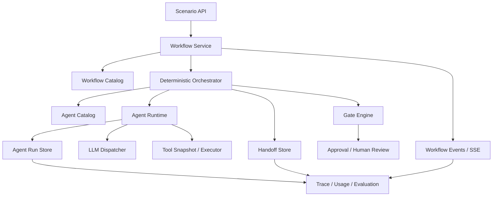

# Nasuta 多 Agent 平台方案

[返回设计索引](README.zh-CN.md)

> 状态：专项目标设计
> 更新日期：2026-08-05
> 前置方案：[单 Agent 解耦与独立 Runtime 方案](11-single-agent-decoupling-proposal.zh-CN.md)
> 依赖基线：模块 01–10

## 1. 结论

推荐建设“确定性 Orchestrator + 独立 Agent Run + 类型化 Artifact Handoff”的多 Agent 平台：

```text
Workflow Definition
  -> Orchestrator 解析固定 DAG
  -> 多个版本化 Agent 独立执行
  -> 通过不可变 Handoff 传递结果
  -> Deterministic Gate 决定继续、返工、终止或等待人工
  -> 聚合为场景结果
```

Nasuta 不建设自由涌现的 Agent 群，也不允许模型自行创建 Agent、扩大工具权限、修改工作流或相互传递无结构长对话。多 Agent 的价值来自专业分工、独立上下文、并行验证和可追溯合成，不来自角色数量。

第一版支持三种编排模式：

1. **Delegated Investigation**：主 Agent 委托若干有界调查任务，再综合证据；
2. **Sequential Artifact Pipeline**：上游 Agent 产出结构化 Artifact，下游 Agent 基于批准版本继续；
3. **Parallel Review Panel**：多个 Reviewer 独立审查同一 Subject，由确定性 Gate 汇总。

## 2. 设计原则

1. **一个 Agent 一个职责**：Definition 描述稳定能力，不把所有角色塞入同一 Prompt。
2. **一个节点一个 Run**：每个 Agent 执行拥有独立 Run、Tool Snapshot、预算、Trace 和错误。
3. **Agent 间只传 Artifact**：不共享隐藏推理，不把无限增长的聊天记录作为协议。
4. **Orchestrator 决定流程**：模型不能自由改写 DAG、跳过 Gate 或批准自己的输出。
5. **权限不随协作扩大**：子 Agent 的权限是调用者权限、Workflow Policy 和 Definition 权限的交集。
6. **配置失败可见**：配置的 Provider 失败不自动替换；可选能力缺失只禁用相关节点。
7. **状态有真实生命周期才持久化**：短时同步 DAG 从 Run/Node 事实推导；队列、Claim、Lease 和恢复存在时才增加持久任务状态。
8. **所有读取有界**：Workflow、Node、Event、Handoff 和 Artifact 列表在存储边界分页和投影。
9. **Nasuta 拥有机制，应用拥有策略**：CodeLoom 等应用选择启用哪些 Workflow 和业务 Gate，不把应用业务规则上移到通用平台。

## 3. 当前基线与差距

### 3.1 可复用基线

Nasuta 已具备多 Agent 的大部分底层原语：

| 已有能力 | 多 Agent 中的用途 |
|---|---|
| Tool Registry 与 Snapshot | 固定每个 Agent 可见和可执行的工具 |
| Agent Loop | 单个 Node 的执行内核 |
| RunHub、RunStore、Step、Usage | 每个 Agent Run 的事件、审计和成本 |
| LLM Provider Dispatcher | 按 Definition 显式选择 Provider/Model |
| Retrieval、Ontology、Memory | 场景层生成有界上下文和证据 |
| Approval / Write Action Catalog | 封闭副作用和人工批准 |
| Feature Delivery Artifact | 不可变、版本化、可审核的阶段交接 |
| Implementation Run、Claim、Lease | 长任务执行与恢复参考实现 |
| Dashboard SSE | Workflow 和子 Run 事件投影 |

### 3.2 主要差距

- 单 Agent 尚未形成独立 Definition 和 Runtime；
- 没有 Workflow Definition、Node、Edge、Gate 和 Handoff 合同；
- Run 之间没有 `workflow_run_id`、`node_id` 和 `parent_run_id` 关联；
- 缺少跨 Agent 的输入/输出 Schema 校验；
- 缺少并行节点的预算、取消和失败聚合；
- 缺少 Workflow 级 Trace、成本、质量和关键路径指标；
- Feature Delivery 的阶段机制尚未抽象为可复用编排原语；
- 当前单人工 Review 无法表达多 Reviewer、Review Round 和 Gate。

## 4. 备选方案

| 方案 | 描述 | 优点 | 主要问题 | 结论 |
|---|---|---|---|---|
| A. 单 Agent 内角色扮演 | 一个 Prompt 依次模拟多个专家 | 实现快、成本低 | 上下文与偏差共享，无法独立授权、并行和审计 | 仅可作为基线 |
| B. 自由 Agent 群聊 | Agent 自主选人、聊天和终止 | 灵活、演示效果强 | 成本和行为不可预测，权限与故障难治理 | 不采用 |
| C. 确定性 DAG + Handoff | 平台固定节点、边和 Gate | 可审计、可测试、可恢复、权限清晰 | 需要定义工作流和 Schema | 推荐 |
| D. 全量外部工作流引擎 | 立即引入 Temporal 等 | 长任务能力成熟 | 初期基础设施和运维成本高，与现有 Run 重叠 | 达到触发条件后再评估 |

引入外部工作流引擎的触发条件应是已经出现跨进程长时间等待、数千并发 Workflow、复杂定时补偿或现有数据库 Claim/Lease 难以可靠承载，而不是因为“多 Agent”这个名称。

## 5. 目标架构



### 5.1 控制面

控制面管理：

- Agent Definition；
- Workflow Definition；
- Schema；
- Tool/Permission Policy；
- Provider/Model Policy；
- Budget Policy；
- 版本发布和停用；
- 离线 Evaluation。

控制面配置只有通过校验后才能发布为不可变 Snapshot。

### 5.2 数据面

数据面负责：

- 接收场景请求；
- 创建 Workflow Run；
- 调度可运行节点；
- 创建 Agent Run；
- 校验和保存 Handoff；
- 执行 Gate；
- 传播取消、超时和失败；
- 聚合结果、事件和使用量。

控制面更新不修改进行中的 Workflow Snapshot。

## 6. 核心领域模型

### 6.1 Workflow Definition

```go
type WorkflowDefinition struct {
    ID            string
    Version       int64
    Purpose       string
    InputSchema   SchemaRef
    OutputSchema  SchemaRef
    Nodes         []NodeDefinition
    Edges         []EdgeDefinition
    Budget        WorkflowBudget
    FailurePolicy WorkflowFailurePolicy
    ContentHash   string
}
```

发布前必须验证：

- Node ID 唯一；
- DAG 无环；
- Entry/Terminal Node 明确；
- 每条 Edge 的输出、输入 Schema 兼容；
- 引用的 Agent Definition 和 Gate 存在；
- 并行度、预算和超时有效；
- 不存在无路可达节点；
- 写节点只能引用封闭 Action Catalog。

### 6.2 Node Definition

```go
type NodeDefinition struct {
    ID           string
    Kind         NodeKind
    Agent        DefinitionRef
    InputMapping MappingSpec
    OutputSchema SchemaRef
    Condition    ConditionSpec
    Gate         *GateSpec
    Retry        RetryPolicy
    Timeout      time.Duration
    Optional     bool
}
```

第一版 Node Kind 只需要：

- `agent`：执行一个 Agent；
- `gate`：确定性检查；
- `human_approval`：等待人工；
- `join`：收敛并行结果；
- `transform`：确定性 Schema 映射。

不要把普通顺序步骤包装成复杂状态机。`transform` 必须是平台注册的确定性函数，不能执行任意用户脚本。

### 6.3 Workflow Run

```text
workflow_run_id
workflow_id / workflow_version / workflow_hash
input_hash
actor / tenant / scenario
status
budget_snapshot
started_at / ended_at
error_code
```

Workflow Run 固定整个 Workflow Snapshot。每个 Node Run 关联：

```text
workflow_run_id
node_id
attempt
agent_run_id
input_handoff_ids
output_handoff_id
started_at / ended_at
result
```

### 6.4 Handoff Artifact

Handoff 是 Agent 之间唯一的语义通信载体：

```go
type Handoff struct {
    ID             string
    WorkflowRunID  string
    ProducerNodeID string
    ProducerRunID  string
    Schema         SchemaRef
    Payload        json.RawMessage
    References     []Reference
    Completeness   Completeness
    ContentHash    string
    CreatedAt      time.Time
}
```

约束：

1. 创建后不可变；
2. 必须通过输出 Schema 校验；
3. 必须标记 complete、partial 或 unavailable；
4. 引用保留原始证据来源，不能只留下二次总结；
5. 大内容保存为可恢复 Artifact，Handoff 中保留有界摘要和引用；
6. 下游只读取 Edge 显式映射的字段；
7. 任何修订创建新 Handoff 和新 Node Attempt。

### 6.5 Gate Decision

```go
type GateDecision struct {
    GateID        string
    SubjectHash   string
    Decision      string
    ReasonCodes   []string
    FindingIDs    []string
    EvaluatedAt   time.Time
}
```

Gate 输出只能是已定义结果，例如 `pass`、`revise`、`blocked`、`human_required`。Gate 不修改 Handoff，也不生成业务 Artifact。

## 7. 编排语义

### 7.1 节点可运行条件

节点可运行由事实推导：

1. 所有必需上游节点已有有效终态；
2. 所需 Handoff 存在且 Schema 有效；
3. Edge Condition 成立；
4. Workflow 未取消且预算未耗尽；
5. 并发限制允许；
6. 人工 Gate 已满足。

无需持久化一套与这些事实重复的“待激活/已激活”状态。

### 7.2 并行执行

同一层的独立节点可并行运行，但必须：

- 使用各自独立 Agent Run 和上下文；
- 预留 Workflow 级总预算；
- 遵守全局和 Workflow 并发上限；
- 一个节点失败时按 Workflow Failure Policy 决定取消同组节点或等待收敛；
- Join 按 Node ID 稳定排序，避免并发完成顺序影响结果。

### 7.3 重试

默认不重试语义性失败。只对明确定义的暂时性基础设施错误进行有限重试：

- 相同 Provider，不切换 Provider；
- 相同 Agent/Workflow Snapshot；
- 每次 Attempt 独立记录；
- 已成功产生有效 Handoff 的节点不重复执行；
- 非幂等写动作不由通用 Orchestrator 自动重试。

### 7.4 取消与超时

- Workflow 取消向所有活动 Agent Run 传播；
- 已完成 Handoff 保留审计，不作为成功结果继续推进；
- Node Timeout 和 Workflow Timeout 分开记录；
- 等待人工可拥有独立到期策略；
- 取消失败或 Worker 失联进入可观察的 Reconcile，不伪装为已取消。

## 8. 三种首期工作流模式

### 8.1 Delegated Investigation

用于 QA 或 Incident 中的复杂多意图调查：

```text
Planner
  -> [Code Investigator, Runtime Investigator, Docs Investigator]
  -> Evidence Join
  -> Synthesizer
```

Planner 只能从 Workflow 允许的调查角色中选择，不能创建任意 Agent。调查 Agent 输出结构化 Evidence Bundle；Synthesizer 只能基于已交付证据回答。

简单问题仍使用单 Agent 直达路径。是否进入多 Agent 由确定性入口规则或可观测 Router 建议决定，Router 不能改变权限。

### 8.2 Sequential Artifact Pipeline

用于 Feature Delivery：

```text
Requirement Analysis Agent
  -> Technical Proposal Agent
  -> System Design Agent
  -> Implementation Plan Agent
  -> Coding Provider
  -> Validation
```

阶段输出继续使用 Feature Delivery 的不可变 Artifact 谱系和人工审核。通用 Workflow 负责调度，Feature Delivery 领域负责“只有当前且 Approved 的父 Artifact 才能继续”等业务 Gate。

### 8.3 Parallel Review Panel

用于每个研发节点的多方 Agent 评审：

```text
Subject
  -> [Reviewer A, Reviewer B, Reviewer C]
  -> Deterministic Gate
  -> optional Adjudicator
  -> Human Review
```

Reviewer 相互隔离，输出 Finding Schema。具体方案见[研发节点多 Agent 评审方案](13-development-multi-agent-review-proposal.zh-CN.md)。

## 9. Agent Catalog

第一批建议 Agent Definition：

| Agent ID | 职责 | 默认工具 |
|---|---|---|
| `qa.answerer` | 基于证据回答问题 | 受限知识读工具 |
| `investigator.code` | 代码、符号和调用链调查 | Code Search / Symbol / Call Chain |
| `investigator.runtime` | 日志、配置和运行证据调查 | 受限 Observe 工具 |
| `investigator.docs` | Runbook、文档和外部证据 | Docs / Web Policy 允许的工具 |
| `delivery.requirement_analyst` | 结构化需求分析 | 知识读工具 |
| `delivery.solution_architect` | 技术方案与系统设计 | 知识读工具 |
| `delivery.planner` | 实现计划 | 知识读工具 |
| `review.*` | 专项独立评审 | 按评审类型限制的只读工具 |
| `synthesizer` | 汇总多个 Handoff | 默认无工具或只读引用解析 |

Agent ID 表达稳定职责，不把 Provider、Model 或客户名称编码进 ID。Provider 和 Model 属于版本化 Definition。

## 10. 场景、平台和应用所有权

### 10.1 Nasuta 平台拥有

- Agent/Workflow Definition、Catalog 和 Snapshot；
- Runtime、Orchestrator、Handoff、Gate 基础接口；
- Run/Node/Event/Usage/Trace；
- 权限求交、预算、取消、超时、并发和失败语义；
- Tool 和 Write Action Catalog；
- 通用 Evaluation 框架；
- Feature Delivery、Incident 等 Nasuta 自有领域工作流。

### 10.2 下游应用拥有

- 应用启用哪些 Agent 和 Workflow；
- 客户系统适配器和专属工具注册；
- 业务入口路由策略；
- 应用角色到 Nasuta Actor/Permission 的映射；
- 客户专属 Prompt 补充、领域词汇和 Gate 阈值；
- Observe 等应用拥有的数据和接口。

应用不能修改 Runtime 规则、绕过 Schema、扩张写权限或替换配置的 Provider。

## 11. 权限与安全

有效权限采用交集：

```text
Actor Permission
∩ Scenario Permission
∩ Workflow Permission
∩ Agent Definition Permission
∩ Tool Capability Availability
```

安全要求：

1. 子 Agent 不能继承调用者未拥有的权限；
2. Planner 只能委托 Workflow 白名单中的 Agent；
3. Handoff、检索内容和源码按不可信证据处理；
4. Agent 输出不能修改 Definition、Workflow、Gate 或审批记录；
5. 写动作仍只存在于封闭 Catalog，并经过现有 Approval；
6. Reviewer 和 Adjudicator 默认只读；
7. Secret 只在执行边界解析，不进入 Prompt、Handoff 和 Trace；
8. Workflow API 不接受任意 Prompt、Tool ID、Provider 或绝对路径；
9. 所有人工 Decision 绑定 Subject Hash，防止审核后内容被替换。

## 12. 预算与资源治理

预算分四层：

```text
平台/租户预算
  -> Workflow 总预算
    -> Node 预算
      -> 单次模型调用与工具调用预算
```

至少限制：

- 最大 Node 数；
- 最大并行度；
- 最大总步骤；
- 最大输入/输出 Token；
- 最大工具调用数和工具输出大小；
- Node/Workflow Timeout；
- 最大 Handoff 大小；
- 最大重试次数；
- 可选成本上限。

Orchestrator 在启动节点前预留预算，在结束后结算实际使用量。预算不足时不再启动新节点，并根据 Failure Policy 进入部分结果汇总或明确失败。

禁止模型通过循环委托规避预算。第一版不支持递归 Workflow。

## 13. 持久化设计

建议新增逻辑实体：

```text
agent_definitions
workflow_definitions
workflow_runs
workflow_node_runs
handoff_artifacts
workflow_events
gate_decisions
```

Definition 可以先使用代码生成快照并只在 Run 中保存引用/哈希；需要平台在线管理后再持久化控制面实体。

存储约束：

- Definition、Workflow、Handoff 和 Gate Decision 不可变；
- Node Attempt 使用 `(workflow_run_id, node_id, attempt)` 唯一键；
- Event 使用单调 `seq`；
- 列表使用稳定 Cursor；
- Handoff 正文和大日志与摘要分离；
- 查询最新 N 条由 SQL `LIMIT` 完成；
- Workflow 详情按需加载节点、事件和大 Artifact，不一次读取全部历史。

## 14. 运行状态与恢复

### 14.1 短时进程内工作流

当 Workflow 在一个请求或短时后台任务内完成，状态可由 Node Run 和终态事实推导，只保存：

```text
running | succeeded | failed | cancelled | timed_out | waiting_human
```

### 14.2 异步长任务

只有具备以下真实要求时启用 Claim/Lease：

- 服务重启后继续；
- 多 Worker 竞争任务；
- Agent/Coding Provider 长时间运行；
- 等待人工批准；
- 需要超时 Reconcile。

此时复用 Feature Delivery Implementation Run 的 Claim、Lease、Heartbeat、Attempt 和事件模式，不创建第二套不一致机制。

### 14.3 恢复规则

- 已有有效 Handoff 的成功节点不重跑；
- 运行中但 Lease 过期的 Attempt 标记 interrupted；
- 可重试节点创建新 Attempt；
- 人工 Gate 从持久 Decision 恢复；
- Workflow Snapshot 缺失或哈希不一致时停止恢复；
- 非幂等副作用必须查询 Approval/Action 的权威状态，不能猜测。

## 15. API 与事件

场景 API 继续是主要入口，通用 Workflow API 仅供受控平台能力使用：

```text
POST /api/workflows/{workflow_id}/runs
GET  /api/workflow-runs/{run_id}
GET  /api/workflow-runs/{run_id}/nodes?cursor=&limit=
GET  /api/workflow-runs/{run_id}/events?after_seq=&limit=
GET  /api/workflow-runs/{run_id}/handoffs?cursor=&limit=
POST /api/workflow-runs/{run_id}/cancel
```

事件至少包括：

```text
workflow_started
node_started
node_progress
node_succeeded
node_failed
handoff_created
gate_evaluated
human_review_required
workflow_succeeded
workflow_failed
workflow_cancelled
```

SSE 是事件投影，不是权威状态。客户端断线后使用 `after_seq` 有界续传。

## 16. 失败策略

Workflow Definition 必须显式声明节点失败语义：

| 策略 | 用途 |
|---|---|
| `fail_fast` | 必需节点失败即取消未开始节点 |
| `collect_available` | 等待同组节点结束，使用有效 Handoff 生成部分结果 |
| `optional_node` | 节点失败不阻塞，但必须标记缺失能力 |
| `human_required` | 自动结果冲突或风险过高时等待人工 |

禁止的隐式行为：

- Provider 失败后换 Provider；
- 工具失败后调用未配置替代后端；
- Reviewer 缺失时伪造“全体通过”；
- Handoff Schema 无效时把原始文本直接交给下游；
- 预算耗尽时静默跳过节点；
- Node 失败但 Workflow 返回普通成功。

## 17. 可观测性与评估

### 17.1 Trace

Trace 层级：

```text
Workflow Run
  -> Node Run
    -> Agent Step
      -> Model Call / Tool Call
  -> Handoff
  -> Gate Decision
```

所有层级通过 `workflow_run_id`、`node_id`、`agent_run_id` 和 `correlation_id` 关联。

### 17.2 指标

平台指标至少包括：

- Workflow 成功率、部分成功率、失败率和取消率；
- 端到端延迟、关键路径延迟和等待人工时间；
- 每个 Agent/Node 的成功率、P50/P95 延迟和 Token；
- 并行节省时间与额外成本；
- Handoff Schema 失败率和完整性；
- Gate 通过、返工、冲突和人工升级比例；
- Provider/Tool 失败率；
- 单 Workflow 平均成本和成本分布。

### 17.3 Evaluation

多 Agent 必须与单 Agent 基线比较：

- 任务正确率和证据完整率是否提高；
- 独立 Reviewer 是否提高缺陷发现率；
- 是否引入更多相互矛盾或无依据结论；
- 延迟和 Token 增量是否值得；
- 关键 Agent 移除后结果是否显著下降；
- 不同模型/Prompt/Workflow 版本是否可回放比较。

不能只用“Agent 数量”或“输出更长”证明多 Agent 有效。

## 18. 分阶段实施

### 阶段 0：完成单 Agent 解耦

- 落地版本化 Agent Definition、Catalog 和 Runtime；
- QA 场景与 Runtime 分离；
- Run 增加 Agent/Definition/Tool Snapshot 标识。

### 阶段 1：最小 Workflow Kernel

- 实现不可变 Workflow Definition 和 DAG 校验；
- 实现顺序 Node、并行 Node、Join 和确定性 Gate；
- 增加 Workflow/Node Run、Handoff 和事件；
- 暂只支持进程内执行和只读 Agent。

### 阶段 2：首个低风险多 Agent 用例

- 选择复杂 QA 的 Delegated Investigation；
- 保留简单 QA 单 Agent 路径；
- 建立单 Agent/多 Agent A/B Evaluation；
- 限制最大三个调查 Agent 和固定总预算。

### 阶段 3：Feature Delivery Artifact Pipeline

- 将阶段 Agent 接入 Workflow Kernel；
- 保留 Feature Delivery 对 Artifact 谱系、Current/Approved 和实现 Run 的领域所有权；
- 复用现有人工审核和 Coding Provider 边界。

### 阶段 4：Parallel Review Panel

- 引入 Review Round、Finding、Gate 和 Adjudicator；
- 覆盖设计 Artifact、Change Set 和 Validation；
- 建立 Reviewer 准确率、重叠率和人工采纳率指标。

### 阶段 5：异步调度与扩展

- 仅在真实需要时增加数据库队列、Claim/Lease 和 Worker；
- 评估远程 Runtime Adapter；
- 达到规模和恢复复杂度阈值后再评估外部工作流引擎。

## 19. 测试策略

1. **DAG 校验**：环、孤立节点、Schema 不兼容和未知 Agent 必须拒绝。
2. **调度确定性**：相同 Snapshot/Input 产生相同可运行节点顺序和 Join 顺序。
3. **并发测试**：并行度、预算预留、取消传播和 Race Safety。
4. **Handoff 合同**：不可变、Schema、哈希、完整性和引用可恢复。
5. **权限测试**：委托后权限不扩大，隐藏工具无法调用。
6. **失败矩阵**：Node、Provider、Tool、Store、Gate、SSE 和人工等待失败。
7. **恢复测试**：Lease 过期、服务重启、重复事件和已完成节点不重跑。
8. **负载测试**：Workflow、Node、Event 和 Handoff 的有界查询。
9. **Evaluation**：单 Agent 与多 Agent 的准确率、成本和延迟对比。
10. **全仓验证**：按阶段执行 `GOWORK=off go test ./...`、`GOWORK=off go build ./...`，并对并发核心执行 Race Test。

## 20. 风险与控制

| 风险 | 控制 |
|---|---|
| Agent 数量膨胀 | 每个 Agent 必须有独立职责、工具或 Evaluation 收益 |
| Agent 互相放大错误 | 类型化 Handoff、证据引用、独立 Gate |
| 成本和延迟失控 | Workflow/Node 分层预算、并行上限、简单任务单 Agent |
| Orchestrator 变成业务杂物包 | 通用调度机制留平台，Feature/Incident Gate 留领域 |
| 持久状态重复且漂移 | 能从 Run/Handoff/Review 推导的状态不单独保存 |
| Provider 行为不一致 | Definition 固定 Provider/Model，失败不替换 |
| 并行结果顺序不确定 | Join 按稳定 Node ID 归并 |
| Prompt Injection 跨 Agent 传播 | Handoff Schema、指令/证据隔离、权限求交 |
| 运维复杂度过早上升 | 先单进程 Runtime 和数据库事实，再按触发条件远程化 |

## 21. 验收标准

1. 一个 Workflow 使用不可变 Definition 和 DAG，运行中配置变化不影响它。
2. 每个 Agent Node 都有独立 Run、Definition、Tool Snapshot、预算、Trace 和错误。
3. Agent 间只通过 Schema 校验的不可变 Handoff 通信。
4. Orchestrator 而非模型决定可运行节点、Gate、终止和人工升级。
5. 并行节点拥有独立上下文，Join 顺序稳定且可重放。
6. 子 Agent 有效权限不超过 Actor、场景、Workflow 和 Definition 权限交集。
7. Provider 或工具失败保持可见，禁止静默替换或伪造成功。
8. 简单 QA 保留单 Agent 路径；多 Agent 必须通过 Evaluation 证明收益。
9. Feature Delivery 继续拥有 Artifact 谱系和业务 Gate，不被通用 Workflow 反向侵入。
10. 写动作继续通过封闭 Catalog 和人工审批，多 Agent 不扩大副作用面。
11. Workflow、Node、Event 和 Handoff API 在存储边界有界读取。
12. 系统可按 Workflow -> Node -> Agent Step -> Model/Tool Call 完整追踪成本、证据和失败。
