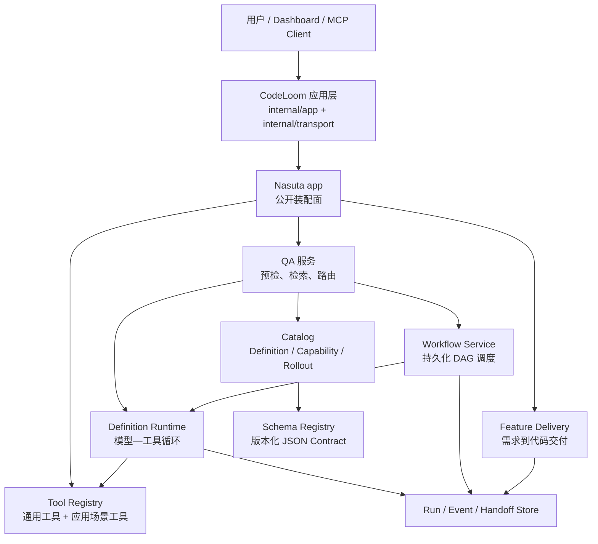
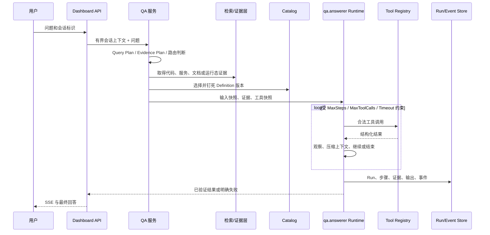
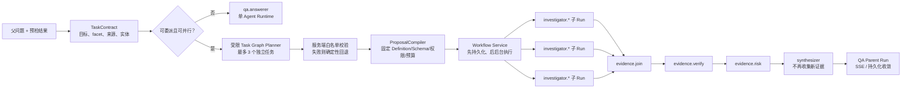
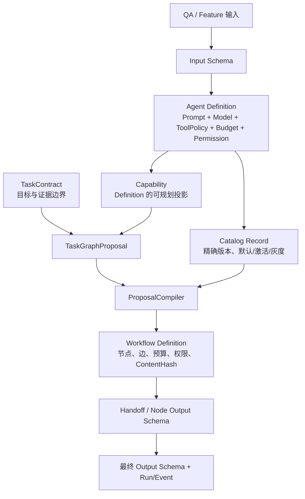
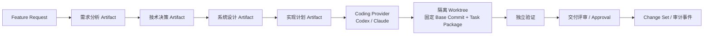

# Agent 编排、协作与契约（当前实现总览）

> **状态：当前实现**  
> **更新日期：2026-08-16**  
> **范围：** CodeLoom 是应用装配层，Nasuta 是可复用 Agent 平台。本文描述本仓库当前运行时行为；被索引的业务知识库内容不属于本文架构范围。

本文梳理系统中有哪些 Agent 链路、单/多 Agent 如何编排、父问题如何分发为子任务，以及 `Catalog`、`Workflow` 和各类合同如何把整个链路连接起来。

## 1. 结论先行

1. **CodeLoom 不维护第二套 Agent 内核。** 它负责环境、应用组装、Dashboard/MCP/REST 和场景工具注册；Agent Runtime、Schema、Catalog、Workflow、Run 持久化属于 Nasuta。
2. **“父 Agent fork 子 Agent”不是模型的自由递归能力。** QA 服务先做预检；仅在只读、存在多个独立且可并行的调查能力等条件成立时，服务端才会生成并执行多 Agent DAG。
3. **子 Agent 不共享可变聊天上下文，也不直接对话。** 它们从有界 `TaskContract` 接收自己的任务投影，输出受 Schema 验证；协作只通过持久化 Handoff、证据账本和 DAG 边发生。
4. **`Catalog` 定义“什么可以运行”，`Workflow` 定义“何时、依赖和并发怎样运行”，`Definition Runtime` 执行“模型—工具—观察—回答”循环。** 三者职责不可互换。
5. **最终回答不是拼接子回答。** 调查报告先汇合为证据视图，再做验证和风险判断，最后由无工具的 `synthesizer` 基于已准入证据输出答案。

## 2. 组件与所有权

| 层次 | 当前职责 | 不负责什么 |
|---|---|---|
| CodeLoom | 环境配置、应用组合、HTTP/SSE/MCP、Observe/Apollo 等场景工具注册、前端展示 | 不绕过 Nasuta 公共面，不复制 Agent 编排逻辑 |
| Nasuta `app` | 装配 QA、Catalog、Workflow、Feature Delivery、存储和恢复任务 | 不拥有客户系统的业务适配策略 |
| QA 服务 | 问题预检、证据计划、检索、单/多 Agent 路由、父 Run 收敛 | 不让模型自行决定权限、预算或 DAG 安全边界 |
| Catalog | 发布、选择和快照 Agent Definition/Capability | 不调用模型，也不调度节点 |
| Definition Runtime | 执行一个 Definition 的 LLM/工具循环 | 不决定是否拆分问题 |
| Workflow | 编译、持久化、恢复、调度 DAG、汇合节点结果 | 不允许模型绕过编译策略创建高权限节点 |
| Feature Delivery | 需求产物、Coding Provider、Worktree、验证、评审、审计 | 不把 QA 对话直接变成代码写入 |

## 3. Agent 链路总览

| 链路 | 触发入口 | 运行形态 | 终态产物 |
|---|---|---|---|
| 标准 QA | Dashboard `POST /api/qa/ask`（SSE） | 一个 `qa.answerer` Definition Runtime | 已验证回答、引用、Run/Event |
| 委派调查 QA | QA 路由判定任务可拆且可并行 | Workflow 内多个调查子 Run + 合成 | `investigation.answer`、证据状态、父/子 Run 关联 |
| Feature Delivery | 研发任务 API / 工作台 | 分阶段 Artifact + Coding Runner + 独立验证/评审 | Artifact 谱系、Change Set、审计和交付状态 |

### 3.1 标准 QA：单 Agent 执行链路

实际动作如下：

1. Dashboard 层加载当前会话的有界对话，创建或关联 QA Parent Run。
2. QA 预处理把问题规范化为 Query Plan，推导实体、回答方式、必需证据 facet、来源和新鲜度要求。
3. 检索层收集代码、服务、Runbook、运行态、Web 或已准入记忆。证据来源会影响允许的能力，但不会单独决定是否多 Agent。
4. Catalog 选择 `qa.answerer` 的精确版本；Runtime 同时固定输入/输出 Schema、Prompt、Model、预算、权限和工具快照。
5. Runtime 执行模型循环：编译消息、调用 Provider、执行可见工具、记录观察、在边界内继续。
6. 结束时 Runtime 为最终回答保留时间；常规循环未产生结论时，可进入仍受 Answer Contract 约束的 forced conclusion。
7. 最终输出必须通过 Definition 的输出 Schema。字符串答案被编码成 JSON 字符串；结构化对象必须是合法 JSON 或单一 JSON fence。

### 3.2 委派调查：多 Agent 链路

多 Agent 是 QA 的受限执行路径，不是所有问答的默认行为。

#### 3.2.1 是否允许拆分

`assessExecution` 根据 `TaskContract` 的目标结构路由，而不是仅仅看问题来自代码、日志还是 Web。当前只有在以下性质同时满足时才进入委派路径：

- 多 Agent 功能和 Workflow 运行时可用；
- 任务只读，写能力不参加调查分支；
- 至少两个独立调查能力可以覆盖所需证据；
- 任务可并行，不存在必须先完成的串行依赖；
- 调用方、Workflow 与 Capability 的权限、预算、并发限制都可满足。

不满足时系统退回单 Agent 路径，不通过放宽权限、虚构子任务或静默替换 Provider 来“凑出”并行执行。

#### 3.2.2 父问题如何分发为子问题

父任务不会把整段原始会话复制给每个子 Agent。子任务分发有四层边界：

| 层次 | 负责者 | 子 Agent 实际获得 | 模型不能决定 |
|---|---|---|---|
| 任务合同 | QA 服务 | 有界目标、实体、调查目标、证据目标、来源、新鲜度、最小覆盖度和已准入证据 | 权限、工具、模型、并发 |
| 能力筛选 | 服务端 | 与 facet/来源匹配的允许 Capability 集合 | 创建任意新能力或跨来源越权 |
| 任务草图 | 快速规划模型 | `purpose`、`capability`、`evidence_goal_ids`、空 `depends_on` | 任务 ID、工具、Schema、预算、Provider、重试、汇总节点 |
| 编译绑定 | `ProposalCompiler` | 钉死后的 Agent 节点和边 | 放宽权限、预算或写安全；增加未注册节点 |

原始用户问题只保留在 QA Parent Run，不会复制到子 Agent。TaskContract 只传递受 token 预算限制的目标投影；Planner 和每个子 Agent 都基于该投影、任务指令和已准入证据工作。当前 Planner 是一轮并行调查：最多三项任务，`depends_on` 必须为空。它只能从允许 Capability 中挑选覆盖必需证据目标的最小有效集合。模型草图不能解析或未通过白名单验证时，服务端使用确定性的能力覆盖算法生成受同样约束的回退草图。

默认 Capability 的分工如下：

| Capability | 绑定的 Definition | 适用职责 |
|---|---|---|
| `knowledge.code.inspect` | `investigator.code` | 源码实现、符号、API、调用路径 |
| `knowledge.service.trace` | `investigator.runtime` | 服务拓扑、依赖、入口和运行操作 |
| `knowledge.docs.verify` | `investigator.docs` | Runbook、系统文档和文档覆盖度 |
| `knowledge.web.research` | `investigator.web` | 经配置 Web Provider 取得当前公开证据 |
| `knowledge.memory.recall` | `investigator.memory` | 已被 TaskContract 准入的有界记忆 |
| `evidence.semantic.verify` | `delegation.verifier` | 基于引用证据消解语义冲突 |
| `evidence.synthesize` | `synthesizer` | 基于已准入证据生成最终答案 |

#### 3.2.3 Workflow 如何执行“fork”

编译后的 DAG 才是可执行的分叉定义。默认只读调查图 `delegated.investigation` 包含并行调查、证据汇合、验证、风险闸门和合成；动态任务图也遵守相同的编译与调度规则。

1. `Workflow Service.Start` **先持久化** Run、Definition 快照和输入 Handoff，再用脱离 HTTP 请求的 context 后台执行。因此浏览器断开 SSE 不会让已接收的工作流中断。
2. 执行器按拓扑关系寻找 ready node，并按 wave 同时派发。Workflow 的 `MaxParallelism` 与每个 Capability 的 `MaxConcurrency` 共同限流。
3. 每个 `agent` 节点都启动独立子 Run，使用精确 `DefinitionRef`、`CapabilityRef`、输入/输出 Schema、可见工具白名单、权限和节点预算；它不是父 Agent 的共享 goroutine。
4. 节点失败按 Retry Policy 处理。默认调查图采用 `collect_available`：可选分支失败不会阻止已有证据进入汇合；required 边、验证失败或风险闸门仍可阻止最终合成。
5. 子 Run ID、父 Run ID、Workflow Run ID、节点 ID、轮次和尝试次数都进入统一 execution trace，最终回答可以反查每个分支。

#### 3.2.4 子结果怎样合作和收敛

子 Agent 的协作是有边界的证据管道，而不是自由文本协商：

1. 子 Agent 输出 `investigation.report`，其中的 claim、引用和证据单位通过 Schema。
2. `evidence.join` 将报告合并为 `investigation.bundle`；证据账本按稳定 identity 去重并记录冲突，而不是字符串拼接。
3. `evidence.verify` 在有界 payload 内检查 required/high-risk 目标、引用和冲突，输出 `investigation.verified_bundle`。
4. `evidence.risk` 只允许通过或要求澄清，阻止证据不足或风险未解决的内容被伪装为完整结论。
5. `synthesize` 读取 verified bundle，输出 `investigation.answer`。其工具白名单为空，避免合成阶段偷偷进行未审计的调查。
6. 父 QA Run 收敛最终文本、证据状态、delegation adoption、错误码和事件，并通过 SSE/查询接口对外提供。

## 4. Runtime 和 Workflow 的动作集合

### 4.1 一个 Agent Run 的循环动作

| 动作 | 执行者 | 输入/输出边界 |
|---|---|---|
| 准备 | Definition Runtime | 解析 Definition、输入、Schema、工具 Snapshot、Budget 和会话消息 |
| 生成 | LLM Provider Dispatcher | 仅使用 Definition 的 Provider/Model；已配置 Provider 失败会显式报错 |
| 工具调用 | Tool Executor | 工具名、参数 Schema、可见范围、权限和写策略由 Snapshot/Definition 限制 |
| 观察 | Runtime + Evidence Ledger | 记录工具结果、步骤和证据单位，压缩为可用上下文 |
| 继续 | Runtime | 受 `MaxSteps`、`MaxToolCalls`、上下文窗口和总超时约束 |
| 收束 | Runtime | 预留 answer reserve；forced conclusion 仍须满足 Answer Contract |
| 验证与映射 | Definition Result Mapper | 验证输出 Schema，映射公开 `RunResult`、文本、结构化输出、引用和失败语义 |
| 记录与通知 | Run Store / Hub | 持久化步骤和终态，SSE 推送运行事件 |

### 4.2 Workflow 节点种类

`Workflow` 是通用 DAG 内核。以下是当前 `NodeKind` 的含义；具体流程是否使用由编译策略决定。

| 节点 | 作用 | 当前委派调查中的位置 |
|---|---|---|
| `agent` | 用精确 Agent Definition 执行有界任务 | 调查分支和 `synthesizer` |
| `join` | 以 payload list 或 evidence view 汇合多个前驱 Handoff | `evidence.join` |
| `verifier` | 验证冲突、required/high-risk 目标和引用 | `evidence.verify` |
| `gate` | 根据策略决定允许继续、拒绝或要求澄清 | `evidence.risk` |
| `transform` | 由服务端 dispatcher 执行确定性转换 | 通用节点，是否采用取决于流程定义 |
| `human_approval` | 进入等待人工状态，恢复后继续 | 通用节点，用于需要人工确认的流程 |

## 5. 连接全链路的合同与契约

| 契约 | 生产者 → 消费者 | 关键约束 | 解决的问题 |
|---|---|---|---|
| `SchemaDefinition` / `SchemaRef` | Catalog/调用方 → Runtime、Workflow、Tool | JSON Schema、ID、版本、内容哈希、显式兼容 | 防止不兼容输入/输出跨边界传播 |
| `agent.Definition` | Catalog → Definition Runtime | Prompt、输入/输出 Schema、Model、Tool Policy、Budget、Permission | 把模型执行冻结为可审计声明 |
| Catalog Record / Rollout | 管理 API/持久化 → 选择器 | Definition 不可变；默认、激活和灰度元数据可变 | 新旧版本并存时运行中 Run 继续使用原快照 |
| `Capability` | Catalog → QA Planner / Compiler | Agent、Schema、facet、工具、权限、副作用、并发、启用状态 | Planner 看到受控能力，不接触内部实现细节 |
| `TaskContract` | QA 预检 → Planner / 子 Agent | 问题、实体、调查/证据目标、来源、新鲜度、覆盖度 | 把父问题分成可验证子问题，不传无限会话历史 |
| `TaskGraphProposal` | Planner → ProposalCompiler | 仅有限任务字段；当前单轮并行无依赖 | 模型提供语义分工，但不拥有系统控制权 |
| `Workflow Definition` | Compiler → Workflow Service | 节点、边、Schema、重试、权限、预算、ContentHash | 将草图变为可验证、可恢复的执行计划 |
| Tool Snapshot | Tool Registry → Runtime | 工具定义、参数/返回契约、可见范围、版本快照 | 防止工具表变化使同一 Run 行为漂移 |
| Handoff / Evidence Unit | 上游节点 → 下游节点 | 输出 Schema、载荷上限、来源、证据 identity、冲突记录 | 让协作基于已验证产物，而不是共享无界上下文 |
| Run / Event / Trace | Runtime/Workflow → 前端、恢复器 | Parent/Child/Workflow 关联、状态、步骤、时间、错误码 | 为流式展示、取消、恢复和审计提供同一事实来源 |

### 5.1 `Catalog`、`Workflow` 与 Runtime 的边界

| 问题 | Catalog | Workflow | Runtime |
|---|---|---|---|
| 什么 Agent 可以运行？ | 发布、激活、默认/灰度选择 Definition 和 Capability | 不决定 | 执行已选择版本 |
| 使用哪个模型、Prompt、工具、权限？ | Definition 固化；Capability 只暴露受控投影 | 只能在节点层收紧 | 用快照实际调用 |
| 是否拆分任务？ | 提供候选能力 | 接收编译后的图 | 不负责 |
| 子任务依赖、并发、重试？ | 不负责 | DAG 边、wave、限流、Retry、Failure Policy | 只执行当前节点 |
| 输出如何汇合？ | 不负责 | Join、Verifier、Gate、Handoff | 产生节点输出 |
| 怎样恢复半途任务？ | 保留可解析 Definition 快照 | 持久化 Workflow 进度并恢复 | 恢复单个 Run 的执行边界 |

一句话概括：**Catalog 是能力与版本的注册表，Workflow 是依赖和生命周期的调度器，Runtime 是模型和工具的执行器。**

## 6. Feature Delivery：并列的 Agent 交付链路

Feature Delivery 与 QA 共享证据、结构化输出、Provider 显式分发、持久化和审计原则，但不是“让 QA Agent 直接改代码”。

- 每个阶段产生不可变 Artifact，并有输入、输出、证据、Prompt、质量门和谱系合同。
- Coding Runner 通过显式 Provider dispatcher 调用配置的 Provider；缺凭据或执行失败返回明确错误，不能自动换 Provider。
- 代码在受限 Worktree 和固定基线提交上执行，任务包、网络、命令和验证都受配置与审计控制。
- 实施后必须经过独立验证和交付评审；写行为不会从 QA 的只读调查 Workflow 越界获得权限。

## 7. 可观测性、取消和恢复

1. Agent 子 Run、QA Parent Run、Workflow Run 和节点执行共享关联 ID；trace 包含 child run、节点、轮次、尝试和调度 wave。
2. Dashboard 通过 SSE 读取运行事件；查询接口使用持久化且有界分页的 Run/Event 记录，不依赖浏览器内存作为唯一事实来源。
3. 单 Agent Run 支持暂停、恢复、取消和 nudge；QA Parent 调查工作流支持取消。
4. Workflow 的输入和进度先持久化，平台启动时扫描并恢复活动 Workflow/QA Parent；恢复继续使用历史 Run 固定的 Definition/Schema 快照。
5. 取消、预算耗尽、工具调用耗尽、输出验证失败、验证失败和需要澄清都以明确状态/错误码记录，不伪装成成功回答。

## 8. 扩展一个调查 Agent 的正确路径

不要只在 Prompt 中让现有 Agent “扮演”一个新角色。新增可规划能力应完成以下闭环：

1. 在 Schema Registry 定义版本化输入/输出 Schema，并声明必要兼容关系。
2. 创建并 `Prepare` Agent Definition，明确 Prompt、模型、工具白名单、预算和最小权限。
3. 在 Catalog 发布 Definition；如需参与任务分发，再创建绑定该 Definition 的 Capability，声明 facet、来源新鲜度、副作用、并发和重试安全性。
4. 让 QA 能把该能力映射到 `TaskContract` 中的证据目标；Planner 只能从此白名单选择。
5. 扩展 Compilation Policy/Workflow 模板，保证节点输入输出、Join、Verifier、Gate 和失败策略的 Schema 连续性。
6. 为 Definition、Capability、Proposal 编译、节点执行、恢复和输出 Schema 添加测试，并更新本目录相关设计文档。

## 9. 关键不变量

- 模型输出、工具参数、Handoff 和公开输出都经过版本化 JSON Schema；结构化对象不能以自然语言替代。
- Provider、工具和 Capability 使用显式 dispatcher；已配置 Provider 失败必须可见，不能静默替换。
- 父任务无法通过 Prompt 给子 Agent 新权限；权限、工具、预算和并发只能由服务端固定或收紧。
- 多 Agent 调查当前只读；写操作必须走 Feature Delivery、Approval 等专门边界。
- 子 Agent 仅通过合同和已验证证据协作；最终合成不得引入未记录的新调查。
- Workflow Definition 和 Agent Definition 都以版本与内容哈希固定运行快照，运行中的行为不随配置热更新漂移。

## 10. 代码导航

| 主题 | 主要实现 |
|---|---|
| CodeLoom 应用装配 | `codeloom/internal/app/app.go`、`codeloom/internal/runtime` |
| Dashboard QA 入口、SSE、Run 控制 | `Nasuta/internal/transport/dashboard/qa.go` |
| QA 预检、路由和任务图规划 | `Nasuta/internal/agent/qa/route.go`、`Nasuta/internal/agent/qa/task_graph_plan.go` |
| 公共 Agent/Schema 契约 | `Nasuta/agent/definition.go`、`Nasuta/agent/schema.go`、`Nasuta/agent/workflow.go` |
| Catalog、默认 Definition 与 Capability | `Nasuta/internal/agent/catalog` |
| 单 Agent Runtime 与工具循环 | `Nasuta/internal/agent/definition`、`Nasuta/internal/agent/execution` |
| Workflow 模型、编译、调度和恢复 | `Nasuta/internal/agent/workflow`、`Nasuta/app/qa.go`、`Nasuta/app/server.go` |
| 默认只读调查 DAG | `Nasuta/internal/agent/workflow/investigation.go` |
| Feature Delivery | `Nasuta/internal/feature`、`Nasuta/app/feature_delivery.go`、[10-feature-delivery.zh-CN.md](10-feature-delivery.zh-CN.md) |

继续阅读：

- [架构、执行流与 Run 收敛](01-architecture-and-execution.zh-CN.md)：单 Run 生命周期、超时、流式输出与失败语义；
- [证据规划、工具与运行时调查](02-evidence-and-tooling.zh-CN.md)：Evidence Plan、工具选择和运行时证据；
- [上下文、会话与工具结果](04-context-session-and-tool-results.zh-CN.md)：会话压缩、上下文和工具结果边界；
- [Workflow 编排入门](19-workflow-orchestration-beginner-guide.zh-CN.md)：DAG 执行器、wave、重试和节点处理的逐步讲解。
