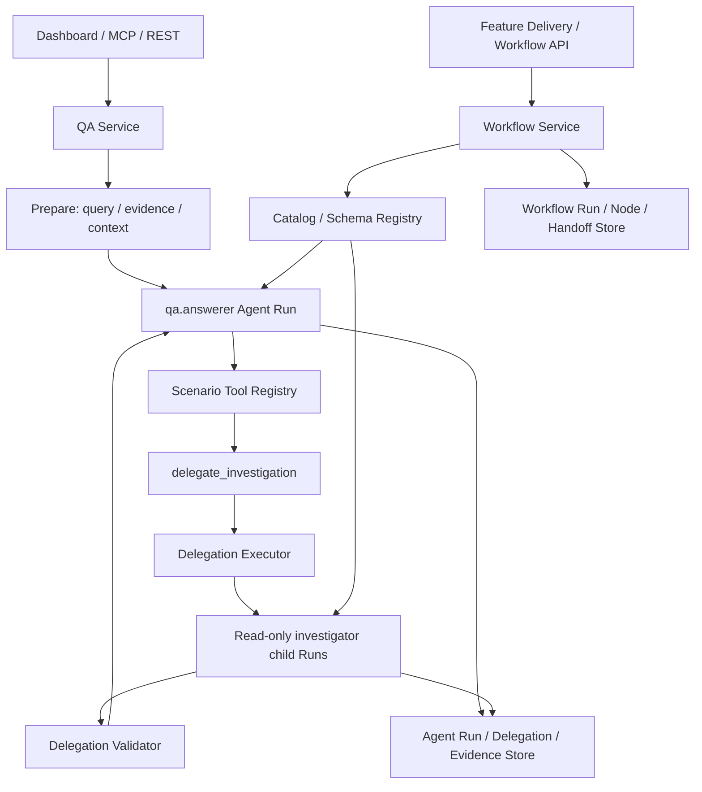

# Agent 编排、协作与契约（当前实现总览）

> **状态：当前实现**
> **更新日期：2026-08-31**
> **范围：** 本文描述 Nasuta 当前的 Agent Runtime、QA 委派、Catalog、Run 持久化和通用 Workflow 边界。
>
> **已废弃的模型：** QA durable investigation run、旧 TaskGraphProposal、ProposalCompiler 和 `internal/agent/investigation` 包已经删除。文中“委派调查”指当前的 `delegate_investigation` 工具，不指旧的独立 Investigation 生命周期。

## 1. 结论先行

1. QA 请求始终启动一个普通的 `qa.answerer` Agent Run；服务端不会先创建一个 QA durable Workflow 再等待另一个 coordinator。
2. 当父 Agent 判断需要并行只读调查时，它可以调用 `delegate_investigation`。该工具由服务端注册，模型不能替换它的 Schema、Capability allowlist、权限或预算。
3. 每个 delegated child 都是一个普通 Agent Run，有自己的 Definition/Capability 快照、上下文投影、Run limits、步骤、LLM usage、报告 artifact 和证据 ledger。
4. `delegation.Executor` 负责 child 的 admission、并发、幂等重放、结算和事件；`delegation.Validator` 负责报告、claim、citation、冲突和 high-risk 结果的服务端验证。
5. `internal/agent/workflow` 是独立的通用持久化 DAG 引擎，提供 Definition、节点、Handoff、Retry、Budget、Approval、Gate 和 Recovery；它不是 QA 委派的隐藏实现。

## 2. 组件和所有权



| 组件 | 当前职责 | 明确不负责 |
|---|---|---|
| QA Service | 规范化问题、构建证据/上下文、advisory route、启动 parent Run | 不创建旧式 durable investigation workflow |
| Definition Runtime | 执行一个 Definition 的模型—工具—观察—回答循环 | 不决定是否创建 child，也不授予权限 |
| Catalog | 发布、选择、快照 Definition/Capability/Schema | 不直接调模型、不调度 child |
| Delegation Executor | 执行 bounded read-only child、并发、结算、artifact、验证接线 | 不执行通用 Workflow DAG |
| Delegation Validator | 校验 child reports、claims、citations、conflicts 和完整性 | 不进行新的检索或扩大证据范围 |
| Workflow Service | 通用 DAG 的编译前校验、持久化、调度、审批、恢复 | 不被 QA 的 `delegate_investigation` 路由隐式调用 |
| Run Store | 保存 Agent Run、步骤、usage、delegation task、artifact、evidence | 不用旧 investigation 表作为事实来源 |

## 3. 当前 QA 请求的完整链路

### 3.1 Prepare

`internal/agent/qa/prepare.go` 和相邻的 QA 文件负责：

- 规范化问题和 Run ID；
- 识别 Query Plan、Evidence Plan 和来源/时间范围；
- 加载有界会话历史、记忆和检索上下文；
- 计算可用工具、写入授权、high-risk 标记和 parent Run limits；
- 选择精确的 `qa.answerer` Definition/Schema/ContentHash。

准备阶段产出的上下文是有界且带 provenance 的。它会进入 parent Run 的 `ContextBlock`，而不是被无限复制给每个 child。

### 3.2 Advisory route

`internal/agent/qa/route.go` 会记录模型/检索 planner 的建议以及服务端的有效路径。当前有效路径只有普通 Agent Run：

```text
proposed strategy
  -> server assessment
       -> single_agent parent Run
            -> delegate_investigation（可选工具）
```

如果写操作被请求，或 delegation 未启用/工具未注册，系统会记录相应 downgrade reason；它不会为了“凑出”多 Agent 而创建虚假的 Workflow。

路由事件只是可观测性和策略结果，不能被理解为 `Workflow Service.Start` 的调用。

### 3.3 Parent Run

`internal/agent/qa/submission.go` 构造普通 `agentapi.RunRequest`：

- Definition 和 DefinitionHash 固定；
- Input、Messages、Context、Actor、Correlation 固定；
- ToolScope 只暴露当前场景允许的工具；
- `Policy` 记录 evidence required、evidence seeded、web research 等边界；
- 如果存在 `delegate_investigation`，通过 `delegation.WithParentContext` 注入 parent Run ID、权限、limits、high-risk、已准入 evidence 和 context index。

最终由 `ManagedRun.Execute` 在 goroutine 中执行，结束后由 QA 持久化 session turn、terminal 和异步 memory extraction。

## 4. `delegate_investigation` 当前实现

### 4.1 工具合同

实现：`internal/agent/delegation/tool.go`

工具输入只有有界的 `tasks` 数组，每个 task 主要包含：

- `capability`：必须来自服务端发布且 allowlist 允许的 capability；
- `objective`：有长度上限的子任务目标；
- `focus_facets`：必须属于 capability 的 facet 白名单；
- `evidence_refs`：只能引用 parent 已有的合法 evidence handle。

工具不是 planner API。模型可以选择当前白名单中的任务，但不能创建新 Capability、添加工具、指定 Provider、改变预算、设定 child 依赖或把写能力带入只读调查。

### 4.2 Child admission

`internal/agent/delegation/executor.go` 在执行前逐项检查：

1. delegation depth 和 child 数量；
2. objective、facet、evidence ref 的大小和格式；
3. Capability 是否存在、启用、allowlist 命中；
4. Capability 是否为 `RoleInvestigator` 且 `SideEffectNone`；
5. parent 权限与 capability 权限交集是否非空；
6. child Definition 是否可解析、输入/输出 Schema 是否匹配；
7. 重复 task 是否已出现；
8. child timeout、token、tool call、report、total budget 和 cost 是否可满足。

不通过的 task 会留下明确 rejected report/error code，而不是静默跳过。

### 4.3 并行和幂等

Executor 为每次工具调用生成稳定 delegation ID，为每个 task 生成稳定 child Run ID、report ID 和 artifact ID。相同 parent/delegation/task 可以从已结算记录 replay，不重复执行模型调用。

可执行 child 受全局 `MaxConcurrent` 和 capability slot 限制；每次 child 完成后先记录 usage 和报告 artifact，再 settle parent 的 delegation task。持久化失败会让 task 进入显式失败状态。

### 4.4 Evidence ledger 和验证

child 输出的 evidence units 会写入当前 Agent Run 的 evidence ledger。Executor 收齐报告后交给 `internal/agent/delegation/validator.go`：

- 验证报告 Schema、大小和 finding 数量；
- 检查 citation 是否指向本批或 parent 已准入的 evidence；
- 对同一 canonical identity 的 claim 去重和比对；
- 发现结构化冲突、缺少关键 citation、high-risk 结果或截断时，返回明确 validation reason；
- 将验证结果附到 `DelegationBatchResult` 和 parent tool result。

父 Agent 只能看到工具返回的 bounded result，并据此决定是否继续或回答。当前动态 QA 委派没有旧式“child delivered → durable investigation report → QA coordinator Await”的第二条生命周期。

## 5. Catalog 和默认角色

`internal/agent/catalog` 发布两类当前仍有用的内容：

- QA/Feature Delivery 所需的 Agent Definitions；
- delegation investigator、semantic verifier、synthesizer 等角色及其 Capability 映射。

`DefaultInvestigators` 生成的 investigator Definition 必须是只读的；`DefaultCapabilities` 再把 Capability 绑定到精确的 Agent、Schema、工具、权限、facet、freshness、并发和 retry policy。

注意：角色/Schema 名称中保留 `investigation.*` 是“证据调查报告”这一业务语义，不表示旧的 `internal/agent/investigation` durable 包仍然存在。当前 child 持久化走 `agent_runs` 和 delegation artifact/evidence 表。

## 6. 通用 Workflow 与 QA 的边界

如果代码路径出现以下调用，它属于通用 Workflow，而不是 QA 动态委派：

```text
workflow.NewService
workflow.Service.Start
workflow.RecoverWithObserver
workflow.WorkflowStore
workflow_runs / workflow_node_runs / handoff_artifacts
```

Workflow Definition 的执行顺序是：

```text
Prepare Definition
  -> Service.Start 持久化
  -> ready nodes / dispatch waves
  -> agent / join / verifier / gate / approval / transform
  -> Handoff 和 checkpoint
  -> terminal 或 recovery
```

通用 Workflow 还保留一个**与 QA 无关、范围很窄的持久化兼容窗口**：Catalog 读取在执行预算字段 `max_rounds`、`max_depth` 加入前发布的 Definition 时，会先校验原始 `content_hash`，再按安全上限执行（`max_rounds=1`、`max_depth=max_nodes`）。新发布的 Definition 缺少任一字段会直接被拒绝；该窗口的清理条件是所有存量 Definition 重新发布或显式终止后，删除 `preparePersisted`、`persistedWithoutExecutionLimits` 和对应的测试。不要把这段通用 Workflow 数据兼容误认为 QA Investigation 遗留。

当前 QA 代码的正确结论是：

```text
QA Ask -> prepareSingleRun -> normal Agent Runtime
                         └-> optional delegate_investigation
```

而不是：

```text
QA Ask -> TaskGraphProposal -> ProposalCompiler -> Investigation Coordinator
```

后者是已删除的历史路径。

## 7. 可观测性、错误和恢复

- Parent、child、delegation、tool invocation 和 evidence artifact 通过 Run/Correlation ID 关联。
- Dashboard 的 QA API 读取普通 Agent Run store 的 terminal、steps、usage、artifacts 和 evidence；没有额外的旧 Investigation projection。
- delegation events 会投影 child 创建、开始、验证、结算和 terminal 状态，便于在 parent stream 中嵌套展示。
- `agent.ErrBudgetExceeded` 是公共预算错误边界；预算错误会映射到 `budget_exhausted`，不再携带旧 package 名称。
- Parent 取消会传给 child；child timeout、rejection、persistence failure、validation failure 和 partial result 都有各自的状态/错误码。
- 普通 Agent Run 的恢复使用 `agent_runs`、steps、LLM calls 和 artifacts；通用 Workflow 的恢复单独使用 Workflow checkpoint。两者不能互相假设对方的表存在。

## 8. 代码导航

| 主题 | 主要代码 |
|---|---|
| QA prepare / route / submit | `internal/agent/qa/prepare.go`、`route.go`、`submission.go` |
| QA 服务生命周期 | `internal/agent/qa/service.go`、`runtime.go` |
| delegation tool / child executor | `internal/agent/delegation/tool.go`、`executor.go` |
| delegation validation | `internal/agent/delegation/validator.go`、`claims.go`、`report.go` |
| Agent Run 和 delegation persistence | `internal/agent/run/store.go`、`store_delegation.go`、`store_evidence.go` |
| 默认 Definition/Capability | `internal/agent/catalog/defaults_investigation.go`、`defaults_capability.go` |
| 通用 Workflow model/service | `internal/agent/workflow/model.go`、`service.go`、`service_execution.go` |
| 通用 Workflow executor/recovery | `executor_orchestration.go`、`executor_attempt.go`、`executor_budget.go`、`service_recovery.go` |
| 应用装配和 delegation 开关 | `app/qa.go`、`app/server.go` |
| 旧表清理 migration | `docs/sql/migration_remove_legacy_investigation_workflow_20260831.sql` |

## 9. Cleanup 后的不变量

1. QA 请求不会创建 `investigation_runs`、`investigation_events`、`investigation_leases` 或旧 `workflow_escalations`。
2. QA 请求不会调用旧 Proposal Compiler、Coordinator、Scheduler、Lease 或 Delivery API。
3. 动态委派只能创建有界的、只读的 investigator child Run。
4. Parent/child 的 Definition、Schema、Capability、工具、权限、预算和 evidence provenance 都可追溯。
5. 不完整、冲突、未授权引用或超限结果必须显式反映在 validation/terminal 中。
6. 通用 Workflow 的持久化 DAG 与 QA delegation 的 Run/Task/Artifact 持久化相互独立。

## 10. 阅读结论

> **当前 QA 不是一个隐藏的 durable investigation workflow。** 它是一个普通 Agent Run，必要时通过 `delegate_investigation` 做 bounded read-only fan-out，再把经过服务端验证的结果交还给父 Agent。
>
> `internal/agent/workflow` 仍然重要，但它是独立的通用 DAG 内核；只有看到明确的 Workflow API/Store 调用时，才应把一段代码当作 Workflow 执行链分析。
