# Agent 委派现状、超时语义与能力演进路线

> **状态：当前实现分析与后续建议**  
> **更新日期：2026-09-02**  
> **范围：** Nasuta 当前 QA Parent Agent、`delegate_investigation`、investigator Child Agent 的执行链路、预算与超时语义，以及后续应实现的能力。

## 1. 结论先行

当前 QA 多 Agent 仍然是“Parent 通过受控工具调用 Child”的 bounded manager-as-tool 架构，不是由 Coordinator 驱动的完整 durable investigation workflow。当前真实链路是：

```text
QA Ask（记录 requestStartedAt）
  -> request-entry deadline / QA Prepare
  -> qa.answerer Parent Agent Run
  -> Root budget gate（生产路径为 MySQL durable ledger）
  -> 普通 reason / tool / observe loop
  -> 可选 delegate_investigation
  -> canonical delegation/task identity
  -> capability / permission / evidence / objective 校验
  -> Root ReserveTask + DB ReserveDelegationBatch
  -> Parent checkpoint = pending
  -> 并行 Child attempt #1
  -> Child physical calls：ReserveCall -> actual Settle
  -> transient failure? bounded retry（复用同一 logical task grant）
  -> 最终 Child report / evidence / FlowIR artifact
  -> SettleDelegationTask + 释放未使用 grant
  -> checkpoint = completed / unavailable / interrupted
  -> 确定性校验 + 可选语义验证
  -> 有界结果返回 Parent
  -> Parent 继续执行
  -> Final answer / flow contract enforcement
```

截至 **2026-09-02**，预算、恢复、队列和输出契约已经从“设计建议”落到运行时：

- QA delegation 开启时，Parent 注入 `MaxTotalTokens`、`MaxCostMicros` 和 `ParentAnswerReserve`；
- 生产构造路径 `run.NewStore(db)` 为每个逻辑 Parent Run 创建 MySQL-backed Durable Root ledger，并将 Parent 直接模型调用纳入结算；同时为 Store 实例生成唯一 lease owner，Root 按 request deadline 自动 acquire lease、正常 Finish 自动 release，expired takeover 会回收未结算 reservation 并保留 settled usage；轻量 `run.Bind(db)` 仅用于测试/兼容绑定，保持进程内 gate；
- Child / semantic verifier admission 前从 Root 申请 task grant，物理模型调用通过 task reservation 结算，完成后释放未使用 grant；retry attempt 复用同一个 logical task grant，不重复扩大任务级预算；
- delegation attempt、Parent logical checkpoint、`parent_resume` queue 与 recovery worker 已形成恢复链路；启动恢复只 claim/入队，不在启动线程内直接调用模型；
- Child context 不携带可递归的 Root task gate，当前 `MaxDepth=1`，因此 Child 不能继续委派；
- `kind=flow` 已有 `RunOutputContract`、Mermaid 运行时校验/修复/安全 fallback、server-owned renderer 和 deterministic rendered-flow quality gate；
- Flow Child 可交接 bounded typed FlowIR；nodes/edges/protocol/sync mode/open hops/evidence state 具有 schema 与服务端校验，unknown verified ref 会降级为 unresolved；
- citation 已可解析为 bounded evidence lookup；Verifier 对 submitted claims 返回零 verdict 时会逐 claim 投影为 `unresolved`，不可用或 unresolved 结果会显式 warning；
- Parent answer reserve 已按 answer phase 保护，普通 reasoning、tool 和 Child grant 不能消耗这部分 token 余量；
- 已增加 Parent/Child budget integration tests 和 flow output contract tests。

仍未闭环的关键能力是：

1. **运营级 durable scheduler**：当前已有 queue、worker lease、heartbeat、fencing、expired re-dispatch 和 Parent durable join，但还没有 backpressure、显式 cancel、dead-letter、人工重放、队列 P95/P99 与告警闭环；
2. **更强的故障注入**：Docker MySQL 已验证两个独立 Store 实例的单 winner claim、stale fence 拒绝和并发 recovery；仍缺真实多进程 kill -9、网络分区、长时间 lease 抖动与压力 soak；
3. **Flow 产品语义**：subject 隔离、canonical renderer、claim/edge hard gate 和真实 Chrome 渲染已验证；overview schema、合法跨 subject 边和复杂前端主题兼容仍需产品化；
4. **自然语言证据语义**：manifest hard gate 能阻止 unknown/state upgrade/uncited supported claim，但不能替代句子与 evidence body 的 NLI/语义蕴含证明；
5. **端到端 telemetry/evaluation**：仍需拆分 queue wait、claim latency、child runtime、settlement、Parent resume 和 answer quality 的 SLO。

在这些能力完成之前，不建议优先引入 peer-to-peer 协作、递归委派、复杂 DAG DSL 或共享可变 Agent State。

---

## 2. 当前真实架构

### 2.1 当前 QA 主链路

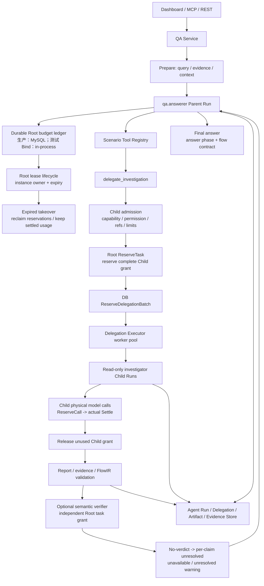

QA 当前入口始终是普通 `qa.answerer` Agent Run：

```text
QA Ask
  -> prepareSingleRun
  -> qa.answerer Agent Runtime
  -> optional delegate_investigation
```

QA 当前不会先创建以下历史路径中的对象：

```text
TaskGraphProposal
ProposalCompiler
Investigation Coordinator
investigation_runs
investigation_leases
旧 workflow escalation
```

通用 `internal/agent/workflow` 仍然存在，但它是独立的 DAG / workflow 执行能力，当前 QA delegation 不会隐式调用它。

### 2.2 关键组件职责

| 组件 | 当前职责 | 当前不负责 |
|---|---|---|
| QA Service | 规范化问题，准备证据和上下文，启动 Parent Run | 不创建旧式 durable investigation workflow |
| Definition Runtime | 执行一个 Definition 的模型—工具—观察—回答循环 | 不决定是否委派，也不授予权限 |
| Catalog | 发布和快照 Definition、Capability、Schema | 不直接调度 Child |
| Delegation Tool | 向 Parent 暴露受控的 `delegate_investigation` | 不允许模型指定任意模型、Provider、Tool 或预算 |
| Delegation Executor | Child admission、并发执行、幂等、settlement、artifact 和验证接线 | 当前不是通用 DAG Scheduler |
| Delegation Validator | 校验 report、claim、citation、冲突、完整性和 high-risk 结果 | 不扩大证据范围，不主动重新检索 |
| Run Store | 持久化 Agent Run、Step、Usage、Delegation、Attempt、Checkpoint、Artifact、Evidence、Root ledger 和 durable work item；负责 owner/expiry/fence、recovery claim、queue lease 与 fenced terminal write | 不负责通用 DAG 编排，也尚未提供 queue backpressure、dead-letter、人工重放、运营 SLO 或自然语言语义证明 |
| Workflow Service | 通用 DAG、节点调度、checkpoint、approval、recovery | 当前不是 QA delegation 的隐藏实现 |

---

## 3. `delegate_investigation` 的执行链路

### 3.1 Parent 调用工具

工具定义位于：

```text
/Users/dequan.mac/agent-workspace/Nasuta/internal/agent/delegation/tool.go
```

输入是有界的：

```text
capability
objective
focus_facets
evidence_refs
```

服务端约束包括：

- 至少一个 task；
- `MaxChildren` 控制最大 Child 数量；
- objective 最大 2000 bytes；
- facets 最多 10 个；
- evidence refs 最多 20 个；
- `additionalProperties=false`；
- capability 使用服务端 enum；
- 模型不能指定 model、provider、tool、budget 或 dependency；
- 工具隐藏于 MCP 暴露面；
- 工具描述鼓励一次提交独立的 bounded read-only batch。

工具描述上虽然鼓励 Parent 一次提交 batch，但代码并没有完全禁止 Parent 后续再次调用。后续调用仍会受到累计的 `MaxChildren` 和 delegation aggregate budget 限制。

### 3.2 Child admission

`Delegation Executor` 会对每个 task 做准入检查，主要包括：

1. delegation depth；
2. Child 数量；
3. objective 格式和大小；
4. capability 是否存在和 enabled；
5. capability role 是否为 investigator；
6. side effect 是否为 none；
7. server allowlist；
8. facet allowlist；
9. evidence / context ref 是否属于 Parent；
10. task 是否重复；
11. Definition 是否可解析；
12. Parent permission 与 capability permission 的交集；
13. Child context projection；
14. input token estimate；
15. Child limits；
16. 稳定的 Child、report、artifact ID。

被拒绝的 task 会持久化为 rejected report，不会静默跳过。

### 3.3 Reservation、并发和幂等

当前 delegation 已有数据库 reservation / settlement 机制：

```text
ReserveDelegationBatch
  -> lock Parent Run
  -> 检查 Parent 状态
  -> 统计 settled usage
  -> 统计 outstanding reservation
  -> 检查新 reservation
  -> 检查 MaxChildren / aggregate tokens / aggregate cost
  -> 原子插入 reservation
```

Child 并发执行大致为：

```text
workers = min(MaxConcurrent, len(tasks))
```

同时存在 capability-level in-process slot。

稳定 ID 关系为：

```text
delegationID = hash(parentRunID, toolInvocationID)
childRunID = hash(parentRunID, delegationID, taskIndex, capabilityHash, objectiveHash)
reportID / artifactID = stable hash
```

已 settlement 的 task 可以 replay 而不重复调用模型，这是当前实现中很重要的基础。

### 3.4 Child 执行和结果返回

Child 仍然通过同一个 Runtime 执行：

```go
agentapi.Runtime.Run
```

Child 完成后的链路是：

```text
RunResult
  -> projectReport
  -> boundReport
  -> report artifact（可含 typed FlowIR）
  -> evidence ledger artifact
  -> SettleDelegationTask
  -> merge evidence ledger
  -> Validator.Validate
  -> optional semantic verifier
  -> DelegationBatchResult
```

Child 的 ToolScope 明确排除：

```text
delegate_investigation
```

并且应用侧固定：

```text
MaxDepth = 1
```

因此当前 Child 不能递归委派。

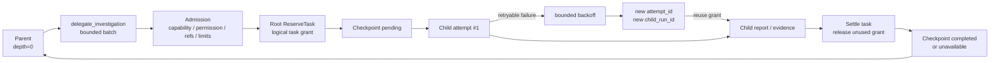

---

## 4. Parent 和 Child 的差异

| 维度 | Parent | Child |
|---|---|---|
| 入口 | QA Service | delegation tool + Executor |
| Definition | `qa.answerer` | investigator Definition |
| 目标 | 用户最终问题 | bounded investigation |
| 控制权 | 保留最终答案控制权 | 只返回 report / evidence |
| Context | QA history、retrieval、memory、当前上下文 | Parent 投影后的最小上下文 |
| Tools | QA 场景工具，可包含 delegation | capability 工具，只读 |
| Permission | QA policy 后的权限 | Parent permission ∩ capability permission |
| Depth | 0 | Parent depth + 1，当前最多 1 |
| 输出 | 用户可见自然语言或结构化答案 | bounded `DelegationReport`，flow 任务可含 typed `FlowIR` |
| 失败影响 | 可能影响整个 QA | 通常表现为 partial / unavailable evidence |
| 是否可继续委派 | 可以 | 当前不可以 |
| 生命周期 | Agent Run + QA turn | Child Run + Delegation Task + Artifact |
| 并发 | 普通 Parent loop | Executor worker pool |
| 验证 | 最终答案和 evidence | report、claim、citation、conflict |
| 恢复 | Parent checkpoint、`parent_resume` work item 与 recovery worker 已形成自动 resume 基础闭环；恢复沿用原始 `StartedAt` / absolute deadline | attempt、work item、lease/fence、interrupted artifact 已持久化；expired lease 可重派，stale writer 被拒绝；多进程故障注入和长期 soak 仍待验收 |

两者的执行引擎相同：

- 都使用 `agentapi.Runtime.Run`；
- 都经过 reason / tool / observe loop；
- 都有 Definition、Schema、Tool snapshot；
- 都记录 Run、Step、LLM call、Usage、Artifact；
- 都受 deadline、step、tool、token、cost 约束。

核心区别不是 Runtime，而是：

```text
入口
Definition
Context
ToolScope
Permission
Limits
Output Contract
Lifecycle
```

因此当前架构是：

```text
相同执行引擎
+ 不同安全边界和运行契约
```

---

## 5. 当前预算模型

### 5.1 Definition Budget 与 Run Limits

Definition 提供上限，Run 可以进一步收窄：

```text
Definition Budget
  - timeout
  - max steps
  - max tool calls
  - context tokens
  - max tool result bytes
  - max continue rounds
  - model max output tokens
  - input/output price

Run Limits
  - deadline
  - max steps
  - max tool calls
  - max input tokens
  - max context tokens
  - max total tokens
  - max cost
```

### 5.2 当前默认 delegation policy

当前默认值位于：

```text
/Users/dequan.mac/agent-workspace/Nasuta/platform/config/platform.go
```

| 配置 | 当前默认值 |
|---|---:|
| `DelegationEnabled` | `true` |
| `MaxDepth` | `1`，应用侧固定 |
| `MaxChildren` | `6` |
| `MaxConcurrent` | `3` |
| `ChildTimeout` | `150s` |
| `MaxChildTurns` | `4` |
| `MaxChildToolCalls` | `16` |
| `MaxChildInputTokens` | `96,000` |
| `MaxChildOutputTokens` | `16,000` |
| `MaxReportTokens` | `4,000` |
| `MaxTotalTokens` | `720,000` |
| `MaxTotalCostMicros` | `0`，当前不启用 aggregate cost 上限 |
| `ParentAnswerReserve` | `4,000 tokens` |

如果按普通（非 `kind=flow`）Child 的 policy 上限计算，理论上的**最坏预留**是：

```text
单 Child grant = 96,000 input + 16,000 output = 112,000 total tokens
6 Child grants = 672,000 tokens
Parent answer reserve = 4,000 tokens
理论最低 headroom = 720,000 - 672,000 - 4,000 = 44,000 tokens
```

但这不是每次请求的固定消耗，原因是：

- `prepareTask` 会先检查 Child context/input estimate；
- Child `RunLimits` 还会受 investigator Definition 的 step、tool、model output 上限收窄；
- `kind=flow` 会把 Child 限制进一步收窄为最多 2 turns、6 tool calls、8,000 output tokens、2,000 report tokens；
- Root 还要为 Parent 直接模型调用和 verifier 保留容量；
- actual provider usage 可能小于 estimate，完成时未使用 grant 会释放回 Root；
- `MaxOutputTokens` 只是单次调用 ceiling，不参与累计 output 的独立相加。

这里的 `ParentAnswerReserve = 4,000 tokens` 是 token budget 中的答案预留，不要与时间上的 `DefaultAgentAnswerReserve = 30s` 混淆。

### 5.3 当前 Parent / Child 预算状态与边界

当前已不是“只有 Child pool 有预算”。当 delegation 开启时，QA 的 `parentRunLimits` 会把 delegation policy 中的 aggregate 限制注入 Parent Root：

```text
Parent Root limits
  - MaxTotalTokens      = 720,000
  - MaxCostMicros       = platform setting；默认 0 表示不限制
  - ParentAnswerReserve = 4,000 tokens
```

因此当前实际模型是：

```text
Root ledger
├── Parent direct physical model calls
├── admitted Child / verifier task grants
│   └── child physical model calls
└── settled actual usage
```

需要区分三个边界：

1. `MaxTotalTokens` 是一个请求级累计 total token 上限，当前 Parent 直接调用、Child 和 verifier 的物理调用都会通过 Root 结算；
2. `MaxCostMicros=0` 的默认配置仍表示 aggregate cost 不设硬上限，成本治理目前不完整；
3. `MaxOutputTokens` 是单次 provider call 的 output ceiling，不是累计 output budget；累计约束主要由 `MaxTotalTokens` 和每个 task grant 的 total 维度承担。

因此当前剩余的不对称不是 Parent 完全没有总预算，而是：

```text
Parent / Child / Verifier 已共享同一个 Root budget 抽象
生产路径已接入 MySQL Durable Root ledger
owner/expiry lease、heartbeat/renew、fencing、expired reservation reclaim 已接入
Root ledger 与 agent_runs 原子创建、owner-aware recovery 和真实 MySQL 双 Store 单 winner 已验证
剩余重点是默认 cost 治理、运营级 queue 控制、SLO 与故障注入
```

生产 `run.NewStore(db)` 会让 Definition Runtime 通过 `NewDurableBudget` 使用 MySQL ledger；`run.Bind(db)` 为测试/轻量绑定保留进程内实现。`NewDurableBudget` 使用 Store 实例唯一 owner acquire Root lease，并在运行期间 heartbeat/renew；reservation、settlement、checkpoint 和终态写入都携带 owner/fence 条件。Root ledger 与 `agent_runs` 在同一事务中创建，`RecoverInterrupted()` 仅 claim 无 owner 或 lease 已过期的 Root，并生成 `parent_resume` work item，由 recovery worker 在启动路径之外恢复 Parent logical loop。expired takeover 会回收 open call / active task reservation、清零 reserved usage并保留 settled actual usage。Docker MySQL 双 Store 测试已经验证单 winner、fence 递增和 stale completion 拒绝。当前预算账本的基础 P0 已闭环，但默认 cost 上限/价格版本、运营级 queue 策略、故障注入和 SLO 仍未完成，因此仍不能称为完整生产级 durable execution。

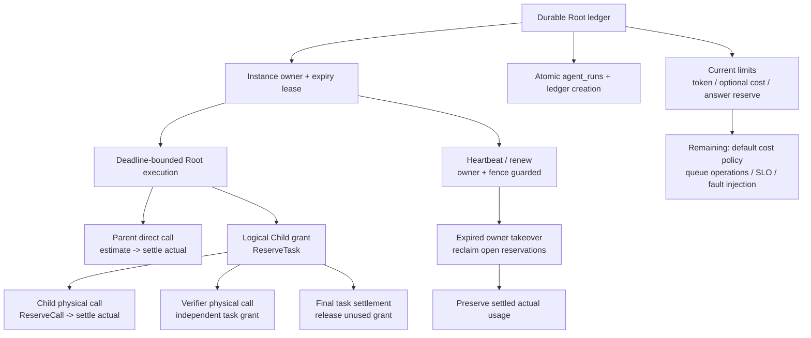

---

## 6. 当前超时语义

### 6.1 Parent 的完整 deadline

Parent 的 SLA deadline 在请求入口确定，而不是在第一次 LLM 调用或 `parentRunLimits` 计算时才开始。入口位于：

```text
/Users/dequan.mac/agent-workspace/Nasuta/internal/agent/qa/service.go
```

`QA Ask()` 先记录 `requestStartedAt`，随后 `initializePreparation` 将 `Definition.Timeout` 加到该入口时间，并与外部 context 中更早的 deadline 取最小值。核心语义可表示为：

```go
requestStartedAt := time.Now().UTC()
absoluteDeadline := requestStartedAt.Add(definition.Budget.Timeout)
```

因此：

```text
RequestStartedAt = QA Ask() 入口时间
ParentDeadline   = min(外部 context deadline, RequestStartedAt + Definition.Timeout)
```

`parentRunLimits` 不再重新启动计时；它只是沿用已经确定的 absolute deadline，并结合 Parent answer reserve、Child/Verifier 剩余预算等约束进一步收窄 `RunLimits`。planning、retrieval、conversation preparation 和 `Runtime.Execute` 共用同一个 prepared context。

实际链路是：

```text
QA Ask()
  ↓ 记录 requestStartedAt
initializePreparation
  ↓ request-entry deadline = requestStartedAt + Definition.Timeout
resolve definition / planner / retrieval / conversation preparation
  ↓ 共用 prepared.ctx；任一阶段消耗的时间都会计入 SLA
parentRunLimits
  ↓ 沿用并进一步收窄 absolute deadline，不重新计时
beginSingleRun
  ↓
Runtime.Execute
  ↓
Parent / Child / tool / LLM calls
```

对应代码形态：

```go
// 不应在 parentRunLimits 内重新以当前时间启动整个 SLA：
// Deadline: time.Now().UTC().Add(definition.Budget.Timeout)

// 应沿用请求入口已经确定的 deadline：
Deadline: requestStartedAt.Add(definition.Budget.Timeout)
```

所以 Parent timeout：

- 不是从第一次 LLM call 开始；
- 不是每一个 step 重新计时；
- 不是每次 tool call 重新计时；
- 也不严格等于 HTTP 请求刚进来那一刻；
- 而是从 QA prepare 中设置 `RunLimits` 的时刻开始形成一个绝对截止时间。

如果外部 request context 更早取消，则实际有效时间更短：

```text
EffectiveParentEnd = min(RequestContextDeadline, ParentRunLimits.Deadline)
```

### 6.2 Parent 的 reasoning/tool window 和 answer reserve

Runtime 在：

```text
/Users/dequan.mac/agent-workspace/Nasuta/internal/agent/execution/loop.go
```

中划分了两个时间窗口：

```text
runCtx  = 完整 Parent Run 窗口
loopCtx = runCtx - AnswerReserve
```

当前默认 Parent 时间 answer reserve：

```text
30 秒
```

配置位置：

```text
/Users/dequan.mac/agent-workspace/Nasuta/platform/config/platform.go
```

默认值：

```go
DefaultAgentAnswerReserve = 30 * time.Second
```

假设：

```text
ParentDeadline = 10:08:00
AnswerReserve  = 30 秒
```

则时间线为：

```text
10:00:00 ─────────────────── 10:07:30 ───────── 10:08:00
        reasoning / tools        final answer
```

因此 Parent 的工具调用和 delegation 最晚通常只能运行到：

```text
ParentDeadline - 30 秒
```

最后 30 秒保留给：

- 最终答案生成；
- 部分答案恢复；
- 强制结论；
- 结构化输出收尾。

### 6.3 Delegation tool 的 timeout

`delegate_investigation` 使用：

```text
/Users/dequan.mac/agent-workspace/Nasuta/internal/agent/delegation/tool.go
```

中的：

```text
tool.InheritCallerDeadline
```

其含义是：

```text
delegate_investigation 没有额外的 tool-level timeout
它直接继承 Parent 当前的 caller context
```

由于 Parent 在 `loopCtx` 中执行 tool call，所以 delegation tool 实际不能进入 Parent 最后的 answer reserve 窗口。

### 6.4 Child 的逻辑 deadline

Child limits 在：

```text
/Users/dequan.mac/agent-workspace/Nasuta/internal/agent/delegation/executor.go
```

中计算，逻辑上是：

```text
ChildDeadline = min(
    ChildStartTime + ChildTimeout,
    ParentDeadline,
    ChildDefinitionTimeout - 1ms,
)
```

当前默认：

```text
ChildTimeout = 150 秒
```

### 6.5 Child 的实际有效 deadline

Child 执行时还会使用 delegation tool 的 caller context：

```go
runCtx, cancel := context.WithDeadline(ctx, task.limits.Deadline)
```

所以实际有效截止时间是：

```text
EffectiveChildEnd = min(
    ChildTaskDeadline,
    CallerContextDeadline,
)
```

在当前 QA 链路中，CallerContext 是 Parent 的 `loopCtx`，因此通常可以近似为：

```text
EffectiveChildEnd = min(
    ChildStartTime + 150 秒,
    ParentDeadline - 30 秒,
)
```

这意味着 Child 虽然 policy 上有 150 秒，但如果它启动得比较晚，实际可能拿不到完整的 150 秒。

### 6.6 Child 的 15 秒 answer reserve

Child 进入 Definition Runtime 后，会使用较小的 answer reserve：

```text
Child answer reserve = min(Parent answer reserve, 15 秒)
```

因此理想情况下，Child 会在：

```text
ChildDeadline - 15 秒
```

之前完成调查和 tool calls，最后约 15 秒生成 report。

但这个 15 秒并不是脱离 Parent 的独立保证，因为 Parent 的外层 `loopCtx` 可能在 Child 自己的 deadline 之前取消它。

### 6.7 完整时间线示例

假设：

```text
Parent Definition.Timeout = 8 分钟
Parent AnswerReserve     = 30 秒
ChildTimeout             = 150 秒
Child AnswerReserve      = 15 秒
```

Parent 在 `10:00:00` 计算 deadline：

```text
Parent full deadline       = 10:08:00
Parent reasoning/tool end  = 10:07:30
```

#### Child 在 10:02:00 启动

```text
Child policy deadline      = 10:04:30
Parent reasoning/tool end  = 10:07:30
```

实际 Child 截止：

```text
10:04:30
```

#### Child 在 10:06:00 启动

```text
Child policy deadline      = 10:08:30
Parent full deadline       = 10:08:00
Parent reasoning/tool end  = 10:07:30
```

实际 Child 截止：

```text
10:07:30
```

因此 Child 实际只剩 90 秒，而不是 policy 中的完整 150 秒。

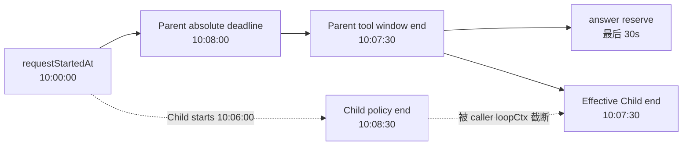

### 6.8 普通 Tool 与 delegation tool 的区别

普通 Tool 通常由：

```text
/Users/dequan.mac/agent-workspace/Nasuta/tool/executor.go
```

额外包一层 tool timeout：

```text
EffectiveToolEnd = min(ToolConfiguredTimeout, CallerDeadline)
```

而 delegation tool 使用 `InheritCallerDeadline`：

```text
EffectiveDelegationToolEnd = CallerDeadline
```

Child 自己还有一层 Child Run deadline，但它不能突破 CallerDeadline。

---

## 7. 当前 timeout 实现状态与剩余缺口

### 7.1 request-entry SLA 已接入：从 `Ask()` 入口开始计时

这部分已在当前实现中完成基础闭环：

```text
QA Ask()
  -> requestStartedAt = time.Now()
  -> initializePreparation()
  -> deadline = requestStartedAt + Definition.Timeout
  -> 若外部 ctx 更早到期，则取更早 deadline
  -> planning / retrieval / conversation preparation / Parent Runtime 共用 prepared.ctx
```

相关代码：

```text
/Users/dequan.mac/agent-workspace/Nasuta/internal/agent/qa/service.go
/Users/dequan.mac/agent-workspace/Nasuta/internal/agent/qa/prepare.go
```

因此，针对“超时时间是从主 Agent 启动还是从请求入口开始”的问题，当前语义是：**从 QA `Ask()` 入口记录 `requestStartedAt` 开始计算 Definition.Timeout；不是从第一次 LLM call 开始，也不是从 Parent Runtime 创建后重新计时。** 外部 request context 如果更早取消，仍以更早的取消时间为准。

`RunLimits.Deadline` 会继续传入 Parent Runtime；普通 tool / delegation tool 和 Child 都不能突破该 absolute deadline。accounting write 已使用 bounded cleanup context，durable read/claim 也有逐操作 `DurableIOTimeout`；worker lease/renew 已接入。当前仍需完善的是 queue wait 的运营 SLO、显式取消策略，以及 deadline 临近时的取消原因分类。

### 7.2 Child 持久化 deadline 可能晚于实际 caller context deadline

Child admission 计算时主要使用：

```text
Parent.Limits.Deadline
```

但 Child 实际执行时还受：

```text
Parent loopCtx deadline = ParentDeadline - 30 秒
```

约束。

因此可能出现：

```text
持久化 task.limits.Deadline 比实际可执行 deadline 更晚
```

当 Parent 的 loop window 结束时，Child 可能被映射成类似：

```text
parent cancelled
```

但真实原因其实可能是：

```text
parent reasoning/tool window exhausted
```

这会把以下两种情况混淆：

```text
用户主动取消 Parent
Parent 正常进入最终答案保留窗口
```

建议增加单独状态，例如：

```text
parent_tool_window_exhausted
```

---

## 8. 必须实现的能力：P0

### 8.1 Parent–Child hierarchical budget

**状态：Durable Root ledger、heartbeat/renew、fencing、Root/Run 原子创建、owner-aware recovery 与真实 MySQL 双 Store 并发验收均已完成基础 P0；剩余为默认 cost 治理和运营级可靠性。**

当前预算树为：

```text
Root QA Run Budget
├── Parent direct physical model calls
├── Parent final answer reserve
├── admitted logical Child task grant
│   ├── Child attempt #1 / retry attempts
│   ├── Child physical model calls
│   └── unused grant released on final settlement
├── semantic verifier task grant
└── settled actual provider usage
```

当前实际约束为：

```text
settled_actual_usage
+ parent_in_flight_call_estimates
+ unconsumed_child_and_verifier_grants
+ parent_answer_reserve_for_default_phase
<= root_budget
```

已经落地的行为：

- QA delegation 开启时 Parent 设置 `MaxTotalTokens`、`MaxCostMicros` 和 `ParentAnswerReserve`；
- 生产 `run.NewStore(db)` 为 Parent 创建 MySQL-backed Durable Root，并为 Store 实例生成唯一 lease owner；`run.Bind(db)` 仅保留测试/轻量绑定的进程内实现；
- Parent 直接模型调用、Child physical call、semantic verifier call 均通过 Root/task reservation 结算 actual usage；
- Child admission 先申请完整 logical task grant，retry attempt 复用该 grant，不因 retry 重复放大 logical task budget；
- task/call reservation 支持幂等 identity 校验、settlement、unused grant release，超出 estimate 的实际 usage 会提交并返回显式 budget error；
- Parent 普通 reasoning/tool 调用不能消耗 answer reserve，final answer phase 可以使用；
- input estimate 在发送 provider request 前再次检查，并按可用容量收窄 output ceiling；
- Root 自动 acquire deadline-derived lease，运行期间 heartbeat/renew；Run outcome 持久化后正常 Finish 自动 release，遗留 active reservation 会阻止静默 release；
- reservation、settlement、checkpoint 和终态写入均校验 owner/fence，expired owner takeover/reclaim 会释放 open call 与 active task reservation、清零 reserved usage并保留 settled actual usage；
- Root ledger 与 `agent_runs` 原子创建；`RecoverInterrupted()` 按 owner/expiry claim，避免恢复活跃实例；
- Durable I/O 每次数据库操作都有 `DurableIOTimeout` 上限；terminal cleanup 使用独立 bounded grace，且不能绕过 fencing；
- 已有 fake durable backend、SQL backend sqlmock、Parent/Child/verifier、并发 reservation、lease/reclaim、lifecycle release、race 和 Docker MySQL 双 Store 测试。

仍需补齐的能力：

- `MaxTotalCostMicros=0` 的默认成本治理、price version 和 provider price 变更策略；
- queue cancel/backpressure/dead-letter/人工重放，以及 queue wait、retry backoff、recovery 的运营 SLO 和告警；
- 多进程 `kill -9`、网络分区、lease jitter 和长时间压力 soak；
- 自然语言句子到 evidence body 的语义蕴含证明；当前 claim/edge manifest hard gate 只能证明状态和引用没有越权升级；
- overview 与合法跨 subject edge 的产品 schema，以及目标 Dashboard 浏览器/主题矩阵。

当前 `ReserveDelegationBatch` / settlement 机制不需要推倒重来，但需要继续收敛为一个 request-level durable ledger 和可恢复 delegation state machine。

### 8.2 Durable delegation state machine

**状态：Batch/Task/Attempt/Checkpoint、durable work queue、worker lease/fence、Parent `parent_resume` 自动恢复已形成基础 P0；运营级 scheduler 仍未完成。**

当前已持久化：

- delegation task 的稳定 identity、admission reservation 和最终 settlement；
- 每次 Child physical execution 的 `attempt_id`、attempt number、child run ID、状态、错误、usage 和 report artifact；
- Parent logical checkpoint 的 running/waiting/terminal 投影及 `pending`、`completed`、`unavailable`、`interrupted` delegation 状态；
- `delegation_child` / `parent_resume` durable work item、owner/expiry lease、lease fence 和终态；
- 启动恢复对 expired Root 的 fenced claim、`parent_resume` 入队，以及 recovery worker 对 Parent loop 的重建；
- Child worker 崩溃后的 expired re-dispatch、stale owner renew/complete 拒绝和幂等 report replay。

建议持久化 Batch、Task 和 Attempt 三层状态：

```text
DelegationBatch
  -> created
  -> reserved
  -> admitted
  -> queued
  -> running
  -> joining
  -> validated
  -> settled
```

异常状态：

```text
rejected
retryable_failed
permanent_failed
timed_out
canceled
partial
interrupted
```

每个 task 建议区分：

```text
logical_task_id
attempt_id
child_run_id
```

这样 retry 时不会把同一个逻辑 task 和多次执行 attempt 混淆。

### 8.3 Parent checkpoint 和 crash resume

Parent 调用 delegation 后，应先持久化等待状态：

```text
parent step = waiting_for_delegation
delegation_id = ...
tool_invocation_id = ...
```

恢复时：

```text
读取 Parent checkpoint
  -> 发现 pending delegation
  -> 查询 Batch / Task 状态
  -> 已完成：重新构建 tool result
  -> 未完成：继续等待或恢复 dispatch
  -> 将 result 重新注入 Parent loop
  -> 继续生成最终答案
```

当前已完成的恢复路径是：启动阶段只扫描无 owner 或 lease 已过期的 Root，在事务中 claim 并推进 fence，随后写入稳定的 `parent_resume` work item；真正的模型调用由 recovery worker 执行。worker 从 checkpoint 重建原始 `StartedAt`、absolute deadline、step/tool counters 和 pending delegation result，将持久化结果重新注入 Parent logical loop。stale owner/fence 的续租、checkpoint 和终态写入都会被拒绝。

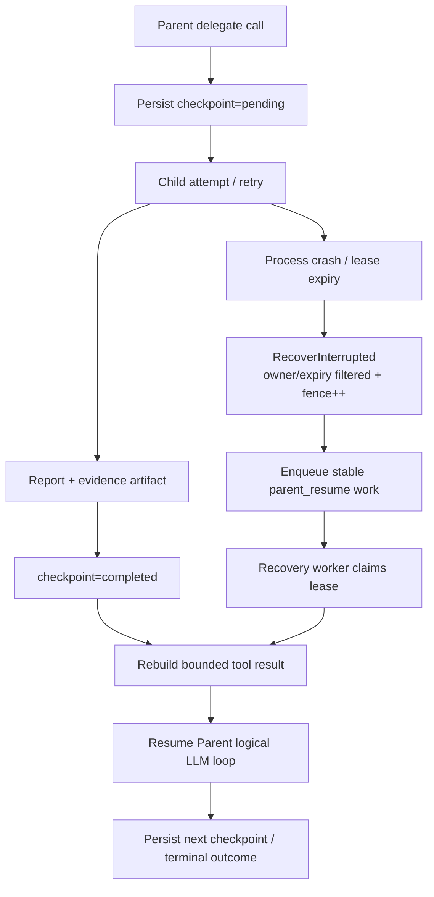

### 8.4 Child retry、重派和错误分类

**状态：Child retry/attempt、durable queue、worker lease/renew/fence、expired re-dispatch 与 Parent durable join 已完成基础 P0；取消、背压、dead-letter 和运营治理仍未完成。**

当前只对以下类别保留 retry 可能性：

```text
provider 5xx
网络错误
rate limit
临时数据库错误
worker 崩溃
可恢复的 timeout
```

以下错误不应 retry：

```text
capability 不存在
capability disabled
权限不足
facet 不允许
evidence ref 非法
schema 校验失败
objective 非法
Child report 永久不符合 contract
```

retry 当前满足：

```text
attempt_no < max_attempts
parent context 未取消
child result 被分类为 retryable
remaining deadline 足够执行 bounded backoff + attempt
logical task grant 仍可用
```

当前实现采用：

```text
bounded exponential backoff
attempt 级别持久化
logical task ID / work ID 稳定
retry 使用新的 attempt_id / child_run_id
worker owner + expiry + lease fence
expired lease 跨实例 re-dispatch
最终 task settlement exactly once
Parent claim race 通过 durable join/replay 收敛
```

仍需补齐：显式 queue cancel、backpressure、dead-letter/人工重放、长时间悬挂 work item 的运营策略，以及更细的 cancellation / timeout 原因分类。

### 8.5 Partial / unavailable result 语义

**状态：运行时已具备基础分类、interrupted/unavailable artifact、bounded report 和 Parent 自动 replay/resume；完整 partial 聚合与取消原因治理仍需继续完善。**

Parent 必须能明确区分：

```text
confirmed
contradicted
inconclusive
unavailable
not_checked
```

尤其要保证：

```text
not_checked != negative finding
```

建议 delegation result 至少包含：

```json
{
  "status": "partial",
  "completed": 3,
  "failed": 1,
  "timed_out": 1,
  "rejected": 1,
  "findings": [],
  "unavailable_facets": [],
  "conflicts": [],
  "evidence_refs": []
}
```

### 8.6 Parent 最终答案 Evidence Guardrail

**状态：Child report/evidence validator 与 Parent claim/Flow-edge manifest hard gate 已接入；尚未完成自然语言句子到 evidence body 的语义蕴含验证。**

当前 Parent 最终答案会通过服务端 manifest 校验 claim/edge identity、状态、evidence refs、重复项和 state upgrade；uncited finding 不得标为 `supported`，verified Flow edge 必须带 evidence ref。链路如下：

```text
Child report / evidence
  -> Parent synthesis
  -> Final answer manifest validator
  -> deterministic accept / repair / unresolved fallback
```

当前结构化 hard gate 至少检查：

1. 最终答案的重要 claim 是否有 evidence；
2. Parent 是否新增了 Child 没有提供的事实；
3. unresolved conflict 是否被写成确定结论；
4. incomplete / unavailable 是否被误写成 negative；
5. high-risk 内容是否经过 verifier；
6. evidence provenance 是否保留；
7. 数字、时间、因果判断是否都有来源。

以上门禁可以阻止 unknown claim/edge、无引用 supported 状态和证据状态升级，但不能证明最终自然语言每个句子都被证据正文语义蕴含；该 NLI/entailment 层仍是生产级缺口。

---

## 9. 强烈建议实现的能力：P1

### 9.1 Delegation metrics 和质量评估

运行指标：

```text
- delegation invocation rate
- average child count
- child success rate
- child timeout rate
- child retry rate
- rejection rate
- partial result rate
- parent resume rate
- batch latency
- queue wait time
```

成本指标：

```text
- parent tokens
- child tokens
- verifier tokens
- total cost
- cost per successful answer
- delegated answer vs single-agent answer cost
```

质量指标：

```text
- evidence coverage
- unsupported claim rate
- citation validity rate
- conflict rate
- child contribution rate
- no-op delegation rate
- delegation 后答案质量提升
```

最重要的对照是：

```text
Single Agent baseline
vs
Delegated Parent + Children
```

需要同时看：

```text
质量提升
成本增加
延迟增加
```

### 9.2 Queue、Scheduler、Lease 和 Backpressure

当前 in-process worker pool 对单实例、短任务、低 QPS 足够。

当出现以下需求时，应演进为 durable queue：

- 多实例横向扩展；
- Child 跨进程执行；
- 用户离线等待长任务；
- Child 执行时间超过单次请求生命周期；
- worker 独立扩缩容；
- capability 级别限流和配额。

Scheduler 至少需要：

```text
priority
capability-level concurrency
per-tenant quota
backpressure
deadline-aware dispatch
queue timeout
worker lease
worker heartbeat
stale task recovery
cancellation
rate limit
fairness
```

### 9.3 Early stop、quorum join 和 cancel losers

当前更接近：

```text
提交 N 个 Child
等待全部结束
再返回 Parent
```

建议支持：

```text
wait_all
wait_any
wait_quorum
wait_until_evidence_sufficient
wait_until_deadline
```

例如：

- 多个 Child 已经得到同一结论；
- 已经获得权威来源；
- 当前证据足够支持最终答案；
- 发现关键冲突，需要把剩余预算转给冲突解决任务；
- 剩余 Child 已不可能在 Parent deadline 前完成。

### 9.4 服务端模型路由

模型不能自行指定 provider、model，这个安全边界应保留。

服务端可以按 capability 选择：

```text
Parent: strong reasoning model
Child: cheap / fast retrieval model
High-risk Child: high-quality model
Verifier: independent verifier model
Synthesizer: strong answer model
```

Capability 可以绑定：

```text
model profile
provider profile
price profile
latency profile
```

### 9.5 Typed Task / Report Contract

**当前进展：** flow 场景已先落地一类 typed handoff：`DelegationReport.flow` 可携带 bounded `FlowIR`，并校验 edge state 和 evidence refs。通用 task type、acceptance criteria、freshness 和不同领域 report schema 仍待继续扩展。

将自然语言 objective 逐步补充为结构化 contract：

```json
{
  "task_type": "fact_check",
  "objective": "...",
  "facets": ["pricing", "availability"],
  "acceptance_criteria": [
    "must provide primary source",
    "must include effective date"
  ],
  "freshness": {
    "max_age_hours": 24
  },
  "max_findings": 5,
  "output_schema": "fact_check_report.v2"
}
```

Child report 可以统一为：

```text
finding
claim
evidence
confidence
conflict
limitations
```

### 9.6 Adaptive fan-out

当前主要是静态上限：

```text
MaxChildren = 6
MaxConcurrent = 3
MaxTotalTokens = 720000
```

后续可根据任务动态分配：

```text
简单问题: 0~2 Child
中等问题: 2~4 Child
高风险问题: 先少量调查，再根据结果扩展
证据已充分: 停止扩展
发现冲突: 将预算转给冲突解决任务
```

前提是预算树、状态机、metrics 已经完成。

---

## 10. 暂时不建议优先实现的能力：P2

### 10.1 Peer-to-peer Agent 协作

例如：

```text
Agent A -> Agent B -> Agent C
Agent 之间动态 handoff 和对话
```

这会显著增加：

- 权限传播复杂度；
- 预算传播复杂度；
- 循环和死锁风险；
- 结果归因难度；
- evidence provenance 复杂度；
- 调试难度。

当前的 manager-as-tool 模式已经满足 bounded investigation 的主要需求。

### 10.2 Recursive delegation

当前 `MaxDepth = 1` 是合理安全边界。

递归委派会导致：

```text
Parent
  -> Child A
      -> Grandchild A1
          -> ...
```

需要额外解决：

- 预算递归切分；
- 权限逐层收缩；
- failure 冒泡；
- 最终 synthesis 归属；
- 指数级 fan-out；
- provenance 层级；
- delegation storm。

没有明确产品需求时不建议开放。

### 10.3 立即把 QA 改成完整 DAG / Workflow

完整 Workflow 只有在出现以下需求时才值得接入：

- 多阶段任务；
- 明确依赖关系；
- 长时间异步运行；
- 人工审批；
- 复杂 conditional branch；
- 跨多个外部系统；
- 可暂停、可恢复、可审计的业务流程。

当前 QA 的核心需求仍然是：

```text
Parent loop
  -> bounded fan-out
  -> Child report
  -> Parent synthesis
```

### 10.4 Shared mutable Agent State

暂时应坚持：

```text
Child 读取投影 context
Child 返回 immutable report / evidence
Parent 负责 merge
```

不建议让多个 Child 直接修改同一个共享状态。

---

## 11. 与业界实现的关系

当前 Nasuta 最接近：

```text
Manager Agent
  -> agents-as-tools / bounded sub-agent
  -> Parent 保留最终控制权
```

而不是：

```text
Handoff-based swarm
Peer-to-peer team
Durable workflow coordinator
Generic DAG execution
```

### 11.1 当前优势

相较于一般 Agent SDK，Nasuta 已经具备较强的服务端治理能力：

- server-owned capability allowlist；
- permission intersection；
- read-only Child boundary；
- Definition / Schema / Capability hash pinning；
- evidence / citation provenance；
- structured claim conflict 检查；
- DB reservation / settlement；
- stable replay；
- Child report contract；
- high-risk 和 semantic verifier 接线；
- bounded evidence lookup、body coverage，以及 no-verdict 的逐 claim unresolved 投影；
- Parent/Child/Verifier 共享 Root budget：生产路径为 MySQL Durable Root，并接入 owner/expiry lease、deadline-derived acquire/release 和 expired reservation reclaim；测试路径保留 in-process gate；
- Flow output contract、server-owned renderer 和 deterministic rendered-flow quality gate。

### 11.2 当前主要差距

与 LangGraph、AutoGen、Temporal 等组合式实现相比，当前主要差距是：

```text
- QA delegation 不是通用 graph
- 目前只有一层同步 fan-out
- 没有通用 typed state merge（FlowIR 有专项 deterministic merge）
- 没有自动 durable Parent continuation
- Root lease/reclaim 只有基础生命周期；没有 heartbeat/fencing
- 没有 queue / worker lease / 外部 worker
- 没有跨实例 Child re-dispatch 闭环（基础 retry/attempt 已完成）
- 没有动态 scheduler / early stop
- model/provider 路由能力有限
- 没有 peer handoff 和多 Agent message bus
```

这些差距并不意味着现在需要全部补齐。当前优先级应由产品运行形态决定：

| 运行形态 | 最低必要能力 |
|---|---|
| 内部验证、单实例、短任务 | Parent 总预算、Child partial 语义、基础 retry、metrics |
| 生产同步 QA、低到中等 QPS | Durable Root + lease/reclaim 基础生命周期、attempt/checkpoint 基础闭环、P0 剩余 guardrail，保留 in-process executor |
| 多实例、高并发、长任务 | P0 + queue、lease、scheduler、Parent resume |
| 通用 Agent 平台 | 上述能力稳定后，再考虑 Workflow、handoff、shared state、recursive tree |

---

## 12. 建议实施顺序

### 阶段一：P0 可靠性和答案安全闭环

```text
已完成基础闭环：
1. Parent `MaxTotalTokens` / `MaxCostMicros` 注入（cost 默认仍可关闭）
2. Durable Root ledger（生产 `run.NewStore(db)`）及 in-process 测试绑定
3. Parent answer token reserve phase
4. Child / verifier actual usage settlement、unused grant release
5. delegation attempt / bounded retry / interrupted cleanup
6. Parent delegation checkpoint pending/completed/unavailable/interrupted 基础状态
7. Flow output contract 的运行时校验与 fallback
8. Flow Child typed FlowIR 与 edge evidence ref 校验/降级
9. Evidence lookup、body coverage、no-verdict unresolved 投影与 warning
10. Parent deterministic FlowIR merge、server-owned canonical renderer 和 rendered-flow 确定性质量门禁
11. Durable Root owner/expiry lease、deadline-derived acquire/release、expired reservation reclaim 与 lifecycle tests

P0 剩余项：
12. Parent checkpoint 驱动的 logical crash resume
13. lease heartbeat/fencing、Root 与 `agent_runs` 原子创建、`RecoverInterrupted()` owner/expiry 过滤及跨实例验证
14. queue / worker lease / cross-instance re-dispatch
15. Partial / unavailable 的完整 batch 聚合与取消原因分类
16. Mermaid actual parser/browser render、overview/subject isolation，以及 final claim-edge evidence hard gate
```

目标：

```text
不会超预算
不会因为进程重启丢失逻辑状态
不会无限 retry
不会把 timeout / unavailable 误认为 negative
Parent 始终保留生成最终答案的能力
```

### 阶段二：P1 运营与质量闭环

```text
1. Evidence Slice 按业务 subject 拆分
2. 统一 delegation trace 与 latency / budget / quality dashboard
3. 单 Agent vs Delegated Agent evaluation set 与真实请求 golden set
4. E2E crash / retry / settlement / partial-result tests
```

重点测试：

- Parent 在 Child running 时重启；
- Child 执行中 worker 重启；
- tool invocation 重复提交；
- reservation 重复结算；
- 部分 Child timeout；
- retry 后只结算一次；
- Parent deadline 临近时仍保留 answer reserve；
- evidence conflict 正确传递到最终答案；
- delegation disabled 时正常降级为 single agent。

### 阶段三：吞吐和效率

```text
1. Queue / Scheduler / Lease 优化
2. Backpressure / quota / rate limit
3. Early stop / quorum join
4. Cancel losers
5. Server-side model routing
6. Adaptive fan-out
```

### 阶段四：平台化

只有业务真正需要时再做：

```text
17. QA delegation 接入通用 Workflow
18. 长时间异步任务
19. 多阶段 DAG
20. Human approval
21. Handoff / peer collaboration
22. Recursive delegation
```

---

## 13. 推荐目标架构

短期不需要推翻当前 Runtime，建议演进为：

```text
QA Request
  -> Parent Agent Run
      -> Persist delegation invocation
          -> Reserve root / child budget
              -> Dispatch Child tasks
                  -> Child Agent Runs
                      -> Validate report / evidence
                          -> Settle task
                              -> Durable join
                                  -> Resume Parent
                                      -> Final answer validation
                                          -> Answer
```

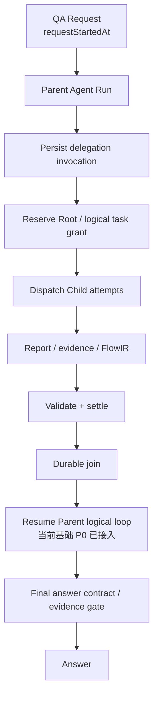

关键原则保持不变：

- Child 仍然是普通 `agentapi.Runtime.Run`；
- Child 仍然通过 capability 绑定工具和权限；
- Child 仍然只读；
- Child 仍然不能自行委派；
- Parent 仍然拥有最终答案控制权；
- evidence 和 permission 仍由服务端控制；
- 模型不能指定任意 provider、tool 或 budget；
- Parent / Child 共享执行引擎，但不共享未经投影的上下文和可变状态。

---

## 14. 代码导航

| 主题 | 主要文件 |
|---|---|
| QA prepare / parent deadline / Root limits | `/Users/dequan.mac/agent-workspace/Nasuta/internal/agent/qa/prepare.go` |
| QA Run request / Parent context / output contract | `/Users/dequan.mac/agent-workspace/Nasuta/internal/agent/qa/submission.go` |
| Hierarchical budget core | `/Users/dequan.mac/agent-workspace/Nasuta/internal/agent/budget/budget.go` |
| Durable Root budget adapter | `/Users/dequan.mac/agent-workspace/Nasuta/internal/agent/budget/durable.go` |
| Durable budget tests | `/Users/dequan.mac/agent-workspace/Nasuta/internal/agent/budget/durable_test.go`、`/Users/dequan.mac/agent-workspace/Nasuta/internal/agent/run/store_budget_test.go` |
| Durable budget SQL store | `/Users/dequan.mac/agent-workspace/Nasuta/internal/agent/run/store_budget.go` |
| Delegation attempt persistence | `/Users/dequan.mac/agent-workspace/Nasuta/internal/agent/run/store_delegation_attempts.go` |
| Parent checkpoint persistence | `/Users/dequan.mac/agent-workspace/Nasuta/internal/agent/run/store_delegation_checkpoint.go` |
| delegation tool | `/Users/dequan.mac/agent-workspace/Nasuta/internal/agent/delegation/tool.go` |
| Child admission / executor / limits | `/Users/dequan.mac/agent-workspace/Nasuta/internal/agent/delegation/executor.go` |
| Child report / FlowIR projection and validation | `/Users/dequan.mac/agent-workspace/Nasuta/internal/agent/delegation/report.go` |
| Child report aggregate validation | `/Users/dequan.mac/agent-workspace/Nasuta/internal/agent/delegation/validator.go` |
| Semantic verifier | `/Users/dequan.mac/agent-workspace/Nasuta/internal/agent/delegation/verifier.go` |
| Definition timeout / Run limits | `/Users/dequan.mac/agent-workspace/Nasuta/internal/agent/definition/prepare.go` |
| Runtime to execution.Config 映射 | `/Users/dequan.mac/agent-workspace/Nasuta/internal/agent/definition/run.go` |
| Agent loop / time answer reserve | `/Users/dequan.mac/agent-workspace/Nasuta/internal/agent/execution/loop.go` |
| Physical model-call reservation / settlement | `/Users/dequan.mac/agent-workspace/Nasuta/internal/agent/execution/model_call.go` |
| Flow output validator / repair / fallback | `/Users/dequan.mac/agent-workspace/Nasuta/internal/agent/execution/flow_contract.go` |
| Tool invocation timeout | `/Users/dequan.mac/agent-workspace/Nasuta/tool/executor.go` |
| Delegation reservation / settlement | `/Users/dequan.mac/agent-workspace/Nasuta/internal/agent/run/store_delegation.go` |
| Platform delegation defaults | `/Users/dequan.mac/agent-workspace/Nasuta/platform/config/platform.go` |
| Startup interrupted recovery | `/Users/dequan.mac/agent-workspace/Nasuta/internal/agent/run/store_lifecycle.go` |
| 当前实现总览 | `/Users/dequan.mac/agent-workspace/Nasuta/docs/design/agent-platform/20-agent-orchestration-current-implementation.zh-CN.md` |

---

## 15. 最终判断

当前最重要的路线不是：

```text
增加更多 Agent
增加更多对话模式
增加更复杂的 graph
```

而是把已经落地的：

```text
Parent
  -> Delegate
  -> Child / Verifier
  -> Validate
  -> Settle
  -> Final Answer / Flow Contract
```

继续补成一个预算统一、deadline 一致、状态可恢复、错误可分类、结果可验证、效果可度量的可靠执行闭环。Parent logical resume、lease heartbeat/fencing、Root/Run 原子创建、owner-aware recovery、queue/worker re-dispatch、subject 隔离、确定性 claim/edge hard gate、真实 MySQL 单 winner 和 Chrome Mermaid render 已完成基础 P0。当前最明确的缺口转为运营级 queue 控制与 SLO、多进程故障注入、默认 cost 治理、overview/合法跨 subject edge 产品 schema、目标前端渲染矩阵，以及自然语言句子到 evidence body 的语义蕴含证明，而不是再增加新的协作形态。

> **短期目标：可靠的 manager-as-tool。**  
> **中期目标：可恢复、可调度的 delegation workflow。**  
> **长期目标：在确有业务需求时再平台化为通用 Agent Workflow。**

---

## 16. 2026-09-02 P0 实现复核与剩余边界

本节是对本文前述“待实现”描述的状态覆盖；判断以当前源码和测试为准。

### 16.1 已落地的 P0 闭环

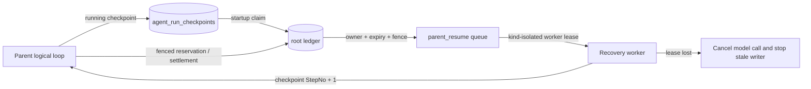

当前代码已经具备：

- Parent logical checkpoint、absolute deadline 恢复语义和 `parent_resume` 工作项；
- Root lease heartbeat/自动 renew，owner、expiry、fencing token；
- reservation、settlement、checkpoint、终态写入的 fence 校验；
- `agent_runs` 与 root ledger 在同一个事务中创建；
- `RecoverInterrupted()` 只选择无 owner 或已过期 root，启动阶段不调用模型；
- `delegation_child` 与 `parent_resume` 按 work kind 隔离；
- worker lease renew、过期重派、旧 owner renew/complete 拒绝；
- Child re-dispatch 使用稳定 work ID 和幂等任务持久化；
- FlowIR merge 将 normalized subject 纳入 node/edge identity，避免跨业务同名节点合并；
- uncited finding 不再被 final-answer evidence contract 标记为 `supported`；verified Flow edge 必须保留 evidence refs；
- Mermaid smoke test 支持已安装 `mmdc`，也支持显式启用固定 `@mermaid-js/mermaid-cli@11.16.0` + 本机 Chrome；本机真实 SVG 已专项通过，默认无 renderer 时仍显式 skip。

### 16.2 仍不能称为“完整生产级 durable execution”的边界

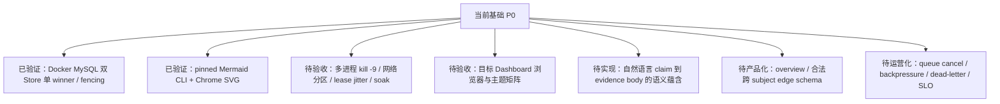

这些边界不是“所有代码都未写完”的同义词，而是基础 P0 已有源码和专项测试，但尚缺真实生产故障、产品语义或更强语义证明：

1. Docker `mysql:8.0` 已证明两个独立 Store 在 InnoDB 行锁下的单 winner claim、expired reclaim、stale fence 拒绝和并发 recovery；尚未覆盖独立进程 `kill -9`、网络分区、lease jitter 和长时间压力 soak；
2. 固定 `@mermaid-js/mermaid-cli@11.16.0` + 本机 Chrome 已完成真实 SVG smoke；尚未覆盖目标 Dashboard 的全部浏览器、主题、字体和安全策略矩阵；
3. claim manifest 已能阻止 unknown、state upgrade 和 uncited supported claim，但它仍是“服务端允许列表”，不是自然语言句子与证据正文的 NLI/语义证明；
4. FlowIR 的 subject identity 已隔离 merge 组件，但 overview 图、合法跨 subject 边和跨 scope evidence 的产品语义仍需独立 schema 与集成验收；
5. worker lease 已能防止 stale worker 写入，但生产级调度还需要 cancel/backpressure/dead-letter/人工重放，以及队列延迟、吞吐、丢失、重试和告警指标。

### 16.3 2026-09-02 验收结果

| 验收项 | 当前状态 | 说明 |
|---|---|---|
| 普通单元/集成测试 | 已通过 | `GOWORK=off go test ./...` |
| root/ledger 原子性 rollback | 已覆盖 | run insert、ledger insert、commit failure |
| worker claim/renew/complete fence | 已覆盖 | kind filter、expired reclaim、stale owner |
| cross-subject 同名 Flow node/edge | 已覆盖 | 相同 label 保持独立 canonical ID |
| Mermaid 真实渲染 | 已专项通过 | `NASUTA_MERMAID_NPX=1` 使用固定 `@mermaid-js/mermaid-cli@11.16.0` + 本机 Chrome；默认环境无 renderer 时仍显式 skip |
| race/vet/build | 已通过（2026-09-02） | 普通测试、指定包 race、`go vet`、`go build`、`git diff --check` 均通过 |
| 真实 MySQL 跨实例并发 | 已专项通过 | Docker `mysql:8.0` 验证双 Store 单 winner claim、expired reclaim、stale fence 拒绝和并发 recovery；尚非多进程故障注入/压力 soak |

### 16.4 超时口径（最终定义）

```text
request_deadline = QA Ask 入口记录的 requestStartedAt + request SLA
parent_deadline  = min(request_deadline, definition timeout 相对 original started_at 的绝对截止点)
child_deadline   = parent 当前剩余时间、child definition timeout、child answer reserve 的最小值
```

因此不能简单说“从 Parent 第一次 LLM 调用开始算”。当前 durable resume 会携带原始 `StartedAt` 和已解析 `RunLimits.Deadline`，恢复进程不会把 deadline 延长为“恢复时间 + definition timeout”。


## 17. 2026-09-02 队列竞态修复与验收补充

### 17.1 Parent 与 Child Worker 的真实链路

Parent 将任务写入 durable queue 后，不再假设自己一定能拿到 queue lease。平台 worker 可能先 claim；此时 Parent 必须等待 durable task projection，而不是把 `sql.ErrNoRows` 当成 Child 失败。

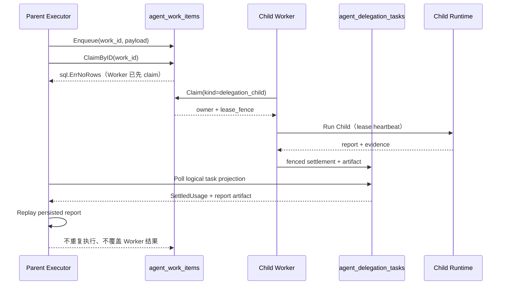

### 17.2 竞态处理规则

- Parent 初次 claim 返回 `sql.ErrNoRows`：进入 `waitForQueuedTask`，不是失败结算；
- Wait 期间只用 `context.WithoutCancel(parentContext)` 读取 durable projection，避免 Parent 请求取消导致关键状态读取被截断；
- Parent 取消只停止等待并返回 `parent_cancelled`，不调用 `settleUnavailable`，不覆盖仍可能运行的 Worker；
- 只有读/claim 到明确的 durable terminal report 后，Parent 才释放本地 task reservation 并 replay；
- Parent 在 lease 过期后重新 claim 时，`Release()` 保持幂等，覆盖“已加入本地 flight”与“实际重新执行”两种路径；
- queue 基础设施错误不被伪装成 Child 的 unavailable terminal state，保留任务供后续 recovery/worker 重试；
- 相同 `work_id` 重复 enqueue 只允许 identity 与 JSON 语义 payload 一致；`run_id`、`delegation_id`、`task_index`、`attempt_no`、`kind` 或 payload 语义任一不一致，返回 `ErrWorkItemConflict`。MySQL 会规范化 JSON 字节表示，因此不能用原始字节相等判断幂等。

### 17.3 本轮新增测试

- worker 先 claim，Parent 等待并 replay 持久化 report；
- Parent cancellation 不产生 unavailable settlement；
- `work_id` 相同但 payload/identity 冲突时拒绝；
- 相同 identity/payload 的重复 enqueue 保持幂等成功；
- `go test -race` 覆盖 delegation、run、budget、definition、execution、qa、dbschema。

### 17.4 当前边界仍然存在

本轮修复解决的是“Parent 把 Worker 先 claim 误判为失败”的直接故障，不等价于完整生产级调度平台。Docker MySQL 已验证跨实例 `SELECT ... FOR UPDATE` 的单 winner 语义；仍需队列 backpressure、指标告警，以及 Parent 取消后长期悬挂 queue item 的运营策略（cancel/requeue/dead-letter）。


## 18. 2026-09-02 真实 MySQL、bounded durable I/O 与 Mermaid 浏览器验收

### 18.1 Durable I/O 不再直接使用无界 `WithoutCancel`

请求取消不能截断关键 accounting write，但也不能因此让数据库调用永久阻塞。当前将上下文分为两类：

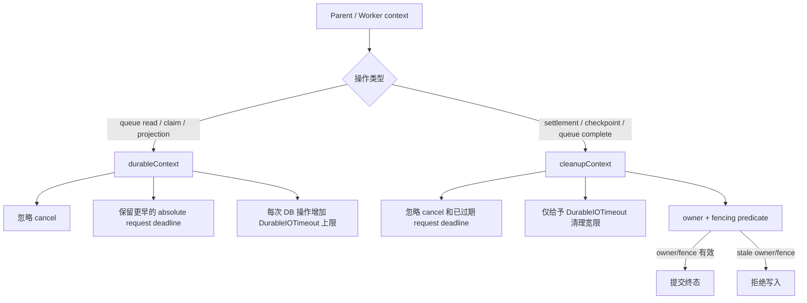

关键区别：

- logical wait 可以持续到 Parent deadline，但每次数据库读取/claim 都是独立有界调用；
- terminal write 在 request deadline 刚过期时仍有短暂清理窗口；
- 清理窗口不能绕过 fencing，旧 worker 仍无法覆盖新 owner；
- `DurableIOTimeout` 当前默认 5 秒，可由 `ExecutorConfig` 显式覆盖。

### 18.2 真实 MySQL 暴露并修复的两个问题

sqlmock 能验证 SQL 形状，却不能模拟 MySQL JSON 存储和单连接 result-set 协议。本次 Docker `mysql:8.0` 专项测试首次暴露：

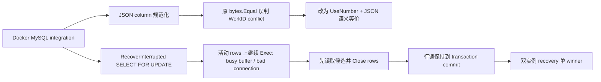

已验证场景：

1. 两个独立 `Store` 同时 claim 同一 `work_id`，仅一个成功；
2. lease 过期后第二 owner 取得更高 `lease_fence`；
3. stale owner/fence 的 completion 被拒绝；
4. 两个独立 recovery owner 并发执行 `RecoverInterrupted()`，总 claim 数为 1；
5. recovery winner 将 Root fence 从 1 推进到 2，并只生成一个 `parent_resume` work item。

专项命令：

```bash
GOWORK=off go test -tags=integration ./internal/agent/run \
  -run 'TestMySQLCrossInstanceWorkClaimAndFencing|TestMySQLConcurrentRecoveryHasSingleLeaseWinner' \
  -count=1 -v
```

### 18.3 Mermaid 真实 Chrome 渲染

smoke test 现在支持两条真实 renderer 路径：

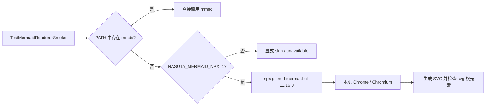

本机专项验收已通过：

```bash
NASUTA_MERMAID_NPX=1 GOWORK=off go test ./internal/agent/execution \
  -run TestMermaidRendererSmoke -count=1 -v
```

默认测试不会隐式下载浏览器；没有 `mmdc` 且未显式开启 npx 时仍记录为 skip，避免把字符串检查冒充真实 parser/browser 验证。

### 18.4 当前生产级声明边界

截至 **2026 年 9 月 2 日**，原始 P0 列表中的 Parent crash resume、Root lease heartbeat/fencing、原子 Root ledger、owner/expiry recovery、queue/worker re-dispatch、真实 MySQL 单 winner、subject 隔离、evidence hard gate 和 Mermaid Chrome render 均已有源码与专项测试证据。

但系统仍不能宣称为“完整生产级 durable execution”，主要剩余的是运营和语义层能力：

- queue cancel/backpressure/dead-letter/人工重放；
- 多进程 kill -9、网络分区和长时间压力 soak；
- overview 与合法跨 subject edge 产品 schema；
- 自然语言句子到 evidence body 的语义蕴含验证；
- queue/worker/recovery/quality 的 SLO、指标和告警。
