# 流程类问题回答质量复盘：2026-08-31 四业务流程分析

> **状态：事故复盘 / 改造依据**  
> **事故分析日期：2026-08-31**  
> **当前实现更新日期：2026-09-02**  
> **原始日志：** `/Users/dequan.mac/.codex/attachments/6fff322f-e8c3-482e-b7ab-cb423810d292/pasted-text.txt`  
> **相关当前实现：** `/Users/dequan.mac/agent-workspace/Nasuta/docs/design/agent-platform/20-agent-orchestration-current-implementation.zh-CN.md`  
> **相关路线文档：** `/Users/dequan.mac/agent-workspace/Nasuta/docs/design/agent-platform/21-agent-delegation-analysis-and-roadmap.zh-CN.md`

本文复盘以下用户问题及其实际回答：

> 帮我分析一下 rgb 灯效、消息中心、菜谱、tts 这几个业务的流程是什么样的

本文不重新判断四个业务本身的全部技术事实，而是重点分析：**为什么本次回答耗时约 164 秒、为什么最终没有达到流程架构分析的质量要求、当前 Parent/Child 委派链路和预算/超时语义是什么，以及应该如何改造。**

---

## 1. 结论先行

### 1.1 这是编排和输出契约问题，不只是模型能力问题

事故发生时同时暴露了四类问题：

1. **路由阶段做了重复 LLM 调用**：Planner 首轮生成了不符合 schema 的 task ID，触发一次 retry。
2. **调查阶段过深、报告过长**：用户只要求业务流程概览，但四个 Child 按 4 step、最多 16 次工具调用、每次最多 12,000 output tokens 的方式执行了深度代码调查。
3. **证据闭环没有真正完成**：Verifier 明确返回“没有可用的 evidence body，无法给出 verdict”，但 Parent 仍继续生成确定性较强的结论。
4. **`kind=flow` 没有转化为最终答案契约**：规划阶段识别了 `kind=flow`，但事故版本没有强制 Mermaid/流程图、节点边、协议、同步异步和证据标注。

截至 **2026-09-02**，第 1、4 项的基础闭环已经落地：服务端会重写 canonical task ID，`kind=flow` 会绑定 `RunOutputContract`，最终答案必须通过 Mermaid、subject coverage、hop 数和图文顺序校验；首次失败会 repair，再失败会返回显式 `unresolved` 的确定性 Mermaid fallback。Flow Child 也已收窄到最多 2 turns、6 tool calls、8,000 output tokens、2,000 report tokens，并可返回 bounded `FlowIR`，携带 nodes、edges、protocol、sync mode、`verified / inferred / unresolved` 和 open hops。

截至当前，Parent FlowIR deterministic merge、subject 隔离、server-owned renderer、claim/edge manifest hard gate、固定 Mermaid CLI + Chrome 真实 SVG、Durable Root heartbeat/fencing、Root/Run 原子创建、owner-aware recovery、`parent_resume`、queue/worker lease 和 Child re-dispatch 均已完成基础 P0。完整根因仍未全部消除：尚缺 queue cancel/backpressure/dead-letter/人工重放与 SLO、多进程故障注入、默认 cost 治理、overview/合法跨 subject edge 产品 schema、目标前端渲染矩阵，以及自然语言句子到 evidence body 的语义蕴含证明。单纯把模型换快或把 `max_tokens` 调大，仍不能解决这些问题。完整目标链路仍是：

```text
Intent / Query Plan
  -> Output Contract
  -> Evidence Slice
  -> Bounded Flow IR
  -> Diagram Renderer
  -> Evidence-aware Final Answer
```

### 1.2 本次延迟的最大贡献者是 delegation，不是 Planner 或 Retrieval

从用户请求开始到 Parent 最终答案结束约 **164 秒**：

- Planner + retry：约 5 秒；
- Retrieval：约 3 秒；
- Parent 首轮推理：13.58 秒；
- Child delegation：**117.30 秒**；
- Verifier：3.04 秒；
- Parent 最终合成：24.83 秒。

其中 `delegate_investigation` 一次调用耗时 **1m57.295670042s**，约占端到端时间的 **71%**。四个 Child 虽然有并发，但 `MaxConcurrent=3` 导致第四个 Child 必须等待槽位；同时最慢 Child 的最后一个 structured-output step 达到 **1m8.05s**。

### 1.3 本次回答没有满足“流程图辅助文字”的直接证据

日志中最终 Parent 输出：

- `answerLen=6158`；
- 有四个业务标题和大量 bullet；
- Mermaid：0；
- `flowchart`：0；
- `sequenceDiagram`：0；
- 代码块：0。

这不是“图没有渲染出来”，而是**回答生成阶段根本没有产出图的代码块**。

### 1.4 最优先的改造顺序

| 优先级 | 改造 | 当前状态（2026-09-02） | 目的 |
|---|---|---|---|
| P0 | `kind=flow` 强制输出契约，服务端生成/校验 Mermaid | **基础闭环已完成**：校验、repair、unresolved fallback、server-owned renderer 和确定性 rendered-flow gate 已接入 | 立即解决“全是文字” |
| P0 | task ID 由服务端 canonicalize | **已完成**：模型 ID 仅作 dependency alias，服务端按位置生成稳定 ID | 消除非 canonical ID 导致的 schema retry |
| P0 | Child 从深度审计改为 bounded Flow IR | **基础闭环已完成**：Flow Child 预算收窄，typed FlowIR、边状态和 evidence ref 校验已接入；Parent deterministic merge、server-owned renderer 和字节级 canonical graph 校验已接入 | 降低 token、上下文和合成时间 |
| P0 | evidence body 随 citation 可解析，最终答案受验证状态约束 | **结构化硬门禁已完成**：lookup/body coverage、claim/edge manifest、uncited finding 降级已接入；自然语言句子到 evidence body 的语义蕴含仍未完成 | 防止无证据断言 |
| P1 | 按业务拆分 Evidence Slice | **未完成** | 提高召回精度和图的完整性 |
| P1 | request-entry deadline、剩余预算感知、取消和 partial result | **request-entry deadline 基础闭环已完成**；queue wait、取消原因分类和完整 partial 聚合未完成 | 降低尾延迟并统一 SLA |
| P0 | Parent / Child / Verifier 共享总 token/cost ledger | **基础 P0 已完成**：Durable Root、heartbeat/renew、fencing、Root/Run 原子创建、owner-aware recovery 与真实 MySQL 双 Store 验收已接入；默认 cost/价格版本和运营治理仍未完成 | 防止 aggregate budget 超卖 |
| P0 | Parent Flow IR merge、canonical renderer、最终 claim/edge evidence gate | **基础 P0 已完成**：subject-isolated merge、server-owned renderer、确定性 claim/edge gate 与固定 Mermaid CLI + Chrome SVG 已验收；overview/合法跨 subject edge、目标前端矩阵和自然语言语义证明仍未完成 | 让图和最终结论可确定性验证 |
| P1 | 评测集、延迟/质量 dashboard、Evidence Slice | **未完成** | 建立持续回归和检索闭环 |

---

## 2. 证据等级和分析边界

为避免把代码事实、日志事实和推断混在一起，本文使用以下标记：

| 标记 | 含义 |
|---|---|
| **日志事实** | 能直接从原始日志的时间戳、运行记录或模型输出确认的事实 |
| **代码事实** | 能从当前源码、配置或测试确认的事实 |
| **推断** | 根据日志和代码事实推导出的原因，仍应通过指标或实验进一步验证 |
| **待确认** | 当前证据不足，不能作为确定性业务结论 |
| **目标建议** | 推荐实现，不代表当前已经存在 |

### 2.1 关键日志事实

| 时间（+08:00） | 事实 |
|---|---|
| 21:30:57 | QA 请求进入，问题为四个业务的流程分析 |
| 21:30:57 | Planner 首次调用 `gpt-4.1`，`max_tokens=512` |
| 21:31:00 | Planner 因 `execution.tasks[0].id must be canonical` 触发 schema retry |
| 21:31:02 | canonical plan 识别为 `kind=flow`，4 个实体、4 个 required facets |
| 21:31:02 | 路由日志为 `proposed=multi_agent effective=single_agent`，实际含义是先启动单个 Parent，再由 Parent 动态委派 |
| 21:31:04 | Retrieval 产生 8 个 runbook、16 个 candidate references，并有 64 个 semantic hits 在过滤前返回 |
| 21:31:05 | Parent `qa.answerer` 启动，首轮 step 耗时 13.58 秒 |
| 21:31:19 | 三个 Child 并发启动，均为 `maxSteps=4`、约 150 秒 timeout、15 秒 reserve |
| 21:32:07 | 第四个 Child 启动，说明并发槽位为 3，存在排队 |
| 21:33:13 | 第四个 Child 完成，随后 Verifier 启动 |
| 21:33:16 | Verifier 3.04 秒完成，但返回没有 evidence body，无法给出 verdict；delegation 总耗时 1m57.30s |
| 21:33:16 | Parent delegation 后 context size 达到 107,393 chars |
| 21:33:41 | Parent 最终 step 耗时 24.83 秒，输出 6,158 chars，回答结束 |

### 2.2 当前代码事实的主要来源

- Parent deadline 计算：`/Users/dequan.mac/agent-workspace/Nasuta/internal/agent/qa/prepare.go`
- Agent loop 和时间 reserve：`/Users/dequan.mac/agent-workspace/Nasuta/internal/agent/execution/loop.go`
- Runtime 将 RunLimits 转换为执行配置：`/Users/dequan.mac/agent-workspace/Nasuta/internal/agent/definition/run.go`
- delegation tool schema 和 caller deadline 继承：`/Users/dequan.mac/agent-workspace/Nasuta/internal/agent/delegation/tool.go`
- Child deadline 和预算：`/Users/dequan.mac/agent-workspace/Nasuta/internal/agent/delegation/executor.go`
- delegation 默认配置：`/Users/dequan.mac/agent-workspace/Nasuta/platform/config/platform.go`

---

## 3. 用户期待与实际回答的差距

### 3.1 用户问题的隐含输出需求

“几个业务的流程是什么样的”不是简单的类名、接口名或表名罗列，至少需要回答：

```text
入口是谁
  -> 调用谁
  -> 使用什么协议（HTTP / Feign / MQ / MQTT / WebSocket / SSE）
  -> 数据如何变换
  -> 状态保存在哪里
  -> 设备/客户端如何回传或消费
  -> 哪些链路已经闭合、哪些仍待确认
```

对于同时包含多个业务的架构问题，推荐输出结构应该是：

1. 总览图：四个业务在系统边界中的位置；
2. 每个业务一张主链路图；
3. 每张图下面只解释关键节点、协议、状态和证据；
4. 用虚线或“待确认”标出未闭合 hop；
5. 最后给出横向差异和共性。

### 3.2 实际回答的主要问题

| 问题 | 日志证据 | 影响 |
|---|---|---|
| 没有流程图 | 最终输出 Mermaid/flowchart/sequenceDiagram 均为 0 | 读者无法快速理解调用关系和边界 |
| 文字过长 | Parent 输出 6,158 chars，包含大量 Controller、Feign、Service、Table、Redis Key | 信息密度低，主链路被实现细节淹没 |
| 证据不完整却语气偏确定 | Verifier 返回 `No cited evidence bodies are available...`，Parent 仍写“四个业务的主链路都已梳理清楚” | 事实、推断和未闭合链路混在一起 |
| 输出完整性异常 | 出现疑似残片“TTL 5 分取欢迎语” | 降低可信度，可能是长文本拼接/截断/生成污染 |
| 路由日志语义混乱 | `proposed=multi_agent effective=single_agent`，但后续确实启动了 4 个 Child | 影响运维判断和路由评估 |
| 没有按业务切片 | 四个业务共用一套混合 Retrieval，出现 `AQ24HourBean.setTs` 等明显无关节点 | Child 需要自己从噪声中筛选证据，增加耗时和误判 |

### 3.3 质量结论

本次回答并非“没有找到任何内容”。它找到了不少有效代码线索，但输出层没有把这些线索转换成架构图和证据化的主链路。因此问题应定义为：

```text
检索能力：部分有效
调查能力：过度展开
证据验证：未闭环
答案组织：不符合 flow intent
可视化表达：缺失
```

---

## 4. 本次请求的实际执行链路

### 4.1 实际链路图

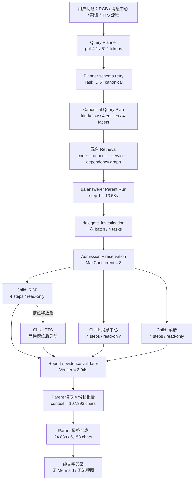

### 4.2 阶段耗时瀑布

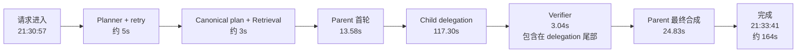

> **说明：** 上图用于表达端到端主路径；部分日志时间戳只有秒级精度，因此表中阶段相加与端到端墙钟时间可能存在小幅差异。Verifier 的 3.04 秒发生在 delegation 返回前，不能再从 117.30 秒外额外相加。

### 4.3 延迟分解表

| 阶段 | 日志/实现观察 | 主要问题 | 优先级 |
|---|---|---|---|
| Planner | 首轮输出了 `rgb灯效_flow` 等非 canonical ID，随后 retry | 确定性字段交给 LLM 生成 | P0 |
| Retrieval | 16 code hits、8 runbook、6 service、dependency edges 30 但 omitted 26；包含噪声节点 | 查询没有按 subject 拆分为 Evidence Slice | P1 |
| Parent 首轮 | 13.58 秒，第一次 tool call 在约 13.49 秒 | Parent 花较长时间理解混合上下文并决定委派 | P1 |
| Child batch | 3 个并发，第四个等槽位；每个最多 4 step / 16 tools | 调查预算对“流程概览”过大 | P0 |
| Child structured output | 最慢 step 4 为 68.05 秒，另一个为 45.65 秒 | 让模型在最后一步生成长报告，尾延迟高 | P0 |
| Validator/Verifier | 3.04 秒，但没有可验证的 evidence body | 花费了时间却没有形成有效 verdict | P0 |
| Parent final | delegation 结果 23,448 chars，Parent context 达 107,393 chars，最终 24.83 秒 | Parent 对长报告再次抽取和重写 | P0 |

### 4.4 Child 并发和尾延迟

| Child | 启动 | 完成 | 最后一步耗时 | 报告长度 |
|---|---:|---:|---:|---:|
| Child A | 21:31:19 | 21:32:07 | 32.97s | 12,083 chars |
| Child B | 21:31:19 | 21:32:09 | 36.94s | 9,443 chars |
| Child C | 21:31:19 | 21:32:39 | **68.05s** | 8,788 chars |
| Child D | 21:32:07 | 21:33:13 | 45.65s | 10,225 chars |

关键事实是：**并发降低了平均耗时，但没有消除最大尾延迟；第四个 Child 的启动还受 `MaxConcurrent=3` 限制。**

---

## 5. 延迟根因分析

### 5.1 事故时：Planner 的确定性字段由 LLM 生成

事故发生时，Planner 首轮返回了：

```json
{
  "tasks": [
    {"id": "rgb灯效_flow", "objective": "分析rgb灯效业务的流程和关键环节。"}
  ]
}
```

当时 schema 要求 task ID 为 canonical，系统因此向模型发送 retry；但 task ID 属于服务端可确定生成的执行字段，不应让模型承担格式正确性。

截至 **2026-09-02**，`bindExecutionTasks` 已改为：

```text
模型 task ID
  -> 仅登记为 dependency alias
  -> 服务端按任务位置生成 task_001 / task_002 / ...
  -> 将 depends_on 中的模型 alias 重写为 canonical ID
```

因此，非 ASCII 或非 canonical 的模型 ID 不再直接触发 schema retry。推荐的 Planner 语义输出仍然是：

```json
{
  "kind": "flow",
  "entities": ["rgb灯效", "消息中心", "菜谱", "tts"],
  "tasks": [
    {"subject": "rgb灯效", "objective": "识别主链路、协议、状态和未闭合 hop"}
  ]
}
```

收益：

- 消除无业务价值的 task ID 格式 retry；
- 模型只负责 subject、objective、dependency 等语义字段；
- 服务端统一 canonical ID，便于依赖绑定、持久化和幂等处理；
- schema 不再校验模型不应负责的执行标识格式。

### 5.2 P0：Child 调查深度与用户意图不匹配

本次每个 Child 都收到类似以下任务：

```text
entrypoint + core_flow + data_and_state + external_dependency + service.topology
```

同时 Child 运行上限为：

```text
maxSteps = 4
maxToolCalls = 16
model max_tokens = 12000
```

这相当于四个并行的“深度代码审计”，而用户首先需要的是“业务流程概览”。深度调查会产生：

```text
大量代码检索
  -> 大量证据候选
  -> 长自然语言报告
  -> Parent 再次阅读和抽取
```

推荐按意图分级：

| Flow 深度 | 适用问题 | Child 上限建议 |
|---|---|---|
| L0 总览 | “这个系统有哪些模块” | 不委派或只检索服务元数据 |
| L1 主链路 | “业务流程是什么” | 1–2 steps，最多 4–6 个关键 hop |
| L2 交互时序 | “调用顺序和协议是什么” | 2–3 steps，最多 6–10 个关键 hop |
| L3 深度审计 | “完整接口/表/异常/依赖” | 才允许 4+ steps 和更大 token |

本次应当路由到 **L1/L2**，而不是 L3。

截至 **2026-09-02**，Flow Child 已通过静态策略收窄到 **2 turns / 6 tool calls / 8,000 output tokens / 2,000 report tokens**；这已经降低了单个 Child 的最坏执行量，但 L0–L3 的动态深度识别和按请求分配预算仍未实现。

### 5.3 P0：长报告造成二次抽取和大上下文

当前链路是：

```text
Child 查代码
  -> Child 生成自然语言长报告
  -> Parent 接收约 23,448 chars delegation result
  -> Parent 在 107,393 chars context 中重新抽取主流程
  -> Parent 再生成最终答案
```

这会产生两次模型工作：

1. Child 把结构化证据翻译成一篇长报告；
2. Parent 再从长报告翻译回主链路和答案。

推荐 Child 直接输出 Flow IR：

```json
{
  "subject": "rgb灯效",
  "status": "partial",
  "nodes": [
    {"id":"n1","label":"App","kind":"client","evidence_ids":["ev_1"]},
    {"id":"n2","label":"hsas-scene","kind":"service","evidence_ids":["ev_2"]}
  ],
  "edges": [
    {"from":"n1","to":"n2","protocol":"HTTP","sync":"sync","evidence_ids":["ev_3"]}
  ],
  "open_hops": ["设备回传路径待确认"],
  "confidence": "medium"
}
```

Parent 只需：

```text
Flow IR 合并
  -> 证据校验
  -> Mermaid 渲染
  -> 简短文字说明
```

### 5.4 P1：Retrieval 过宽且没有按业务切片

本次四个业务一次性混合检索，结果中包括：

- 16 个 code hits；
- 8 个 runbook；
- 6 个 service；
- dependency edges 30 条，省略 26 条；
- semantic backend 在过滤前返回 64 hits；
- 出现 `AQ24HourBean.setTs`、`getTs`、`setSeq`、`getAqi` 等与问题明显无关的节点。

建议改为：

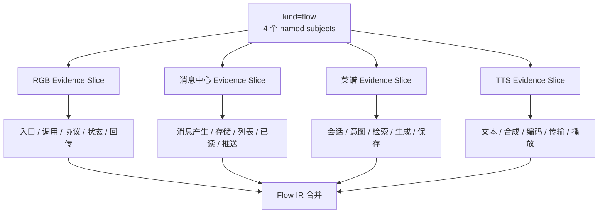

每个 Slice 应有自己的：

- subject aliases；
- service allowlist 或优先级；
- route / event / table / topic 查询模板；
- top-K 和 evidence budget；
- 未闭合 hop 列表。

---

## 6. Parent / Child 当前链路与差异

### 6.1 当前架构图

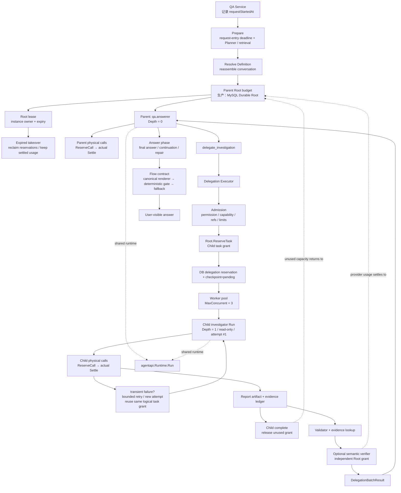

### 6.2 Parent 和 Child 的共同点

二者都使用同一个 Agent Runtime 执行模型—工具—观察—回答循环，都具备：

- Definition；
- Schema；
- Tool snapshot；
- Run / Step / LLM usage 记录；
- deadline；
- step limit / tool limit；
- token / cost accounting；
- artifact / evidence 持久化。

因此不是两套完全不同的 Agent 引擎，而是：

```text
相同执行引擎
+ 不同入口
+ 不同安全边界
+ 不同上下文投影
+ 不同输出契约
+ 不同预算策略
```

### 6.3 Parent 和 Child 的差异

| 维度 | Parent | Child |
|---|---|---|
| 入口 | QA Service 启动 `qa.answerer` | Parent 调用 `delegate_investigation`，Executor 启动 |
| 目标 | 回答用户最终问题 | 完成一个 bounded、只读、独立调查 |
| Context | QA 历史、检索结果、memory、当前对话 | Parent 投影后的问题摘要、目标、facet、证据引用 |
| Tools | QA 场景工具，可包含 delegation | capability 允许的只读工具，排除 `delegate_investigation` |
| Permission | QA policy | Parent permission 与 capability permission 的交集 |
| Depth | 0 | 1；当前不能递归委派 |
| Budget | Root owner；直接模型调用按 phase 执行 `ReserveCall → actual Settle`，answer phase 可使用答案预留 | 只持有 task grant；任务内调用结算到 grant，不能递归 admission，完成后释放 unused grant |
| 输出 | 用户可见答案 | `DelegationReport` / artifact / evidence ledger |
| 并发 | Parent loop 通常单实例推进 | Executor worker pool 并发执行多个 Child |
| 失败影响 | 可能影响整个 QA | 通常返回 partial / unavailable evidence |
| 生命周期 | Agent Run + QA turn | Child Run + Delegation Task + Artifact |
| 恢复 | 当前不是完整 Parent logical resume | 已 settlement task 可以幂等 replay；未完成通常为 interrupted |
| 控制权 | 负责最终答案和用户体验 | 无最终回答控制权 |

---

## 7. 当前预算模型

### 7.1 三层预算关系

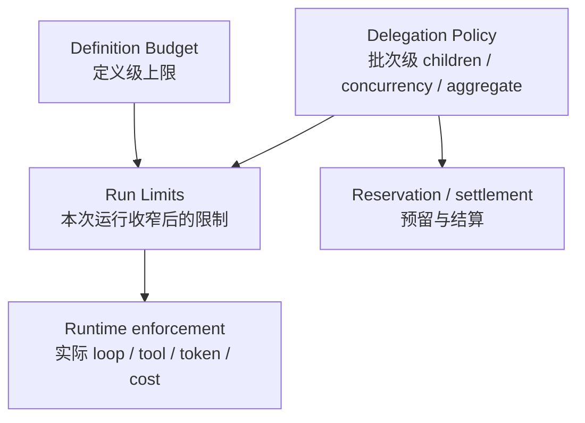

Definition 负责定义 Agent 能力的上限，Run Limits 可以进一步收窄；delegation policy 再对整个 Child batch 施加数量、并发和 aggregate 预算。

### 7.2 当前 delegation 默认值

来源：`/Users/dequan.mac/agent-workspace/Nasuta/platform/config/platform.go`

| 配置 | 当前默认值 |
|---|---:|
| `DelegationEnabled` | `true` |
| `MaxDepth` | `1`（应用侧固定） |
| `MaxChildren` | `6` |
| `MaxConcurrent` | `3` |
| `ChildTimeout` | `150s` |
| `MaxChildTurns` | `4` |
| `MaxChildToolCalls` | `16` |
| `MaxChildInputTokens` | `96,000` |
| `MaxChildOutputTokens` | `16,000` |
| `MaxReportTokens` | `4,000` |
| `MaxTotalTokens` | `720,000` |
| `MaxTotalCostMicros` | `0`，当前不启用 aggregate cost 上限 |
| `ParentAnswerReserve` | `4,000 tokens` |

理论 delegation token reservation：

```text
单 Child = 96,000 + 16,000 = 112,000 tokens
6 Child  = 672,000 tokens
答案预留 =   4,000 tokens
合计      = 676,000 tokens
aggregate = 720,000 tokens
headroom  =  44,000 tokens
```

`672,000 tokens` 是 6 个普通 Child 按默认上限进行的最坏预留算术，并不表示每次 Flow 请求都会实际消耗这些 token。实际 admission 还会被 Child Definition、Root 当前可用量和 Flow 专用静态预算收窄；任务完成后，未使用的 grant 会释放回 Root。

这里的 `ParentAnswerReserve = 4,000 tokens` 是 delegation aggregate token 预算中的答案预留，**不要与 Runtime 时间上的 30 秒 answer reserve 混淆**。

### 7.3 Parent / Child 当前预算闭环

事故发生时，Child delegation 已有每任务与批次级预算，但 QA Parent 没有设置累计 `MaxTotalTokens` / `MaxCostMicros`。截至 **2026-09-02**，该描述已经过时：当前 Parent/Child/Verifier 已接入 Root budget 抽象，生产 `run.NewStore(db)` 使用 MySQL Durable Root ledger，并接入 heartbeat/renew、owner/expiry/fence、Root/Run 原子创建、owner-aware recovery 和 expired reservation reclaim；测试/轻量绑定仍可使用进程内实现：

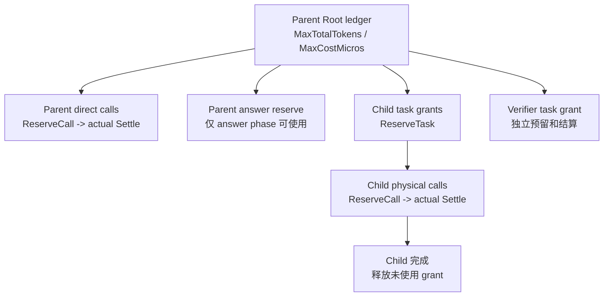

当前实际能力：

- delegation 开启时，QA Parent 注入 `MaxTotalTokens`、`MaxCostMicros`、`ParentAnswerReserve`；
- Definition Runtime 为 Parent 创建或继承同一个 Root ledger；
- Parent 直接模型调用、Child、semantic verifier 的 provider usage 都结算到 Root；
- Child admission 先申请 task grant，完整 grant 在任务结束前保持预留，未使用部分随后释放；
- durable DB `ReserveDelegationBatch` 失败时，会释放已申请的 in-memory grant；
- 普通 reasoning/tool call 和 Child grant 不能消耗 Parent answer reserve；final answer、continuation、repair 进入 answer phase 后可以使用 reserve；
- Child 只持有 task reservation，不持有 `RunBudgetTaskGate`，因此不能借预算句柄递归委派。

仍需明确四个边界：

1. `MaxOutputTokens` 是**单次 provider call 的输出上限**，不是累计输出预算；累计约束由 `MaxTotalTokens` 承担；
2. 默认 `MaxTotalCostMicros = 0`，仍表示 cost 维度不启用硬上限；
3. Durable Root ledger 已持久化 root/task/call reservation、actual settlement 和 unused grant release；heartbeat/renew、fencing、Root 与 `agent_runs` 原子创建、owner-aware recovery 和 Docker MySQL 双 Store 并发验证均已完成基础 P0；
4. retry/attempt 复用同一个 logical task grant，durable queue/worker re-dispatch 和 bounded accounting I/O 已接入；queue cancel/backpressure/dead-letter、默认 cost 治理和运营 SLO 仍未形成完整闭环。

### 7.4 当前预算公式与目标差距

当前 Parent 执行阶段已经满足以下进程内约束：

```text
Parent direct in-flight / settled usage
  + admitted Child remaining grants
  + Verifier remaining grant
  + protected Parent answer reserve
  <= Root MaxTotalTokens
```

Child 完成后，Root 保留实际 provider usage，只释放未使用 grant。对同一次物理调用，reservation 只能按同一 actual usage 幂等结算；不同 usage 的二次结算会失败。

完整请求级目标仍应显式定义为：

```text
TotalRequestBudget
  = PreparationBudget
  + ParentReasoningBudget
  + Σ ChildReservedBudget
  + VerificationBudget
  + ParentAnswerBudget
  + RetryAttemptBudget
```

并且在跨进程 durable ledger 中同时满足：

```text
Σ settled_tokens + Σ in_flight_tokens + Σ remaining_grants
  <= request_max_tokens
```

```text
Σ settled_cost + Σ in_flight_cost + Σ remaining_cost_grants
  <= request_max_cost
```

因此，当前不再是“只有 Child 有预算”，而是**Parent 执行阶段已有共享 Root token ledger；尚缺 request-entry preparation、retry attempt、默认 cost 硬上限和跨实例持久化**。


---

## 8. 当前超时语义：从 QA `Ask()` 入口开始，不是从第一次 LLM 调用开始

### 8.1 Parent deadline 的计算位置

当前代码在：

```text
/Users/dequan.mac/agent-workspace/Nasuta/internal/agent/qa/service.go
/Users/dequan.mac/agent-workspace/Nasuta/internal/agent/qa/prepare.go
```

`QA Ask()` 在请求入口记录 `requestStartedAt`；随后 `initializePreparation` 使用入口时间计算本次请求的 deadline，并沿用到后续阶段：

```go
requestStartedAt := time.Now()
// ...
deadline := requestStartedAt.Add(definition.Budget.Timeout)
prepared.requestDeadline = min(request context deadline, deadline)
```

因此 Parent timeout **从 QA 请求入口开始计算**，不是从 Definition resolve 完成、conversation reassemble 完成，也不是从第一次 LLM 调用开始重新计算：


公式为：

```text
ParentDeadline
  = min(
      外部 RequestContextDeadline,
      requestStartedAt + Definition.Timeout,
    )
```

这意味着 planning、retrieval、conversation preparation、Parent Runtime 和最终答案生成共同消费同一个 request-entry SLA；前置阶段不会再获得一段额外的 `Definition.Timeout`。当前仍需补齐 queue wait、worker lease、accounting write 的 bounded context，以及 Parent tool-window exhaustion 与用户主动取消的细粒度分类。

### 8.2 Runtime 内部的 answer reserve

`/Users/dequan.mac/agent-workspace/Nasuta/internal/agent/execution/loop.go` 中：

```go
runCtx, runCancel := context.WithTimeout(ctx, agent.cfg.Timeout)
loopCtx, loopCancel := context.WithTimeout(
    runCtx,
    agent.cfg.Timeout-agent.cfg.AnswerReserve,
)
```

默认配置：

```go
DefaultAgentAnswerReserve = 30 * time.Second
```

可视化为：

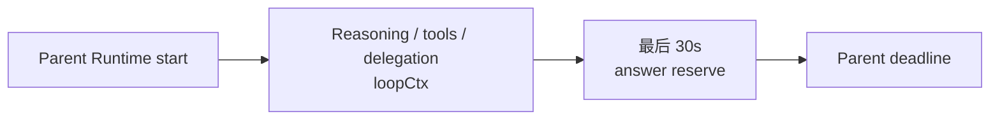

所以 delegation tool 使用 `tool.InheritCallerDeadline` 时，实际继承的是 Parent 当前 caller context；它在 Parent 的 `loopCtx` 中执行，通常不能侵占最后的 30 秒 answer reserve。

### 8.3 Child deadline 的计算

Child limits 位于：

```text
/Users/dequan.mac/agent-workspace/Nasuta/internal/agent/delegation/executor.go
```

逻辑为：

```text
ChildDeadline = min(
    ChildStartTime + ChildTimeout,
    ParentDeadline,
    ChildDefinitionTimeout - 1ms
)
```

实际执行还会叠加 caller context：

```text
EffectiveChildEnd = min(ChildTaskDeadline, CallerContextDeadline)
```

在当前 Parent answer reserve 语义下，近似为：

```text
EffectiveChildEnd
  = min(
      ChildStartTime + 150s,
      ParentDeadline - 30s
    )
```

因此 `ChildTimeout=150s` 是 policy 上限，不是每一个 Child 都能拿到的绝对 150 秒保证。

本次日志直接体现了这一点：

```text
首批 Child：timeout ≈ 2m29.97s
第四个 Child：timeout = 1m41.624s
```

第四个 Child 因为启动更晚，受 Parent 剩余窗口约束，只获得了更短的有效时间。

### 8.4 本次请求的时间线

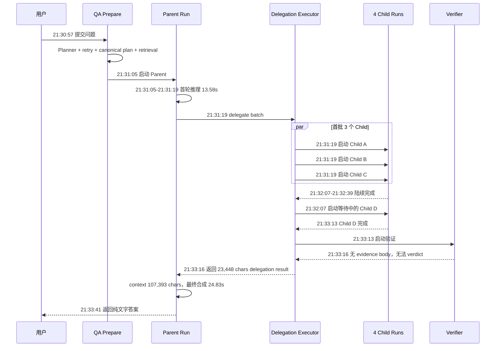

### 8.5 是否应该改成“从主 Agent 启动开始计时”

建议改为**请求级 deadline 在入口创建，Parent/Child 只消费剩余预算**，但要明确分层：

```text
RequestDeadline：从 QA 请求进入时创建，覆盖全部准备和执行
ParentDeadline：不晚于 RequestDeadline，覆盖 Parent 生命周期
ChildDeadline：不晚于 Parent 可用于 delegation 的剩余窗口
```

不要让每个阶段重新拥有一段完整 timeout，否则会出现：

```text
Planner 5min + Retrieval 5min + Parent 5min + Child 5min
```

这种端到端时间无限叠加的问题。

推荐公式：

```text
RequestDeadline = RequestStart + SLA
ParentDeadline  = min(RequestDeadline, ParentPolicyDeadline)
ChildDeadline   = min(
    ChildStart + ChildPolicyTimeout,
    ParentDeadline - ParentAnswerReserve,
    RequestDeadline
)
```

---

## 9. Flow 输出契约：事故根因与当前修复

### 9.1 事故发生时：Planner 识别了 intent，但没有绑定输出契约

日志已经有：

```text
canonical query plan kind=flow required_facets=4 entities=4
```

但在 **2026-08-31 的事故版本**中，这个字段主要用于 required facets、路由、检索准备和 Parent 调查指导，没有成为最终输出的硬约束。因此 Parent 可以用纯 bullet 满足“短结论 + 每业务一节”的软提示，最终没有 Mermaid 并不意外。

事故链路是：

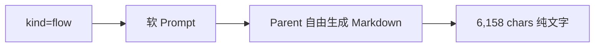

### 9.2 截至 2026-09-02：基础 Flow contract 已落地

当前代码已将 `domain.QueryFlow` 映射为 `RunOutputContract`：

```text
kind = flow
require_mermaid = true
subjects = normalized requested subjects
max_hops = 6
```

最终答案链路变为：

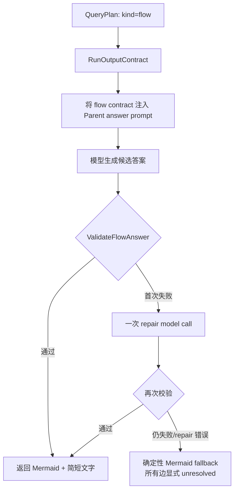

服务端当前强制检查：

1. 答案必须以 fenced `mermaid` diagram 开始；
2. 所有 Mermaid 图必须出现在解释文字之前；
3. 图后必须存在解释文字；
4. 图类型必须包含 `flowchart` 或 `sequenceDiagram`；
5. 至少存在一条 Mermaid edge；
6. 每张图不能超过 `MaxHops`；
7. 多 subject 请求至少有对应数量的图，并且每个 requested subject 必须在某张图中出现。

如果 repair 仍失败，fallback 不会编造已验证架构关系，而是为每个 subject 输出一条标记为“待确认”的虚线边，并明确说明原答案未通过流程图契约校验。

Flow Child 预算也已单独收窄：

| 项目 | 普通 Child 默认 | Flow Child 上限 |
|---|---:|---:|
| turns | 4 | 2 |
| tool calls | 16 | 6 |
| output tokens | 16,000 | 8,000 |
| report tokens | 4,000 | 2,000 |

这已经解决“flow 回答可以完全没有图”的最低质量门禁，并直接降低 Child 深度和报告长度上限。

同时，Child 报告的结构化 Flow IR 基础层也已接入：

- `investigation.report` 和 `delegation.report` schema 支持 `flow`；
- Flow IR 包含 `subject / status / nodes / edges / open_hops / confidence`；
- edge 支持 `protocol / sync_mode / evidence_refs / evidence_state`；
- 服务端限制最多 32 nodes、32 edges、16 open hops，并校验节点唯一性和边端点引用；
- `verified` edge 必须携带 evidence refs；引用不属于 admitted evidence index 时会被移除，并将该 edge 降级为 `unresolved`；
- invalid Flow IR 不进入 Parent handoff，而是记录显式 uncertainty；报告过长时会先按预算收缩 Flow IR。

### 9.3 结构化边级门禁与真实渲染已接入，语义证明仍未完成

当前 Flow IR 已形成 **Child → Parent → renderer → deterministic quality gate → final manifest gate** 的 typed handoff。Parent 在收到 delegation tool result 后收集 Child FlowIR，`finishLoop` 通过 `MergeFlowIRs` 做确定性合并；node/edge identity 纳入 normalized subject，避免不同业务的同名节点或边被错误合并。结论阶段将合并结果放入 server-owned execution context，由 `RenderFlowIR` 生成 canonical Mermaid，再由 `ValidateRenderedFlowIR` 校验 typed IR 不变量以及 rendered graph 与 canonical renderer 的字节级一致性。模型提供的 Mermaid 会被移除，不能注入最终架构图。

当前链路为：

```text
Child Flow IR
  -> Parent subject-isolated deterministic merge
  -> edge evidence refs / state gate
  -> server-owned canonical renderer
  -> deterministic rendered-flow quality gate
  -> final claim/edge manifest gate
  -> invalid/uncited 状态降级 unresolved
  -> Mermaid + concise prose
```

当前已经确定性保证：

- 有效 FlowIR edge 的 protocol、sync mode 和 evidence state 由服务端 renderer 写入图标签；`verified` 使用实线，`inferred / unresolved` 使用虚线；
- rendered graph 必须与 canonical `RenderFlowIR` 字节级一致，节点/边注入、遗漏和 marker 篡改不能通过；
- 多个 Child FlowIR 由服务端按确定性规则合并，而不是 Parent 再次从自然语言抽取；node/edge canonical identity 按 subject 隔离；
- final manifest 必须匹配 server-owned claim/edge identity、状态和 evidence refs，拒绝 unknown、重复项和 state upgrade；
- uncited finding 不得标为 `supported`，verified Flow edge 无 evidence refs 时降级为 `unresolved`；
- invalid FlowIR 或 renderer gate 失败会降级为显式 `unresolved`，不会回退为模型自由生成的确定性图；
- 固定 `@mermaid-js/mermaid-cli@11.16.0` + 本机 Chrome 已真实生成并校验 SVG 根元素。

仍未强制保证：

- 每条 `verified` edge 的 citation 都能解析到完整 evidence body 并获得语义一致的 verifier verdict；
- protocol、同步/异步和状态变化的自然语言解释逐句被 evidence body 语义蕴含；
- Mermaid 在目标 Dashboard 的全部浏览器、主题、字体和 CSP 组合中都能正确渲染；
- overview diagram、合法跨 subject edge 和跨 scope evidence 具有独立、明确的产品 schema。

完整目标仍应是：

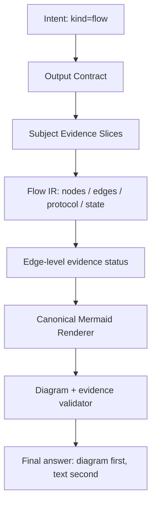

目标答案顺序：

```text
1. 总览架构图
2. 每个业务主链路图
3. 关键节点解释（每业务不超过 6 hop）
4. verified / inferred / unresolved 证据状态
5. 未闭合链路和继续深挖入口
```

因此 P0 的准确状态是：**Flow 输出形状、Child typed handoff、subject-isolated deterministic merge、server-owned renderer、结构化 claim/edge evidence hard gate 和 Chrome 实际 SVG render 已完成基础闭环；overview/合法跨 subject edge 产品语义、目标前端矩阵和自然语言语义蕴含尚未完成。**


---

## 10. 证据和验证问题

### 10.1 事故发生时：Verifier 没有形成 verdict

事故日志中的 Verifier 结果是：

```json
{
  "summary": "No cited evidence bodies are available to verify any claim, so no verdict can be issued.",
  "verdicts": [],
  "uncertainties": [
    "The evidence_lookup context is missing, so none of the cited evidence bodies could be retrieved for verification."
  ]
}
```

当时的断点是：

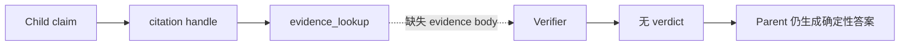

### 10.2 截至 2026-09-02：evidence lookup 与结构化 manifest gate 已接入

当前实现已经增加服务端 `evidence_lookup` 构造：

- citation reference 先解析到 admitted `EvidenceUnit`；
- 优先从 server-owned `ContextBlock` 提取 authoritative body；
- 找不到 body 时，可使用匹配的 bounded child observation summary；
- 单条 summary 最多 2,000 bytes、单条 body 最多 8,000 bytes、Verifier body 总量最多 32,000 bytes；
- Validator 分开记录 `CitationCoverage` 和 `EvidenceBodyCoverage`；
- semantic verifier request 会携带 `EvidenceLookup`；
- body coverage 低于 citation coverage、verifier 不可用，或任一 verdict 为 `unresolved` 时，delegation result 会加入警告，要求 Parent 保留 inferred / unresolved 语义；
- verifier 对 submitted claims 返回零条 verdict 时，`projectVerification` 会为每个 claim 生成确定性的 `unresolved` verdict，并记录 uncertainty；
- Parent 最终答案必须声明采用的 delegation report，并提交 server-owned claim/edge manifest；
- manifest 校验 identity、状态、evidence refs、重复项和 state upgrade；uncited finding 不能标为 `supported`，verified Flow edge 必须保留 evidence refs。

当前链路：

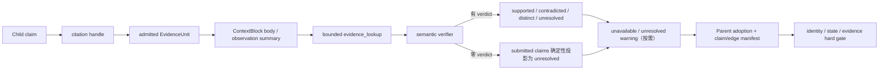

这意味着 P0-4 的结构化 claim/edge guardrail 已形成基础闭环，但仍不是自然语言句子到 evidence body 的完整语义证明。

### 10.3 已完成结构化硬门禁，仍未完成句子级语义蕴含

当前已能把“Verifier 对 submitted claims 返回零 verdict”确定性投影为逐 claim 的 `unresolved`，并通过 final manifest 拒绝 unknown claim/edge、重复项、证据状态升级、uncited supported finding 和无 evidence refs 的 verified edge。该门禁约束的是**服务端结构化状态与引用**，不会逐句解析最终自然语言并证明每条表述都被 evidence body 语义蕴含。body 也可能因为上下文缺失或 32,000-byte 总量上限而不可用/被截断，因此仍需要句子级 entailment/NLI 或等价的受控生成机制。

目标验证状态应明确为三态：

| 验证状态 | Parent 可用表达 |
|---|---|
| `verified` | 可以使用确定性语气，并附证据引用 |
| `inferred` | 必须使用“推断/从现有证据看”，不得伪装成已验证 |
| `unresolved` | 必须明确“待确认”，不能写成完整链路 |

服务端最终目标：

```text
当前已完成：
  -> 零 verdict 的 submitted claims 自动投影为 unresolved
  -> uncited finding 禁止 supported
  -> verified edge 无 evidence refs 自动降级 unresolved
  -> final manifest 禁止 unknown / duplicate / state upgrade
  -> renderer 和最终 manifest 继承同一 evidence status

仍需完成：
  -> 将最终自然语言拆分为可验证句子/claim
  -> 对每句执行 evidence body entailment/NLI 或受控模板生成
  -> body 缺失、截断或不蕴含时确定性降级/拒绝
  -> 将语义 verdict 与用户可见措辞一一绑定
```

### 10.4 报告结构仍应从“自然语言优先”改成“证据优先”

Child 目标输出：

```json
{
  "subject": "消息中心",
  "status": "partial",
  "nodes": [],
  "edges": [],
  "claims": [
    {
      "statement": "...",
      "status": "verified",
      "evidence_ids": ["ev_xxx"]
    }
  ],
  "open_hops": [],
  "summary": "最多 300 字"
}
```

自然语言 summary 只作为展示字段，不能继续作为 Parent 唯一事实来源。


---

## 11. 与业界成熟实现的差距

> 本节是架构模式对照，不把某个厂商或框架当作唯一标准。成熟实现的共同关注点通常是：**持久化状态、可恢复执行、显式预算、结构化中间结果、可观测性和可验证输出。**

### 11.1 差距总表

| 能力 | 当前 Nasuta（2026-09-02） | 成熟实现通常具备 | 仍存差距 |
|---|---|---|---|
| Parent/Child 状态 | Run、Step、Delegation、Artifact、Attempt、Checkpoint、`parent_resume` work item 已持久化，recovery worker 可恢复 Parent logical loop | durable state machine 驱动 Parent，Child 可恢复 | 基础闭环已完成；仍缺多进程故障注入、长期 soak 和运营 runbook |
| Child 调度 | durable queue + kind-isolated worker、owner/expiry lease、heartbeat/fence、expired re-dispatch、Parent durable join | durable queue / workflow scheduler、lease、任务重放 | backpressure、显式 cancel、dead-letter、人工重放和尾部控制仍弱 |
| 超时 | request-entry absolute deadline + Child min deadline + Parent answer reserve + per-operation `DurableIOTimeout` | per-node timeout/cancellation + queue/lease deadline awareness | queue SLO、retry backoff telemetry 和取消原因分类仍需完善 |
| Retry | logical task grant + attempt 持久化；queue/lease 驱动跨实例 re-dispatch | attempt、backoff、retryable/non-retryable 分类、跨实例重派 | 基础重派已完成；仍缺 dead-letter、人工 replay 和长期悬挂治理 |
| Task identity | 服务端生成 canonical task ID / stable work ID，并重写 dependency alias；JSON payload 按语义幂等 | control-plane identity 完全由服务端拥有 | 基础闭环已完成，仍需更完整 planner 与冲突评测 |
| 中间结果 | bounded report + evidence ledger + typed FlowIR；subject 纳入 node/edge identity；verified edge 无 ref 会降级 | typed artifact / deterministic IR merge / citation graph | overview、合法跨 subject edge 和跨 scope evidence 产品 schema 仍缺 |
| 输出渲染 | server-owned canonical renderer + deterministic gate；固定 Mermaid CLI + 本机 Chrome 已真实生成 SVG | intent 驱动 renderer + schema/evidence validator + 多端渲染矩阵 | 仍缺目标 Dashboard 浏览器/主题/字体/CSP 全矩阵和 overview 语义 |
| 证据验证 | evidence lookup/body coverage、semantic verifier、claim/edge manifest hard gate、uncited supported 降级已接线 | claim-level grounding gate，未验证内容确定性降级，语义蕴含验证 | 结构化状态门禁已完成；自然语言句子到 evidence body 的 NLI 仍缺 |
| 预算控制 | Durable Root、heartbeat/renew、fencing、原子 Root/Run、owner-aware recovery 与真实 MySQL 双 Store 验证已完成 | request-level durable token/cost ledger + fenced lease/recovery | 默认 cost 为 `0`、price version/变更策略和运营告警仍缺 |
| 可观测性 | 有 Run/Step/LLM usage、delegation 与 work item 状态 | trace tree、critical path、queue wait、quality metrics | 需要把 queue、resume、预算和答案质量关联为 SLO |
| 评测 | 单元/race/sqlmock、Docker MySQL 并发 recovery、Chrome Mermaid SVG 已通过 | golden set、图解析、事实/覆盖率、P95/P99、故障注入 | 缺真实请求 golden set、多进程 fault injection 和完整前端矩阵 |

### 11.2 对照的通用成熟模式

- **Durable execution**：长任务不依赖单个进程内存，必须能在进程重启后从已持久化状态继续或安全重放。
- **Child workflow / subgraph**：Child 具有明确输入、输出、边界和状态，而不是仅仅把一大段自然语言塞回 Parent 上下文。
- **Per-node retry and timeout**：每个节点有可重试错误、不可重试错误、截止时间和取消语义，且不会突破请求总 SLA。
- **Tracing and evaluation**：Parent、Child、tool call、queue wait、provider call、artifact 和最终答案在一棵 trace tree 中可关联，并能计算质量指标。

这些模式与当前已有的 Run/Step/Usage/Delegation/Artifact 基础是兼容的；当前差距主要在**闭环程度和默认行为**，不是必须推倒重来。

### 11.3 不建议现在优先做的事情

在以下能力未完成前，不建议优先引入：

- peer-to-peer 自由协作；
- 递归委派；
- 共享可变 Agent State；
- 复杂 DAG DSL；
- 让模型自由选择 provider/model/tool/budget；
- 用更大的上下文窗口掩盖检索和输出契约问题。

---

## 12. 推荐目标链路

### 12.1 目标架构

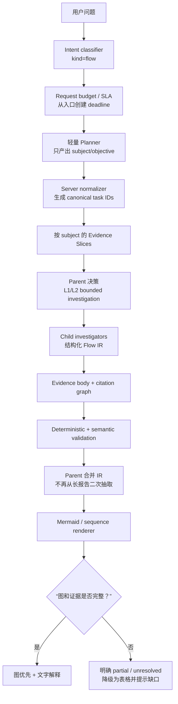

### 12.2 目标 Parent/Child 执行方式

```text
Parent
  1. 识别 flow intent
  2. 生成 4 个 subject task
  3. 服务端规范化 ID、预算和证据范围
  4. 一次 batch 委派
  5. 等待/恢复 Child 状态
  6. 合并 Flow IR
  7. 通过 renderer 生成图
  8. 用 evidence guardrail 生成简短说明

Child
  1. 只读检索
  2. 找入口、关键调用、协议、状态、回传
  3. 最多输出 6 个 verified/inferred hops
  4. 直接输出 nodes/edges/open_hops
  5. 每条边绑定 evidence body
  6. 到时返回 partial IR，而不是丢失全部结果
```

### 12.3 建议的 flow answer schema

```json
{
  "kind": "flow",
  "overview": {
    "mermaid": "flowchart TB ...",
    "summary": "..."
  },
  "subjects": [
    {
      "subject": "rgb灯效",
      "status": "partial",
      "mermaid": "flowchart LR ...",
      "hops": [
        {
          "from": "App",
          "to": "hsas-scene",
          "protocol": "HTTP",
          "sync_mode": "sync",
          "evidence_status": "verified",
          "evidence_ids": ["ev_xxx"]
        }
      ],
      "open_hops": ["设备回传路径待确认"]
    }
  ]
}
```

注意：Mermaid 字符串可以由服务端 renderer 根据 IR 生成；不建议让模型直接自由拼接所有图代码。

---

## 13. 改造清单和验收标准

### 13.1 P0：当前落地状态与剩余闭环

#### P0-1：把 `kind=flow` 变成硬输出契约 — 基础闭环已完成

已完成：

- `QueryFlow -> RunOutputContract`；
- Mermaid 必须在文字之前；
- requested subject 数量和名称覆盖校验；
- hop 上限和至少一条 edge 校验；
- 一次 repair；
- repair 失败后生成显式 unresolved 的 Mermaid fallback；
- server-owned `RenderFlowIR`，模型生成的 Mermaid 不进入最终 canonical answer；
- `ValidateRenderedFlowIR` 确定性质量门禁：唯一闭合 Mermaid fence、`flowchart LR`、typed FlowIR 不变量、节点/边/open hop 完整性、protocol/sync/evidence state 和 verified evidence refs 校验；
- rendered graph 与服务端 canonical renderer 字节级一致，注入节点/边、节点遗漏和 marker 篡改均会被拒绝；
- invalid FlowIR 或 rendered graph 自动降级为通用 `unresolved` FlowIR，并明确提示未通过服务端渲染质量门禁。

固定 `@mermaid-js/mermaid-cli@11.16.0` + 本机 Chrome 的真实 SVG smoke 已通过，node/edge canonical identity 也已按 subject 隔离，verified edge 无 evidence refs 会确定性降级。仍需完成 overview diagram 独立语义、合法跨 subject edge schema、目标 Dashboard 浏览器/主题矩阵，以及自然语言句子到 evidence body 的语义蕴含验证。

#### P0-2：服务端生成 canonical task ID — 已完成

已完成：

- 模型给出的 `id` 仅作为 dependency alias；
- 服务端按任务位置生成 `task_001`、`task_002` 等 canonical ID；
- `depends_on` 会映射到 canonical ID；
- 非 ASCII / 非 canonical 模型 ID 不再直接导致 planner schema retry。

仍需通过线上指标验证 schema retry rate 是否降到目标值。

#### P0-3：Flow Child bounded execution 与 typed Flow IR — 基础闭环已完成

已完成：

- Flow Child 最多 2 turns；
- 最多 6 tool calls；
- 最多 8,000 output tokens；
- 最多 2,000 report tokens；
- Child input 携带 `output_kind=flow` 和 `max_hops`；
- `investigation.report` / `delegation.report` 支持 typed Flow IR；
- nodes / edges / protocol / sync mode / open hops / evidence state 有 schema 和服务端校验；
- unknown verified evidence ref 会被移除，并将 edge 降级为 `unresolved`；invalid IR 会被拒绝进入 handoff。

Parent deterministic merge、subject 隔离、canonical renderer、rendered-flow 确定性质量门禁和 Chrome SVG smoke 已接入；仍需完成 overview/合法跨 subject edge 产品语义、目标前端渲染矩阵和自然语言语义蕴含验证。

#### P0-4：evidence body lookup 和最终答案 guardrail — 结构化硬门禁已完成

已完成：

- ContextBlock / observation 到 bounded evidence lookup；
- citation coverage 与 body coverage 分开统计；
- verifier request 携带 evidence lookup；
- verification unavailable / unresolved warning；
- Verifier 对 submitted claims 返回零 verdict 时，逐 claim 确定性投影为 `unresolved`；
- Parent report adoption metadata 校验；
- final manifest 精确匹配 server-owned claim/edge identity、状态和 evidence refs，拒绝 unknown、重复项和 state upgrade；
- uncited finding 不得标为 `supported`，verified Flow edge 必须保留 evidence refs，否则降级为 `unresolved`。

仍需完成：自然语言最终答案的句子级 entailment/NLI。当前 hard gate 能证明“模型没有越权提升服务端状态或引用未知证据”，不能证明每一句表述都被 evidence body 语义蕴含。

#### P0-5：Parent–Child hierarchical budget — fenced Durable Root 基础 P0 已完成

当前已完成：

- Parent / Child / Verifier 共享 Root budget 抽象；
- 生产 MySQL Durable Root：root/task/call reservation、actual usage settlement、unused grant release；
- `run.NewStore(db)` 为实例生成 `hostname + pid + random` 的唯一 lease owner；
- `NewDurableBudget` 自动 acquire Root lease，TTL 为 `max(1 minute, RootDeadline - now + 30 seconds grace)`；
- Run outcome 持久化后，Root 正常 Finish 自动 release lease；仍有 active reservation 时 release 会显式失败并保留 lease，等待 expiry/reclaim；
- live foreign owner 会被拒绝；expired owner takeover 会在同一事务中回收 open call / active task reservation、清零 reserved usage，并保留 settled actual usage；reclaim 幂等；
- lease heartbeat/自动 renew、fencing token，以及 reservation/settlement/checkpoint/terminal write 的 owner/fence 校验；
- Root ledger 与 `agent_runs` 同事务原子创建；`RecoverInterrupted()` 按 owner/expiry claim，并只入队 `parent_resume`；
- durable queue、worker lease、kind 隔离、expired Child re-dispatch、stale renew/complete 拒绝与 Parent durable join；
- retry attempt 复用同一个 logical task grant；
- answer reserve、DB admission failure rollback、overrun settlement error；
- per-operation `DurableIOTimeout` 与 bounded cleanup grace；
- fake durable backend、SQL backend sqlmock、race，以及 Docker MySQL 双 Store 单 winner/fencing/concurrent recovery 测试。

当前仍不能称为完整 production-grade durable execution：默认 cost 治理和价格版本未闭环；queue cancel/backpressure/dead-letter/人工重放与 SLO/告警未完成；还缺多进程 `kill -9`、网络分区、lease jitter 和长时间压力 soak。

### 13.2 剩余 P0：可靠性与最终答案闭环

以下项目仍属于“生产级 P0/上线硬化”，完成前不应把当前实现描述为完整的生产级 durable execution：

- queue cancel/backpressure/dead-letter/人工重放、长期悬挂 work item 治理，以及完整 partial/unavailable/取消原因聚合；
- queue/worker/recovery 的 P95/P99、吞吐、丢失、重试、stale write 和告警 SLO；
- 多进程 `kill -9`、网络分区、lease jitter、数据库 failover 和长时间压力 soak；
- 默认非零 cost policy、price version 与 provider price 变更策略；
- overview diagram 与合法跨 subject edge/evidence scope 的产品 schema；
- 目标 Dashboard 的浏览器、主题、字体和 CSP 渲染矩阵；
- 自然语言句子到 evidence body 的语义蕴含/NLI，避免把结构化 manifest gate 误写成完整语义证明。

### 13.3 P1：两到四周内继续完成

- Retrieval 按 subject 生成 Evidence Slice；
- 统一 trace：`request -> parent -> delegation -> child -> attempt -> tool -> llm -> artifact`；
- 增加 `queue_wait_ms`、`critical_path_ms`、`context_chars`、`report_chars`、`reserved_vs_actual_tokens`、`retry_count`、`evidence_coverage`、`unsupported_claim_rate` 指标；
- 将 `effective=single_agent` 改为更准确的路由枚举，例如 `parent_dynamic_delegation`；
- 建立 flow 真实请求回归集，验证延迟、图覆盖、证据覆盖和事实一致性；
- 完善完整 partial/unavailable 聚合的用户可见解释与取消原因分类；
- 增加单 Agent vs Delegated Agent 的离线评测和线上质量 dashboard。

### 13.4 P2：持续演进

- 多视图 Flow IR：业务总览、服务调用、设备/消息时序；
- 对高风险结论提供交互式证据展开；
- 将已完成的 flow 回归集扩展为长期 golden set；
- 根据问题复杂度动态选择 fast model / deep model，而不是所有 Child 都走深度模型路径；
- 在 P0/P1 稳定后，再考虑通用 Workflow、human approval、handoff 和更复杂 DAG。

### 13.5 验收指标

| 指标 | 事故观测 / 当前实现 | 目标 |
|---|---|---:|
| 端到端 P50（L1 flow） | 事故单样本约 164s；尚无新基线 | ≤ 30s |
| 端到端 P95（L1 flow） | 待建立线上基线 | ≤ 60s |
| Planner schema retry rate | 事故至少 1 次；canonical ID 服务端重写已落地 | < 1% |
| Flow answer Mermaid presence | 事故 0%；当前 flow contract 路径由 validator/fallback 强制 | 线上 100% |
| Requested subject diagram coverage | 事故 0%；当前 validator/fallback 强制 subject coverage | 线上 100% |
| 关键 hop evidence body coverage | 已有 `EvidenceBodyCoverage` 指标，事故样本不可验证 | ≥ 95% |
| Unresolved claim overstatement | 当前只有 warning/adoption 约束，尚非逐 claim 硬门禁 | 0 |
| Flow Child 执行预算 | 已收窄到 2 turns / 6 tools / 8k output / 2k report | 100% flow 请求生效 |
| Child report/context 二次膨胀 | 事故 delegation 23,448 chars、Parent context 107,393 chars；当前已有 Child FlowIR、Parent deterministic merge 和 server-owned renderer | 合并 IR + bounded report 后 ≤ 20,000 chars/request |
| Parent total token hard-limit | delegation 开启时 Root `MaxTotalTokens` 已生效 | 100% 请求生效 |
| Parent total cost hard-limit | Root 支持，但默认 `MaxTotalCostMicros=0` | 生产配置 100% 非零生效 |
| Child timeout 后 partial result | 基础状态、interrupted/unavailable artifact 已存在；完整 batch 聚合和取消原因仍待补齐 | 100% 可解释返回 |
| P99 queue wait | 事故第四 Child 等槽位；当前仍无完整 queue/lease 指标 | 有指标且受 SLA 约束 |

---

## 14. 最终判断

对 **2026-08-31** 事故回答的两个用户反馈都成立：

1. **回答时间太长**：深度 Child 调查、并发槽位等待、长报告和 Parent 二次合成共同造成 164 秒端到端时间；其中 delegation 117.30 秒，是最大瓶颈。
2. **回答质量太差且全是文字**：事故版本虽然识别了 `kind=flow`，但没有最终输出契约，Verifier 也没有拿到可读 evidence body，因此没有形成“图 + 证据”的闭环。

截至 **2026-09-02**，已经完成的关键修复是：

```text
canonical task ID 服务端重写
  + flow RunOutputContract
  + Mermaid validator / repair / unresolved fallback
  + Flow Child 预算收窄
  + typed FlowIR / edge evidence state 校验与降级
  + Parent deterministic FlowIR merge
  + server-owned canonical Mermaid renderer
  + deterministic rendered-flow quality gate
  + Parent/Child/Verifier Durable Root token ledger
  + Root owner/expiry lease lifecycle + heartbeat / renew / fencing
  + Root ledger 与 agent_runs 原子创建
  + owner-aware recovery + parent_resume worker
  + durable queue / Child re-dispatch / Parent durable join
  + expired reservation reclaim（保留 settled usage）
  + subject-isolated FlowIR merge + claim/edge manifest hard gate
  + pinned Mermaid CLI + Chrome 真实 SVG
  + evidence lookup / body coverage / verification warning
```

因此当前系统已经不再是事故时的“纯 Prompt 约束 + 只有 Child aggregate budget”。但它仍处于基础闭环阶段，下一步不应继续增加 Agent 数量，而应完成：

```text
queue cancel / backpressure / dead-letter / 人工重放
  -> 多进程 kill -9 / 网络分区 / lease jitter / soak
  -> 默认 cost / price version 治理
  -> overview / 合法跨 subject edge 产品 schema
  -> 目标 Dashboard 浏览器与主题矩阵
  -> 自然语言句子到 evidence body 的语义蕴含
  -> Evidence Slice / telemetry / evaluation
```

**结论：本轮已解决“流程问题必须有图”、Parent/Child/Verifier 共享 Root budget、Parent logical crash resume、lease heartbeat/fencing、Root/Run 原子创建、owner-aware recovery、queue/worker re-dispatch、subject 隔离、结构化 claim/edge evidence hard gate，以及真实 MySQL/Chrome 专项验收等基础 P0。尚未解决的是运营级 queue 控制与 SLO、多进程故障注入、默认 cost 治理、overview/合法跨 subject edge 产品语义、目标前端渲染矩阵，以及自然语言句子到 evidence body 的语义蕴含。当前仍不能将实现描述为完整的生产级 durable execution。**


---

## 15. 外部模式参考

本文的“业界成熟模式”采用以下官方文档所体现的通用设计方向作为对照：

- Temporal 官方文档：Durable Execution、Child Workflows、Retry Policies、Timeouts；
- LangGraph 官方文档：Persistence、Durable Execution、Interrupt/Resume、Subgraphs；
- OpenAI Agents SDK 官方文档：Handoffs、Tracing、Multi-agent orchestration。

这些资料用于说明通用架构模式，不代表 Nasuta 必须直接引入对应框架。

---

## 16. 2026-09-02 P0 修复后的质量门禁状态

### 16.1 现在的 flow 输出链路

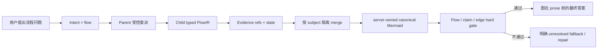

### 16.2 本轮补强

- 同名节点不再仅按 `kind + label` 合并，而是按 `normalized subject + kind + label` 形成 canonical identity；
- 同名 edge 也按 subject 隔离，避免把业务 A 的 evidence 迁移到业务 B；
- verified edge 没有 evidence refs 时降级为 unresolved；
- finding 没有 citation 时，即使 verifier 没有开启，也不能在最终 contract 中被标成 supported；
- final answer 的 manifest 仍必须精确匹配 server state，禁止 unknown claim/edge、重复项和 evidence state upgrade；
- Mermaid CLI 测试只在真实 renderer 可用时运行，缺失时显式报告 unavailable。

### 16.3 仍需避免的过度 claim

当前 hard gate 能证明“答案使用的 claim/edge 状态没有越权升级”，不能证明模型自然语言的每一句都完成了语义蕴含验证。生产文案应继续区分：

- `supported`：有 citation/evidence ref，且 verifier 通过；
- `inferred`：有证据但需要推断，图中使用虚线或明确标注；
- `unresolved`：证据正文、scope 或 verifier 不足，不得写成确定事实。

最终答案仍建议使用以下顺序：

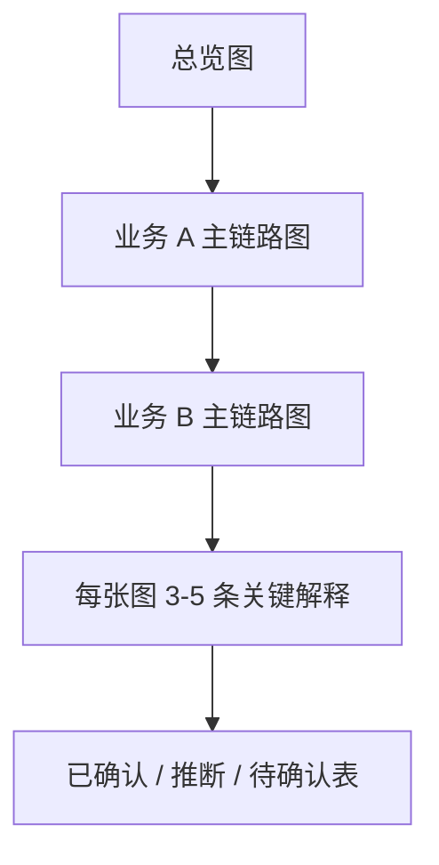

这比输出长篇 Controller、Feign、表名清单更符合流程问题的认知负担和验收方式。


## 17. 2026-09-02 队列竞态对回答时延与质量的影响

本轮队列修复不是简单增加轮询，而是把 Parent 的“等待 Child 结果”从进程内假设改成 durable join。这样可以避免一次错误的 unavailable settlement 直接截断证据和 FlowIR 链路。

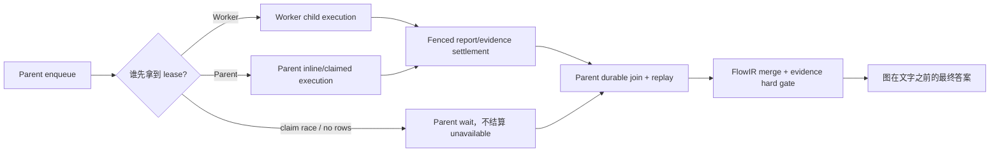

### 17.1 对“回答时间太长”的直接改善

- Parent 不再因错误的 claim race 立即走失败分支后重新触发一轮补偿逻辑；
- Worker 先 claim 时，Parent 只等待已有 durable task，不重复调用模型；
- worker lease 过期后可 re-dispatch，旧 worker 的 renew/complete 被 fencing 拒绝；
- 仍需通过 queue latency、claim wait、child runtime、settlement wait、parent resume 等指标拆解真实 P95/P99，不能只看总耗时。

### 17.2 对“回答质量太差”的直接改善

- Parent replay 的是持久化 report artifact，而不是重新让模型口述 Child 结果；
- FlowIR merge、canonical Mermaid renderer 和 evidence state gate 仍在 Parent 侧执行；
- Parent cancellation 不再用 unavailable settlement 覆盖 Worker 可能刚刚写入的证据；
- `work_id` payload 冲突直接失败，避免同一逻辑任务被错误 payload 污染。

### 17.3 验收口径

截至 **2026 年 9 月 2 日**，源码级测试已覆盖上述竞态和 fencing 条件；Docker MySQL 已验证双 Store 单 winner claim、stale fence 拒绝和并发 recovery，本机 Chrome 也已通过固定版本 Mermaid CLI 的真实 SVG 渲染。仍未完成的是多进程故障注入/压力 soak、目标 Dashboard 全主题兼容，以及自然语言 claim 与证据正文的语义蕴含证明。文档和对外状态不得把 deterministic contract gate 表述成完整语义证明。
