# 生产级 Durable Execution 剩余七项能力说明

> **状态：生产化能力说明与实施验收基线**  
> **更新日期：2026-09-02**  
> **适用范围：** Nasuta QA Parent/Child 委派、Durable Root、`agent_work_items`、FlowIR、Dashboard 和 evidence verification。  
> **相关文档：** [21-Agent 委派现状、超时语义与能力演进路线](21-agent-delegation-analysis-and-roadmap.zh-CN.md)、[22-流程类问题回答质量复盘](22-flow-query-answer-quality-review-20260831.zh-CN.md)。

## 1. 为什么还需要这七项能力

当前基础 P0 已经具备：

- Parent logical checkpoint 和 `parent_resume`；
- Root lease heartbeat/renew、owner、expiry、fencing token；
- Root ledger 与 `agent_runs` 原子创建；
- owner-aware recovery；
- durable queue、worker lease、Child expired re-dispatch；
- Parent durable join；
- FlowIR subject 隔离、canonical renderer 和结构化 claim/edge hard gate；
- Docker MySQL 双 Store 并发验证；
- 固定 Mermaid CLI 与 Chrome 的真实 SVG 渲染验证。

这说明系统已经有了“任务崩溃后能够被接管”的基础能力，但还没有完全解决以下问题：

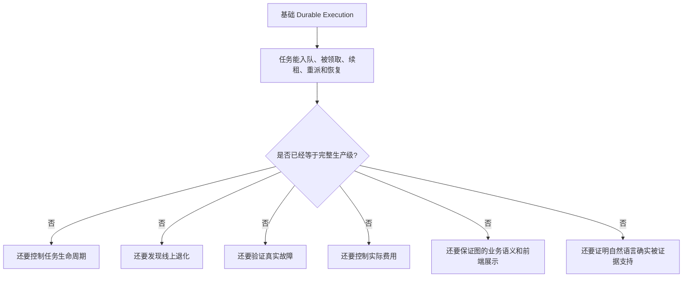

> **大白话解释：** 现在系统已经像一辆“发动机、刹车和安全带基本可用”的车，但还没有完整的交通规则、仪表盘、碰撞测试、油费限制和全路况验证。能开起来，不等于已经适合无条件投入大规模生产。

七项能力分别保护三个层面：

| 层面 | 能力 | 保护目标 |
|---|---|---|
| 执行可靠性 | Queue 生命周期治理 | 任务不会失控、无限执行或无限重试 |
| 执行可靠性 | SLO、指标、告警 | 系统发生退化时能够及时发现 |
| 执行可靠性 | 多进程故障注入与 soak | 证明恢复机制在真实故障下成立 |
| 成本治理 | Cost policy 与 price version | 防止费用失控，并保证账目可复算 |
| 输出语义 | Overview 与跨 Subject Schema | 图中的业务关系不会错误合并或丢失 |
| 输出展示 | Dashboard 渲染矩阵 | 后端生成的图在用户端确实可见、可读、安全 |
| 答案可信度 | Evidence entailment / NLI | 引用的证据正文真的支持答案中的句子 |

---

## 2. Queue cancel、backpressure、dead-letter、人工重放

### 2.1 这项能力具体做什么

它为 durable queue 补齐完整的任务生命周期：

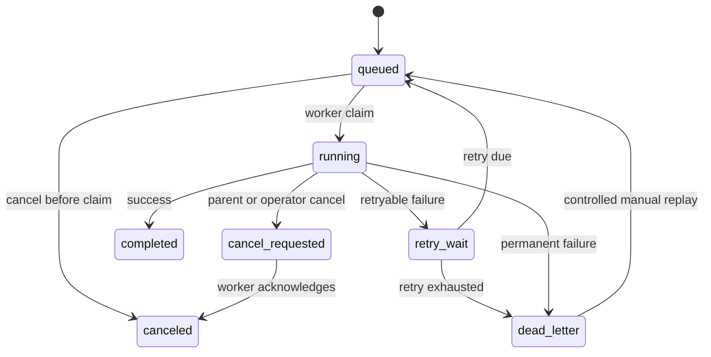

当前 lease/fencing 解决的是“谁有权执行和写入”，这一项解决的是：

- 任务是否还应该继续执行；
- 系统是否还能接收更多任务；
- 一直失败的任务应该去哪里；
- 修复故障后如何安全地重新执行。

### 2.2 Queue cancel

#### 技术含义

Parent、用户或管理员可以取消：

- 尚未被 Worker claim 的任务；
- 正在执行的任务；
- 已经过 Root deadline 的任务；
- 已经不再影响最终答案的剩余 Child；
- 参数或业务范围错误的任务。

建议增加：

```text
cancel_requested_at
cancel_reason
cancel_requested_by
canceled_at
cancel_ack_owner
```

Worker 在 claim、heartbeat、模型调用前后和 settlement 前检查 cancel 状态。已经被取消的 Worker 不得再提交正常成功结果。

> **大白话解释：** 用户已经关掉页面或者 Parent 已经拿到答案时，后台 Child 不应该还在继续花钱查资料。Queue cancel 就是给后台任务提供一个真正有效的“停止按钮”，而不是前台不等了、后台却继续跑。

#### 解决的问题

没有 cancel 时可能出现：

```text
用户取消请求
  -> Parent 返回 canceled
  -> Child 仍调用模型和检索服务
  -> lease 继续续租
  -> 继续消耗 token、费用和 Worker 槽位
```

### 2.3 Backpressure

#### 技术含义

系统根据容量决定：正常接收、降低 fan-out、延迟、返回 partial，或者直接拒绝新任务。

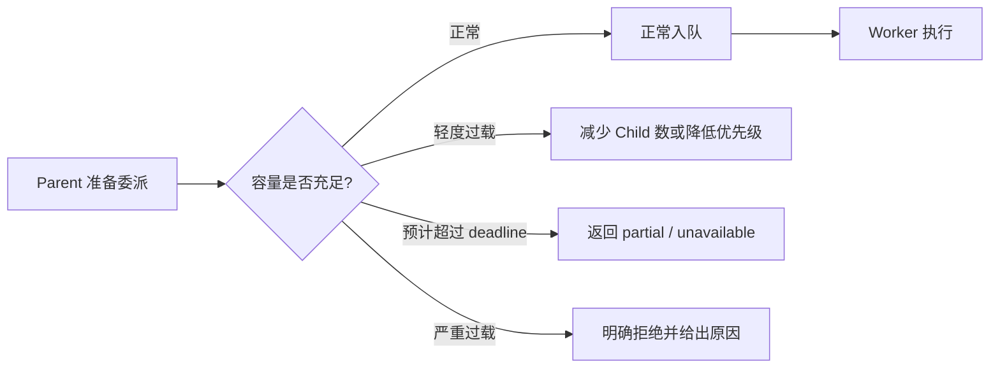

容量判断可以包含：

- 全局、租户、Root Run 的队列长度；
- 最老任务等待时间；
- Worker 并发利用率；
- Provider rate limit；
- 数据库连接池压力；
- 当前 Root token/cost reservation；
- 预计 queue wait 是否会突破 request deadline。

> **大白话解释：** Backpressure 就像餐厅已经坐满时停止继续发号，或者明确告诉顾客要等多久。没有它时，系统会一直收任务，最后所有任务一起超时，而不是只拒绝超过容量的那一部分。

#### 解决的问题

防止以下雪崩：

```text
请求突增
  -> Parent 大量 fan-out
  -> Queue 快速膨胀
  -> Queue wait 超过 deadline
  -> Retry 和 recovery 增加数据库压力
  -> 正常任务也无法完成
```

### 2.4 Dead-letter queue

#### 技术含义

任务超过最大重试次数、最大存活时间，或者发生永久错误后，进入隔离状态，不再自动重试。

建议记录：

```text
dead_letter_reason
last_error_class
attempt_count
first_enqueued_at
last_failed_at
payload_version
operator_note
```

适合进入 dead-letter 的情况：

- payload 或 schema 永久不合法；
- capability/permission 永久不允许；
- 数据版本无法解析；
- Child report 多次无法满足 contract；
- retry 次数或任务最大年龄已耗尽；
- 同一个数据库或 Provider 错误持续出现。

> **大白话解释：** 有些包裹地址就是错的，快递员再送一百次也送不到。Dead-letter queue 就是把这种“继续重试也不会成功”的任务单独放到问题区，避免它一直占着正常队列。

#### 解决的问题

- poison task 无限重试；
- Provider 和数据库资源被持续消耗；
- 相同错误重复刷日志和告警；
- 正常任务被失败任务挤占。

### 2.5 人工重放

#### 技术含义

管理员修复外部故障、数据或配置后，可以从 dead-letter 或失败记录发起受控 replay。

重放不应该直接把原记录改回 `queued`，而应保留审计关系：

```text
original_work_id
replay_work_id
replay_id
replay_reason
operator
original_attempt_no
new_attempt_no
original_payload_hash
replay_payload_version
```

> **大白话解释：** 人工重放不是“偷偷把失败状态改成成功”，而是问题修好以后，由管理员按一次“重新执行”，并且系统能看出是谁、为什么、从哪个失败任务重新执行的。

#### 解决的问题

- Provider 恢复后无法重新处理历史失败任务；
- 修复 schema 后只能重新提交整个用户请求；
- 管理员手工改数据库，破坏 fence、budget 和幂等关系；
- 无法审计历史任务为什么被再次执行。

### 2.6 最小验收标准

| 验收项 | 通过条件 |
|---|---|
| Cancel queued task | canceled 任务不会被新 Worker claim |
| Cancel running task | Worker 在 bounded 时间内停止续租和模型调用 |
| Backpressure | 超载时不会继续无界入队，返回原因可观测 |
| Dead-letter | retry exhausted 后不再自动回到主队列 |
| Manual replay | 创建新 replay/attempt，保留原任务和操作审计 |
| Fence | canceled、dead-letter 或 stale owner 无法写入正常完成状态 |

---

## 3. Queue、Worker、Recovery SLO、指标和告警

### 3.1 这项能力具体做什么

它将一次任务从入队到 Parent 恢复的每个阶段变成可测量、可设目标、可告警的链路。

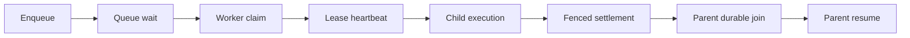

> **大白话解释：** 当前系统即使会自动恢复，如果没有仪表盘，我们也不知道队列是不是已经堵了、Worker 是不是一直掉线、恢复是不是越来越慢。SLO、指标和告警就是给系统加速度表、油表、故障灯和报警器。

### 3.2 三个概念的区别

| 概念 | 含义 | 大白话 |
|---|---|---|
| Metric | 实际采集的数据 | “现在排队 120 个任务，最老的等了 40 秒” |
| SLI | 用来衡量服务质量的指标 | “任务在 2 秒内被领取的比例” |
| SLO | 对 SLI 的目标 | “99% 的任务必须在 2 秒内被领取” |
| Alert | 违反目标时通知负责人 | “连续 10 分钟达不到 99%，触发告警” |

### 3.3 建议指标

| 阶段 | 建议指标 | 主要发现的问题 |
|---|---|---|
| Enqueue | enqueue success/error/conflict rate | 数据库错误、WorkID 冲突 |
| Queue | queue depth、oldest age、`queue_wait_ms` | 积压和容量不足 |
| Claim | claim latency、claim no-row/race | Worker 不足或竞态异常 |
| Lease | renew success/failure、lease expiry | 网络、数据库或 Worker 卡顿 |
| Worker | active、busy、idle、execution time | 并发配置和慢任务 |
| Retry | retry count、backoff、re-dispatch | 下游不稳定或 TTL 不合理 |
| Fencing | stale renew/write rejection | 双执行、旧 Worker 恢复 |
| Settlement | latency、conflict、rollback | 终态写入和账本异常 |
| Recovery | backlog、claim count、resume latency | 重启恢复是否正常 |
| Parent | join latency、resume success | Child 已完成但 Parent 未继续 |
| Quality | partial、unavailable、unsupported rate | 可靠性问题是否影响答案质量 |

### 3.4 SLO 示例

以下仅作为设计示例，最终阈值需要用真实流量基线确定：

```text
99% queue item 在 2 秒内被 claim
99% parent_resume 在 10 秒内开始执行
99% expired work item 在 30 秒内完成 re-dispatch
99.9% terminal settlement 不丢失
stale fenced write 成功数必须为 0
dead-letter rate 小于 0.1%
```

> **大白话解释：** “有监控”不能只看机器 CPU。真正需要回答的是：用户的任务等了多久、有没有被重复执行、Worker 死了以后多久被接管、Child 已完成以后 Parent 多久继续。这些才是 Agent 业务真正关心的服务质量。

### 3.5 告警示例

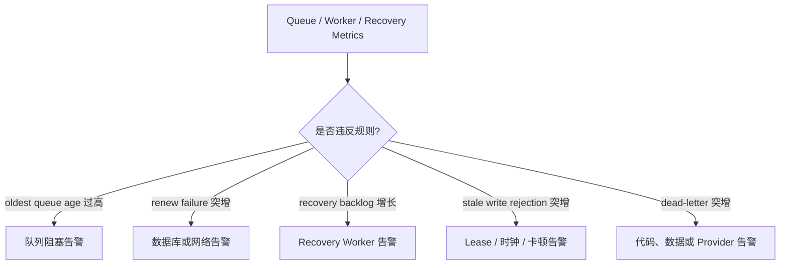

### 3.6 解决的问题

- 用户先反馈超时，平台才知道队列已经积压；
- 只能看到总耗时，不知道慢在 queue、Child、settlement 还是 Parent resume；
- recovery 已经失效，但没有人收到通知；
- stale write、重复执行和 dead-letter 持续增长却无人处理；
- 无法验证上线前后的可靠性是否改善。

### 3.7 最小验收标准

1. 每个 work item 可关联 `root_run_id`、`parent_run_id`、`delegation_id`、`attempt_id`；
2. enqueue、claim、renew、complete、re-dispatch、dead-letter、replay 都有 counter 和 latency；
3. Dashboard 可以按 kind、owner、tenant、error class 聚合；
4. 至少建立 queue age、renew failure、recovery backlog、dead-letter 四类告警；
5. 告警可以定位到 Run、WorkID 和最后一个 owner/fence，而不是只给出数据库错误总数。

---

## 4. 多进程 `kill -9`、网络分区、lease jitter、长期压力 soak

### 4.1 这项能力具体做什么

这不是新增业务功能，而是通过真实故障证明 durable execution 的实现没有依赖“进程正常退出”或“网络永远稳定”。

> **大白话解释：** 单元测试相当于在实验室里检查安全带能不能扣上；`kill -9`、断网和压力 soak 相当于真正做碰撞测试、雨天测试和长途测试。代码看起来能恢复，不代表机器突然断电时真的不会丢任务或重复扣费。

### 4.2 多进程 `kill -9`

在独立 Parent、Worker 进程中，随机选择以下位置强制结束进程：

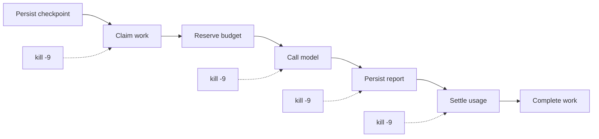

> **大白话解释：** `kill -9` 就是直接拔电源，不给程序执行清理代码的机会。它要验证的是：即使 Worker 没来得及说“我要退出”，其他实例仍然可以在 lease 过期后安全接管。

需要验证：

- lease 是否在预期时间过期；
- 新 Worker 是否只接管一次；
- stale Worker 是否无法 settlement；
- open reservation 是否被正确 reclaim；
- Parent 是否从原 checkpoint 继续；
- 模型调用重复发生时是否仍保持账本幂等和可审计。

### 4.3 网络分区

需要模拟：

- Worker 可以访问 Provider，但不能访问 MySQL；
- Worker 可以访问 MySQL，但不能访问 Provider；
- heartbeat 写失败，但模型请求还在运行；
- settlement 已在 MySQL 提交，但响应包丢失；
- Parent 与 queue store 之间出现间歇性超时。

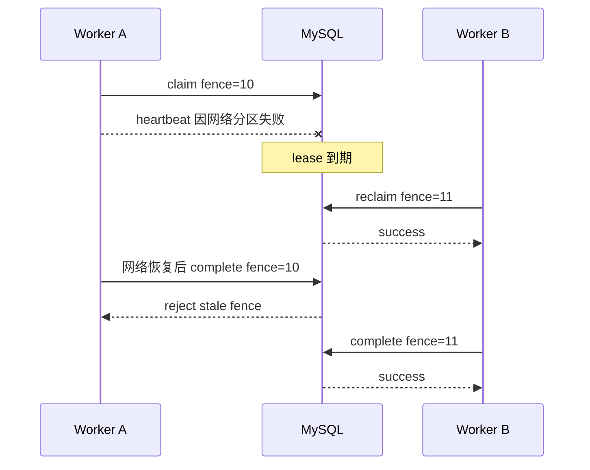

> **大白话解释：** 最危险的不是 Worker 完全宕机，而是“它以为自己还活着，但数据库已经认为它死了”。网络恢复后，旧 Worker 和新 Worker 可能同时写结果。Fencing 必须保证旧 Worker 一定写不进去。

### 4.4 Lease jitter

随机延迟 heartbeat，例如正常每 5 秒一次，但测试中加入 1–20 秒延迟、CPU 抢占和 GC pause。

> **大白话解释：** Worker 不一定真的死了，也可能只是机器卡了十几秒。如果 lease 设置得太激进，系统会把暂时卡顿的 Worker 当成死机，导致同一个任务被其他 Worker 重做。

需要验证：

- heartbeat interval、TTL 和模型调用时间的比例是否合理；
- 接近 lease expiry 时是否停止新模型调用；
- renew 失败多少次后应该主动取消；
- 时钟偏差和调度延迟是否造成误接管；
- 误接管发生后 fencing 是否仍然保证单一写入者。

### 4.5 长期压力 soak

持续数小时或数天运行：

- 多 Parent、多 Child 和多实例 Worker；
- 随机 Provider 429/5xx；
- 随机数据库慢查询和连接断开；
- 随机 kill/restart；
- 随机 lease renew 延迟；
- 持续产生 queue backlog 和 recovery；
- 定期核对 ledger、work item、attempt 和 terminal state。

> **大白话解释：** 有些问题跑十分钟看不出来，跑两天才会出现，例如连接慢慢泄漏、队列越积越多、reservation 一直不释放。Soak 就是让系统连续长跑，观察它会不会“越跑越慢、越跑账越不平”。

### 4.6 解决的问题

- 只在 defer/正常 shutdown 执行时才成立的恢复逻辑；
- settlement 已成功但客户端误判失败，导致重复执行；
- lease TTL 太短造成频繁误接管；
- 连接、goroutine、reservation 或 queue item 长期泄漏；
- 小概率重复 claim、重复 settlement 或 Parent 重复 resume；
- 数据量增长后索引退化、recovery 扫描越来越慢。

### 4.7 最小验收标准

| 故障 | 通过条件 |
|---|---|
| kill after claim | lease expiry 后只有一个新 owner 接管 |
| kill during model call | 允许物理调用重复，但账本和终态不能重复提交 |
| network partition | stale fence 永远不能写成功 |
| settlement response lost | 重试 settlement 保持幂等 |
| lease jitter | 可接受抖动不触发大规模误接管 |
| 24h soak | 无持续增长的 goroutine、连接、open reservation、recovery backlog |

---

## 5. 默认 Cost Policy、Price Version 和价格变更治理

### 5.1 这项能力具体做什么

它把 token 使用量转换成可控制、可预留、可结算和可复算的实际费用。

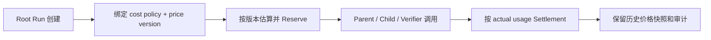

> **大白话解释：** Token 数量相当于“用了多少度电”，Cost policy 相当于“这次最多允许花多少钱”，Price version 相当于“当时执行时每度电是多少钱”。只记录用电量、不记录价格，就无法控制账单，也无法在以后复算。

### 5.2 默认 Cost Policy

建议至少支持：

```text
platform default cost limit
tenant cost limit
request/root cost limit
capability/model specific limit
high-risk verifier reserve
```

当前 `MaxTotalCostMicros=0` 表示 cost 维度不做硬限制。生产默认值应明确：

- `0` 是无限制还是禁止调用；
- 默认限制由平台、租户还是业务配置；
- Parent、Child、Verifier、retry、repair 是否共享同一上限；
- 达到上限后返回 partial、降级模型还是直接拒绝。

> **大白话解释：** 如果默认费用上限是无限，某个 Parent 一次委派很多 Child，再加重试和 Verifier，虽然没有超过 token 配额，也可能使用了非常昂贵的模型，最后产生不可接受的单次请求费用。

### 5.3 Price Version

每次 Run 固定价格版本，例如：

```json
{
  "provider": "provider-a",
  "model": "model-x",
  "price_version": "2026-09-01",
  "input_price_micros_per_unit": 100,
  "output_price_micros_per_unit": 300
}
```

同一个 Root Run 的 estimate、reserve、settlement 应使用同一价格版本，不能在执行中途自动切换到最新价格。

> **大白话解释：** 请求开始时按旧价预留 10 元，结束时如果突然按新价结算成 20 元，预算判断就失效了。价格版本就是把本次请求使用的价目表锁定下来。

### 5.4 价格变更治理

需要定义：

1. 新价格何时生效；
2. 已运行中的 Root 是否继续使用旧版本；
3. 未开始的 queued task 是否继承 Root 旧价格；
4. Provider 回补 usage 或修正账单时如何处理；
5. 找不到历史价格时是否阻止执行；
6. 价格表由谁更新，是否有审批和审计；
7. 不同币种、折扣、缓存 token、推理 token 如何换算。

> **大白话解释：** 价格表不是普通配置项。改错一个小数点可能让所有预算判断失效，所以价格更新需要像数据库 migration 一样可追踪、可回滚、可审计。

### 5.5 解决的问题

- token 没超限，但实际费用超限；
- Parent、Child、Verifier 分别计费，无法得到请求总成本；
- Provider 调价后历史账单无法复算；
- estimate 用旧价、settlement 用新价；
- 不同实例加载了不同价格配置；
- 重试、repair 和 recovery 的费用未纳入 Root。

### 5.6 最小验收标准

1. 生产环境默认 cost policy 非零，或有明确的无限制审批；
2. Root 创建时绑定不可变 `price_version`；
3. reservation 和 settlement 使用同一版本；
4. Parent、Child、Verifier、retry、repair 都结算到 Root；
5. 历史 Run 可以根据 usage 和价格快照重新计算出相同费用；
6. 价格更新有审批、审计、灰度和回滚能力。

---

## 6. Overview 与合法跨 Subject Edge 产品 Schema

### 6.1 这项能力具体做什么

当前 subject 隔离解决的是：不同业务中同名节点或边不能因为 label 相同被错误合并。但隔离之后，还需要显式表达真实存在的跨业务关系。

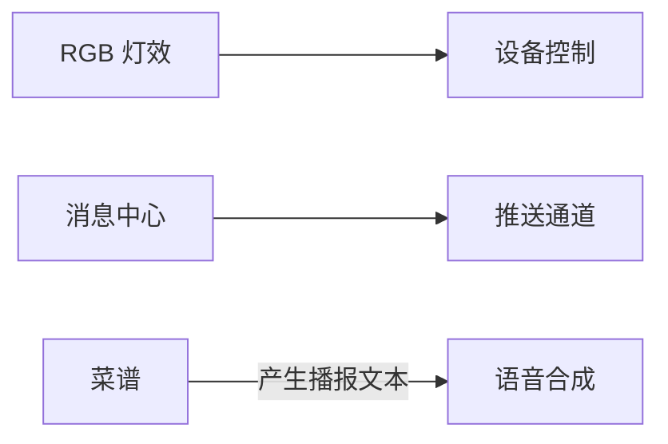

> **大白话解释：** 现在我们已经给不同业务画了不同房间，避免把同名设备混在一起。但真实系统中房间之间确实有门，例如“菜谱调用 TTS”。Overview 和跨 Subject Schema 就是规定哪些门是真实存在的、门从哪里通向哪里，以及用什么证据证明。

### 6.2 Overview Schema

Overview 不是把所有 Child 的详细节点简单拼成一张大图，而是独立视图：

```text
view_kind = overview
view_kind = subject_flow
view_kind = sequence
view_kind = deployment
```

Overview 节点通常代表：

- 业务域；
- 平台能力；
- 外部系统；
- 核心数据或事件通道；
- 用户或设备。

Subject flow 节点才可能代表：

- Controller/API；
- Service；
- Topic；
- Table；
- Device command；
- 状态转换。

> **大白话解释：** 总览图应该像地铁线路图，只展示线路和换乘站；单业务图才像站内地图，展示入口、楼梯和闸机。如果把所有代码方法都塞进总览图，图虽然“信息很多”，但用户看不懂。

### 6.3 合法跨 Subject Edge

建议显式结构：

```json
{
  "edge_kind": "cross_subject",
  "from_subject": "菜谱",
  "from_node": "生成播报文本",
  "to_subject": "TTS",
  "to_node": "语音合成入口",
  "relation": "invokes",
  "protocol": "HTTP",
  "sync_mode": "sync",
  "evidence_refs": ["ev_xxx"],
  "evidence_state": "verified"
}
```

需要校验：

- `from_subject != to_subject`；
- 两端 subject 和 node 都存在；
- relation 属于允许枚举；
- evidence scope 有权证明两端关系；
- verified 必须有 evidence refs；
- overview 是否允许展示该 relation；
- unresolved/inferred 使用不同线型和文案。

> **大白话解释：** 不能因为两个业务都出现了“发送消息”就自动连线。只有证据明确说明业务 A 调用了业务 B，服务端才允许画一条跨业务边。

### 6.4 解决的问题

- 不同 subject 的同名节点被错误合并；
- 为了避免错误合并，又无法表达真实跨业务调用；
- evidence 从业务 A 错误迁移到业务 B；
- overview 退化为一张节点过多、没有层次的大图；
- Parent 用自然语言猜测跨域关系，图中却标成 verified。

### 6.5 最小验收标准

1. Overview 和 subject flow 使用不同 schema/view kind；
2. 普通 merge 永远不能自动生成 cross-subject edge；
3. cross-subject edge 必须由显式结构和 evidence 创建；
4. 相同 label 在不同 subject 中保持不同 canonical ID；
5. overview 节点和边有独立数量上限；
6. 未验证跨域关系必须显示为 inferred/unresolved。

---

## 7. Dashboard 浏览器、主题、字体和 CSP 渲染矩阵

### 7.1 这项能力具体做什么

它验证后端生成的 canonical Mermaid/SVG 在真实用户界面中可以正确、安全地展示。

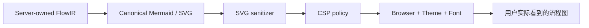

> **大白话解释：** 后端生成了一张正确图片，不代表前端一定能展示。它可能被安全过滤器删掉箭头、在深色主题下变成黑底黑字，或者在 Safari 中被裁掉。渲染矩阵就是确认“用户真的能看到并看懂”，不是只确认后端字符串合法。

### 7.2 需要覆盖的矩阵

| 维度 | 最低覆盖 |
|---|---|
| 浏览器 | Chrome、Edge、Safari、Firefox |
| 主题 | 浅色、深色、高对比度 |
| 字体 | 中文字体、系统 fallback、字体加载失败 |
| 布局 | 全屏、右侧面板、窄窗口、移动宽度 |
| 图规模 | 单图、多图、长节点名、最大 hop 数 |
| CSP | 禁止 inline script/style、data URI、外部字体 |
| Sanitizer | marker、class、style、foreignObject 保留/移除 |
| 可访问性 | 键盘、缩放、对比度、文本替代 |

### 7.3 常见故障

```text
Mermaid CLI 渲染成功
  -> Dashboard sanitizer 删除 marker
  -> 箭头消失

浅色主题正常
  -> 深色主题文字仍为黑色
  -> 节点不可读

Chrome 正常
  -> Safari 对尺寸或 foreignObject 行为不同
  -> 图被裁切

开发环境 CSP 宽松
  -> 生产 CSP 禁止 inline style
  -> 图显示空白
```

> **大白话解释：** “测试通过”如果只代表开发者电脑上的 Chrome 能显示，就像网页只在一个人的电脑上能打开。生产验收必须覆盖真正支持的浏览器和主题组合。

### 7.4 解决的问题

- 后端有图，但用户看到空白；
- 箭头、虚线或 evidence state 样式被 sanitizer 删除；
- 中文字体变化导致节点重叠或超出边界；
- 深色主题文字和背景对比度不足；
- CSP 阻止 inline style、脚本或资源；
- 大图没有缩放、滚动和降级策略。

### 7.5 最小验收标准

1. 定义平台正式支持的浏览器和主题，不追求无限矩阵；
2. 每个支持组合执行截图或 DOM/SVG 快照测试；
3. verified/inferred/unresolved 的线型和文字在所有主题中可区分；
4. CSP 和 sanitizer 使用生产配置验收；
5. 渲染失败时显示可读的文本 fallback，而不是空白；
6. 超大图有缩放、滚动、分图或折叠策略。

---

## 8. 自然语言句子到 Evidence Body 的语义蕴含/NLI

### 8.1 这项能力具体做什么

它验证最终答案中的自然语言句子是否真的被引用的 evidence body 支持。

当前结构化 hard gate 可以验证：

- claim/edge ID 是否由服务端允许；
- evidence ref 是否存在；
- `unresolved` 是否被模型越权升级为 `supported`；
- verified Flow edge 是否保留 evidence refs；
- 是否出现 unknown、duplicate 或 state upgrade。

但它不能证明 evidence body 的实际内容支持 Parent 写出的完整句子。

> **大白话解释：** 当前系统能检查“这句话后面有没有挂参考资料”，但还不能完全检查“参考资料里面是不是真的说了这件事”。NLI 要解决的就是“有引用，不等于引用支持结论”。

### 8.2 典型问题

Evidence body：

```text
菜谱服务将播报文本发送给语音合成服务。
```

Parent 最终答案：

```text
菜谱服务通过 Kafka 异步调用 TTS，并保证 exactly-once。
```

结构上可能满足：

- 有 claim ID；
- 有 evidence ref；
- 引用来源存在。

但 evidence 没有证明：

- Kafka；
- 异步；
- exactly-once。

### 8.3 推荐链路

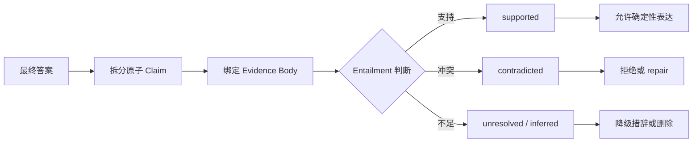

建议分层实现：

```text
1. 确定性 claim/句子切分
2. claim 到 evidence ref 的绑定
3. evidence scope 和权限校验
4. 数字、协议、时间、主体、否定词等规则校验
5. NLI/Verifier 语义判断
6. 阈值、冲突和 coverage gate
7. repair / 删除 / inferred / unresolved 降级
8. 保存 claim-evidence-verdict 审计记录
```

> **大白话解释：** 最终答案要先拆成一句一句的小结论，再给每句话找到证据，然后判断证据是支持、反对还是没有说清楚。没有说清楚的内容只能写成“推测”或“待确认”，不能写成确定事实。

### 8.4 为什么不能只再调用一次 LLM

Verifier 本身也可能：

- 漏掉限定词；
- 把相关性误判为支持；
- 忽略数字或时间范围；
- 在长 evidence body 中丢失关键信息；
- 输出不稳定 verdict。

因此不能把“另一个 LLM 说通过”当成绝对证明，需要组合：

```text
结构化 claim
+ evidence scope
+ 确定性规则
+ NLI/Verifier
+ 阈值和降级
+ 可审计记录
```

> **大白话解释：** 让另一个模型复核，就像让第二个人看一遍合同，确实能降低错误，但不能代替合同条款校验、金额核对和审计记录。

### 8.5 解决的问题

- 引用了证据，但证据没有支持结论；
- evidence 只证明“调用”，答案却扩写成协议、异步和一致性保证；
- evidence body 被截断，Parent 仍使用确定性语气；
- 多个 evidence 分别支持局部事实，Parent 错误合成为更强因果结论；
- `not_checked` 被误写成“不存在”；
- `inferred` 被误写成 `verified`。

### 8.6 最小验收标准

1. 最终答案中的关键事实可以拆成稳定 claim；
2. 每个关键 claim 绑定 evidence body，而不只是引用 ID；
3. verdict 至少区分 supported、contradicted、insufficient；
4. 数字、协议、时间、否定和因果有专项规则；
5. evidence 缺失、截断或不蕴含时自动降级；
6. high-risk claim 未通过时不能输出确定性结论；
7. 保存最终句子、evidence、verdict、模型/规则版本和 repair 记录。

---

## 9. 七项能力之间是什么关系

这些能力不是七个互相独立的开关，而是一条生产闭环：

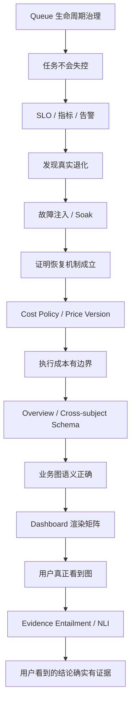

可以用一句话概括：

```text
Queue 治理：任务不要失控
SLO 告警：失控时马上知道
故障注入：证明真的不会失控
Cost 治理：即使正常执行也不能花费失控
Flow Schema：图里的关系不能画错
Dashboard Matrix：正确的图必须真的显示出来
NLI：图和文字里的结论必须真的被证据支持
```

---

## 10. 建议实施顺序

### 10.1 第一阶段：先补生产运行安全

1. Queue cancel；
2. Backpressure；
3. Dead-letter 和人工重放；
4. Queue/Worker/Recovery 指标；
5. 最基础的 SLO 和告警。

原因：没有这一层，任务会持续积压或消耗资源，但平台无法控制和发现。

### 10.2 第二阶段：做真实故障验收

1. 多进程 Worker/Parent harness；
2. `kill -9` fault points；
3. 数据库和 Provider 网络分区；
4. lease jitter；
5. 24h/72h soak；
6. ledger/work item invariant checker。

原因：先有 queue 控制和指标，故障测试时才能判断系统是否真的恢复。

### 10.3 第三阶段：补成本治理

1. 默认非零 cost policy；
2. price catalog/version；
3. Root price snapshot；
4. estimate/reserve/settle 一致性；
5. 价格更新审批和审计。

### 10.4 第四阶段：补输出产品语义

1. Overview view kind；
2. cross-subject edge schema；
3. evidence scope；
4. Dashboard browser/theme/CSP matrix；
5. 失败 fallback。

### 10.5 第五阶段：补自然语言语义证明

优先覆盖高风险 claim：

- 数字；
- 时间；
- 协议；
- 同步/异步；
- 因果；
- 否定判断；
- 安全、权限、数据一致性结论。

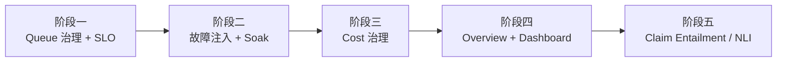

---

## 11. 最终判断

七项能力分别回答七个生产问题：

| 问题 | 对应能力 |
|---|---|
| 任务已经不需要了，怎么让它真正停下来？ | Queue cancel |
| 系统忙不过来时，怎么避免所有请求一起超时？ | Backpressure |
| 一直失败的任务怎么办？ | Dead-letter |
| 修复故障后怎么安全重新执行？ | 人工重放 |
| 系统正在变慢或恢复失效，怎么及时知道？ | SLO、指标、告警 |
| 真实断电、断网和长期运行时恢复是否还成立？ | Fault injection、jitter、soak |
| 一次 Agent 请求最多允许花多少钱？ | Cost policy |
| Provider 调价后历史账目如何保持一致？ | Price version |
| 多业务之间真实存在的调用关系怎么表达？ | Overview 和 cross-subject schema |
| 后端生成的图在用户浏览器里是否真的能看？ | Dashboard 渲染矩阵 |
| 引用的证据是否真的支持答案中的句子？ | Entailment / NLI |

> **最终大白话解释：** 前四类执行能力决定“系统敢不敢上线跑”，Flow 和 Dashboard 能力决定“用户能不能正确看懂”，NLI 决定“用户看到的结论能不能相信”。当前基础 durable execution 已经解决了任务接管和 stale write，但只有补齐这七项运营、产品和语义能力，才能更接近完整生产级 Agent 执行平台。

本文仍坚持以下声明边界：

```text
当前不能称为完整生产级 durable execution。
```
