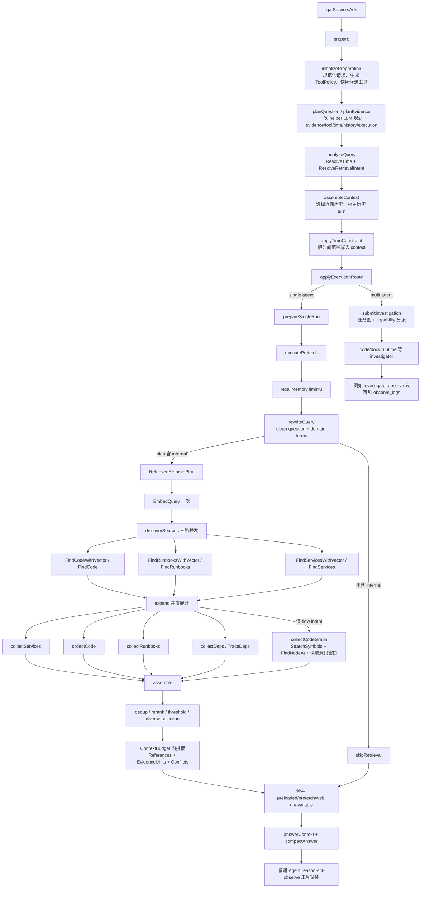

# CodeLoom 当前 Retrieval 链路梳理

> 状态基线：2026-08-15。CodeLoom 通过 `go.mod` 的 `replace github.com/dekwanlabs/nasuta => ../Nasuta` 使用本地 Nasuta；本文描述的是这两个工作区当前代码的实际链路，而不是目标架构。

## 1. 先区分四类“取信息”动作

当前系统里容易都被叫作 retrieval，但实际有四条不同链路：

| 类型 | 触发时机 | 谁决定 | 主要信息 | 是否进入 Agent 工具轮次 |
|---|---|---|---|---|
| 会话与记忆召回 | 问题准备阶段 | 服务端规则 + evidence plan | 当前会话历史、长期 memory | 否 |
| 自动预检索（pre-retrieval） | 单 Agent 启动前 | evidence plan 中是否包含 `internal` | code、runbook/docs、service metadata、dependency、特定意图下的 codegraph | 否 |
| 可信预取（prefetch） | 自动预检索前 | 上层传入的 `Request.ToolPlan.Prefetch` | 任意被明确预取的只读工具结果 | 否；服务端直接执行 |
| Agent 工具调用 | reason → act → observe 循环中 | 模型根据当前缺口决定 | `search_code`、`list_apis`、`observe_logs` 等注册工具 | 是，每个调用计一个 tool call |

最关键的边界是：**`observe_logs` 不属于自动 internal pre-retrieval 的 code/docs/service fan-out。** 它通常由路由器选择 runtime capability 后，在专用 runtime investigator 或普通 Agent 工具循环中显式调用。

## 2. 总体调用图



## 3. Preparation 与路由阶段

入口在 Nasuta：

- `internal/agent/qa/service.go`
  - `Service.Ask`
  - `svc.prepare`
  - 根据 `prepared.execution.Strategy` 进入 `prepareSingleRun` 或 `submitInvestigation`

### 3.1 `initializePreparation`

文件：`Nasuta/internal/agent/qa/prepare.go`

主要动作：

1. `normalizeRequest` 规范化问题和 run ID。
2. `toolPolicyForRun` 根据读写授权生成工具策略。
3. `svc.runtimeTools.ToolsFor(...)` 获取本次运行的工具 registry snapshot。
4. `routingCandidates(...)` 把工具 ID、描述、证据类型、时间属性等变成路由候选。

### 3.2 `planQuestion` → `planEvidence`

文件：

- `Nasuta/internal/agent/qa/prepare.go`
- `Nasuta/internal/agent/qa/evidence.go`
- `Nasuta/internal/retrieval/route.go`
- `Nasuta/internal/prompts/text/retrieval/`

普通问题调用一次 `retrieval.AnalyzeEvidence`；显式 evidence plan 调用 `retrieval.AnalyzeForPlan`。planner prompt 由以下片段组成：

- `routing.txt`：选择 `memory` / `internal` / `web` 等 evidence source。
- `tool_routing.txt`：选择建议优先使用的注册工具 ID。
- `query_terms.txt`：提取 clean question、domain terms、identifiers。
- `time.txt`：提取相对或绝对时间表达。
- `history.txt`：判断是否依赖历史实体、结论或证据。
- `execution.txt`：建议 single-agent 或 multi-agent，并给出独立任务。
- `planner.txt`：组合以上 section，要求一次返回完整规划结果。

因此 evidence source、工具路由、query terms、时间、历史关系和执行策略不是多次独立 LLM 分类，而是在同一个 helper 规划调用里返回。

路由失败时，当前实现会保留错误并退化为 internal fallback；低置信度的 direct decision 也会退回 internal。

### 3.3 `analyzeQuery`

文件：`Nasuta/internal/agent/qa/query.go`

调用两个通用方法：

- `retrieval.ResolveTime`：只基于服务端 anchor 解析 planner 提取的时间表达。
- `domain.ResolveRetrievalIntent`：结合问题、identifiers 和 domain terms 得到：
  - response mode；
  - retrieval intent；
  - required facets；
  - target entities；
  - intent origin。

### 3.4 历史上下文和时间约束

- `assembleContext`：在 context window 预算内选择近期 turn、必要的历史 detail/reference，并在需要时从 history store materialize/recall 压缩历史。
- `applyTimeConstraint`：把解析后的 `tool.TimeRange` 放进 context，供 temporal tools 自动继承；模型不需要自己计算“昨天”“最近两小时”的绝对时间。

### 3.5 single-agent / multi-agent 路由

`applyExecutionRoute` 只有在以下条件同时成立时才保留 multi-agent：

- planner 建议 multi-agent；
- 是标准 QA 请求，不是某个已有 workflow node；
- 没有写操作要求；
- investigation workflow、scenario registry、coordinator 可用；
- 评估得到至少两个独立任务和至少两个所需 capability；
- 任务可并行，协调成本可接受。

进入 multi-agent 后，系统通过 task graph 和 capability 将 evidence goals 分发给 code/docs/runtime 等 investigator。CodeLoom 当前新增的：

- capability：`knowledge.runtime.observe`
- agent：`investigator.observe`
- visible tools：仅 `observe_logs`

它是复杂问题的工作流分解，不会替代下面的自动 internal retrieval。

## 4. Single-agent 启动前的证据准备

文件：`Nasuta/internal/agent/qa/prepare.go::prepareEvidence`

执行顺序固定如下。

### 4.1 Trusted prefetch

`executePrefetch` 只执行上层明确提供的 `Request.ToolPlan.Prefetch`。它不是模型在当前轮自由生成的工具调用，结果被转换为 `ContextBlock`，随后和其他预加载上下文合并。

### 4.2 Memory recall

当 evidence plan 包含 `memory` 时，调用 memory store：

```text
Recall(userID, question, limit=3)
```

memory 不可用会生成 unavailable context block，而不是静默伪造结果。

### 4.3 Query rewrite

`canonicalRetrievalQuery` 把 planner 的 clean question 与 grounded domain terms 合并。这里是确定性拼接，不再发起一次 query-rewrite LLM 调用。

### 4.4 是否执行 internal retrieval

- evidence plan 不含 `internal`：`skipRetrieval`，只合并 prefetch、preloaded context、memory 和 unavailable source 信息。
- evidence plan 含 `internal`：调用 `Retriever.RetrievePlan`。

retrieval 完成后：

1. 合并 preloaded/prefetch context；
2. 附加 web unavailable 标记；
3. `answerContext` 把 retrieved context 和 recalled memory 注入对话；
4. `compactAnswer` 按 Agent definition 的 context/output 预算压缩；
5. 才进入正常 Agent reason-act-observe 循环。

## 5. `Retriever.RetrievePlan` 的实际检索内容

文件：

- `Nasuta/internal/retrieval/pipeline.go`
- `Nasuta/internal/retrieval/collection.go`
- `Nasuta/internal/retrieval/rerank.go`

### 5.1 Embedding：一次向量，多路复用

若 toolset 实现 `vectorToolset`，先调用一次：

```go
EmbedQuery(ctx, searchQuery)
```

同一个 query vector 复用于 code、runbook、service 三路检索，避免每路重复 embedding。若不能走共享向量接口，则各普通方法走自己的后端路径。

### 5.2 Discover：三路并发召回

`discoverSources` 同时启动三条 goroutine：

| 召回类型 | 首选方法 | 回退方法 | 产出 |
|---|---|---|---|
| Code | `FindCodeWithVector` | `FindCode` | 文件路径、repo、语言、layer、snippet、dense/fusion score、行号、trust 信息 |
| Runbook/docs | `FindRunbooksWithVector` | `FindRunbooks` | 文档、命中 chunk、section、score、scope |
| Service metadata | `FindServicesWithVector` | `FindServices` | service name、layer、language、summary |

Code 命中后还会通过 `ServiceModules` 批量完成 repo → service 映射，避免逐条查服务。

当前意图预算：

| Retrieval intent | code | runbook | service | rerank pool |
|---|---:|---:|---:|---:|
| focused fact（默认） | 12 | 8 | 6 | 20 |
| flow | 16 | 8 | 6 | 24 |
| overview | 16 | 16 | 8 | 24 |
| runtime diagnosis / inventory | 16 | 12 | 8 | 24 |

### 5.3 Code 底层搜索

文件：`Nasuta/internal/agent/tools/code_search.go`

`FindCode` 先生成 query embedding，再进入 `FindCodeByVector`。后者的实际路径是：

1. dense semantic query；
2. BM25 可用时生成 sparse query；
3. dense + sparse hybrid/fusion（RRF）；
4. 文件级去重；
5. code rank；
6. 返回带 dense/fusion/score-kind 的 code hits。

BM25 不可用时运行 dense-only，并保留可观察日志；不会悄悄切换到另一个 provider。

### 5.4 Service 与 Runbook 搜索

- Service：结构化/lexical service score 与 semantic service vector 结果合并。
- Runbook：从 semantic runbook chunks 召回；expand 阶段不会再次搜索，而是只展开 discover 已命中的文档。

### 5.5 Expand：并发展开五类信息

`expand` 对 anchor 结果并发展开：

1. `collectServices`
   - 生成 service name、layer、language、summary。
2. `collectCode`
   - 将 code hits 转成统一 `codeDoc` pool；
   - 非 RRF hit 应用 `PlatformSettings.CodeMinScore`。
3. `collectRunbooks`
   - 同一文档的命中 chunk 合并；
   - 每个 runbook 最多 3 个 chunks；
   - 每个 runbook 在线读取内容最多约 4000 runes。
4. `collectDeps`
   - 对 anchor services 调用 `TraceDeps(service, "both", 2)`；
   - 最多查询 3 个 service；
   - 总时间预算 500ms；
   - 最多保留 30 条 dependency edge。
5. `collectCodeGraph`，仅 `RetrievalFlow`
   - `buildCodeGraphKeywords` 生成关键词；
   - `codegraph.DB.SearchSymbols` 做一次带 service path scope 的 symbol 搜索；
   - `FindNodeAt` 定位符号；
   - 从 workspace 文件流式读取 symbol 附近源码窗口；
   - 搜索最多取 20 个 symbol candidate，排序后最多展开 10 个。

### 5.6 Rerank 与多样性选择

`postProcessCodePool` 在 `RerankEnabled` 时执行：

1. `dedupBySource`；
2. `selectRerankCandidates`；
3. rerank：
   - 配置远程 DashScope reranker 时调用远端；
   - 否则使用本地 dense reranker；
   - 远端失败或超时保留 recall 顺序，不伪装成远端成功；
4. score threshold；
5. `selectDiverse`，限制单个 service/source 对结果的过度占用；
6. trust tier 参与最终排序加权。

### 5.7 Assemble 与上下文预算

`assemble` 把以下 partial 统一排序和拼接：

- service metadata；
- dependency edges；
- code；
- runbook/docs；
- codegraph snippets。

默认 `ContextBudget` 为 48000 tokens，可由 `PlatformSettings.ContextBudget` 覆盖。拼接过程中：

- 按 priority 保序；
- 超预算时截断当前证据并停止；
- references 按 `type + target` 去重；
- 生成 `EvidenceUnits`；
- evidence ledger 记录冲突；
- 返回 `RetrievedContext`：`Text`、`References`、`EvidenceUnits`、`EvidenceConflicts`、`HitCount`、`Intent`。

## 6. 当前自动 retrieval 不会检索什么

`Retriever.toolset` 接口虽然声明了：

```go
FindAPIs(ctx, service, keyword, limit)
```

但当前 `RetrievePlan`、`discoverSources` 和 `expand` 都没有调用它。

因此，**自动 pre-retrieval 当前不会直接召回结构化 API/endpoint 列表**。API 或 entrypoint 信息只能来自：

1. code hits；
2. runbook/docs；
3. service metadata；
4. flow intent 的 codegraph；
5. Agent 后续显式调用 `list_apis`。

这是当前链路的明确缺口。如果问题强依赖“某服务有哪些 API / 某 endpoint 属于哪个服务”，要么依靠工具路由优先调用 `list_apis`，要么后续把 API retrieval 作为新的 discover/expand source 设计进去；不能把现状描述成“自动 retrieval 已经会查 API”。

## 7. Agent 工具调用阶段

自动预检索完成后，普通 Agent 才进入 reason → act(tool) → observe 循环。当前内建 read tools 包括：

- `get_service`
- `trace_deps`
- `list_apis`
- `search_code`
- `get_symbol`
- `trace_calls`
- `search_runbooks`
- `check_docs`
- `index_stats`

CodeLoom 额外注册 `observe_logs` 等应用工具。

`Nasuta/internal/agent/execution/loop_turn.go::executeToolTurn` 支持模型在同一个 assistant turn 返回多个 tool calls，但当前是按 call slice 顺序执行。执行层可对**相同调用指纹**做 admission/dedup；不同参数（例如三个不同错误码）拥有不同指纹，因此不会自动合并。

通用执行层也无法可靠地把跨模型轮次的不同参数合并，因为它不知道：

- 后续轮次是否还会产生更多值；
- 不同调用的 source、gateway、index、time、URL、trace、aggregation 是否语义兼容；
- 合并后是否会改变 AND/OR 关系或证据覆盖口径。

因此参数批量化应由工具契约和专用 Agent 规划约束完成，而不是在 generic loop 里硬编码 `observe_logs` 合并器。

## 8. `observe_logs` 多错误码查询为什么会变成多轮

后端本身已经支持批量，不是 Elasticsearch/Kibana 能力缺失：

- `internal/observe/schema.go`
  - 字段支持 `eq` 时会向工具 schema 暴露 `neq`、`in`、`not_in`；
  - `canonicalFilterValue` 校验并按字段类型转换数组值。
- `internal/observe/kibana.go`
  - `in` / `not_in` 编译为 Elasticsearch `terms` provider filter。
- `internal/observe/schema_test.go`
  - 已验证 code 的 `in` 数组会生成 `terms` 查询。

例如多个错误码应合成一次调用：

```json
{
  "filters": [
    {
      "field": "code",
      "operator": "in",
      "value": [10000, 100028, 100017]
    }
  ]
}
```

`value` 的元素类型以当前 source 的字段配置为准；integer/long 字段使用数字，keyword/text 字段使用字符串。

此前模型仍逐个查询的主要原因是：

1. schema 虽暴露 `in`，但 `filters` 和顶层工具描述没有突出“同字段多值必须合并”；
2. `investigator.observe` prompt 只要求使用 `observe_logs`，没有最少调用数和批量规则；
3. generic tool loop 只会去重相同参数，不会把不同错误码视为重复调用；
4. 跨轮自动合并会破坏通用执行层的语义边界。

本次在 CodeLoom 中强化的通用契约是：

- compatible predicates 尽量合并到最少的 `observe_logs` 调用；
- 同一 configured field 的多个已知值使用一个 `in` filter 和一个数组；
- 多个 URL alternatives 放进同一个 `url_groups` 数组；
- 不为每个错误码、响应码、标识符或 URL 单独调用一次。

该修复不硬编码任何具体错误码，适用于所有支持 `in` 的配置字段。

## 9. 关键通用方法速查

| 阶段 | 方法 | 职责 |
|---|---|---|
| QA 入口 | `qa.Service.Ask` | 准备请求并选择 single/multi-agent |
| 工具候选 | `initializePreparation` / `routingCandidates` | ToolPolicy、registry snapshot、路由元数据 |
| 证据规划 | `planEvidence` / `retrieval.AnalyzeEvidence` | 一次规划 sources、tools、terms、time、history、execution |
| 查询分析 | `analyzeQuery` / `ResolveTime` / `ResolveRetrievalIntent` | 时间范围和 retrieval intent |
| 历史 | `assembleContext` | 当前会话与历史 turn 选择 |
| 可信工具预取 | `executePrefetch` | 执行上层 ToolPlan.Prefetch |
| 长期记忆 | `recallMemory` | memory recall，limit=3 |
| 查询改写 | `canonicalRetrievalQuery` | clean question + domain terms |
| 自动检索入口 | `Retriever.RetrievePlan` | embedding → discover → expand → assemble |
| 三路召回 | `discoverSources` | code/runbook/service 并发召回 |
| 代码搜索 | `FindCodeWithVector` / `FindCode` | hybrid code recall |
| 文档搜索 | `FindRunbooksWithVector` / `FindRunbooks` | runbook chunk recall |
| 服务搜索 | `FindServicesWithVector` / `FindServices` | service metadata recall |
| 依赖展开 | `collectDeps` / `TraceDeps` | 上下游依赖关系 |
| 流程深挖 | `collectCodeGraph` / `SearchSymbols` / `FindNodeAt` | flow intent 的 symbol/source expansion |
| 排序 | `postProcessCodePool` | dedup、rerank、threshold、diversity |
| 拼接 | `assemble` | context budget、refs、evidence units/conflicts |
| Agent 工具循环 | `executeToolTurn` | 逐个执行模型产生的 tool calls |
| Observe 批量过滤 | `toolFilterSchema` / `compileFilters` / `buildProviderFilter` | `in` 数组校验并编译为 provider `terms` |

## 10. 后续建议

1. 用真实 QA trace 统计 `observe_logs` 的：
   - 每 run 调用数；
   - 相同 field 不同 scalar value 的连续调用比例；
   - 使用 `in` 的比例；
   - tool-call budget 消耗和首个有效证据耗时。
2. 增加 planner/evaluation case：输入同字段多个值，期望单次 `in` 调用；输入多个 URL alternatives，期望单个 `url_groups`。
3. 如果 prompt/schema 约束后仍大量拆分，可在 Agent admission 前增加**通用的同一 assistant turn 批量规范化层**，但必须只合并 source/index/time/trace/aggregation 等作用域完全相同且逻辑可证明等价的调用；不要做跨轮猜测式合并。
4. 单独评估是否把 `FindAPIs` 纳入 automatic retrieval。若加入，应定义触发 intent、service scope、候选预算、与 code/list_apis 的去重和证据优先级，避免无条件扩大上下文。
